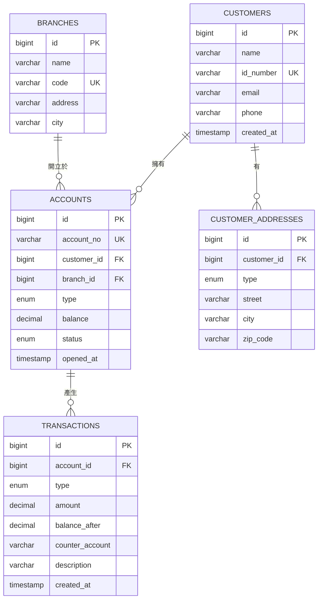
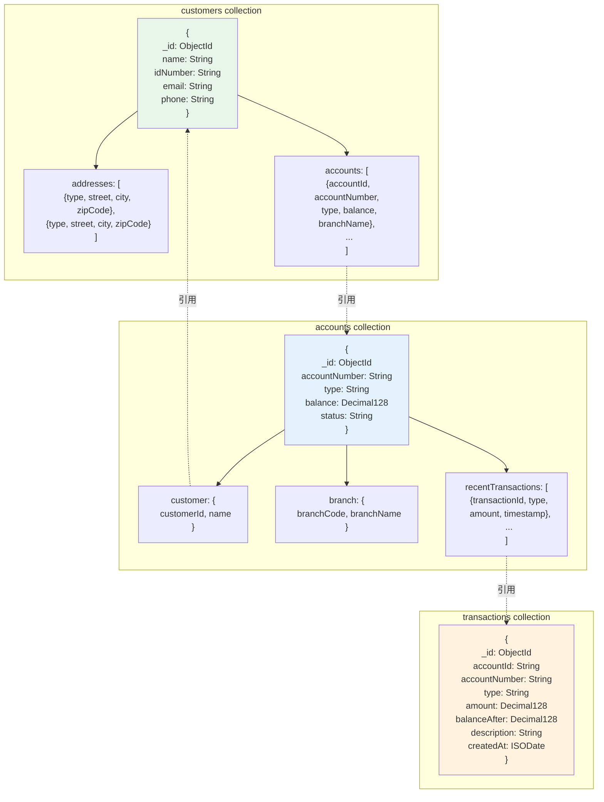
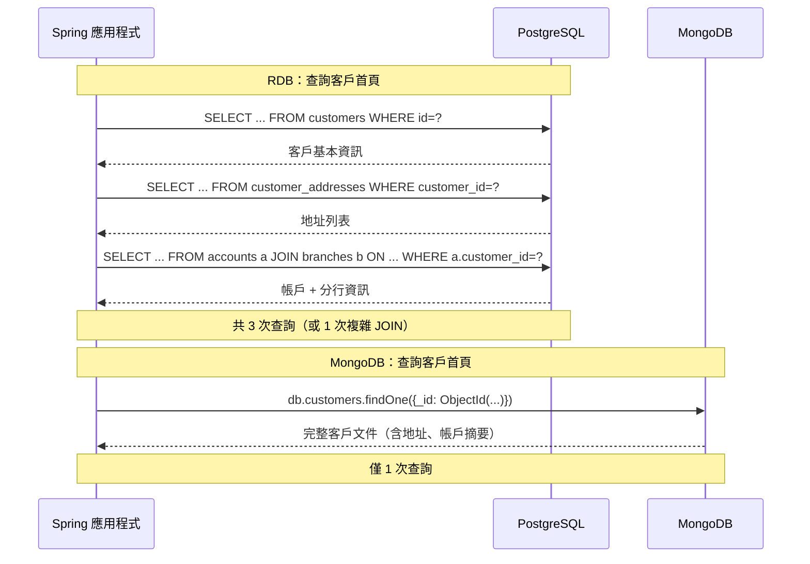
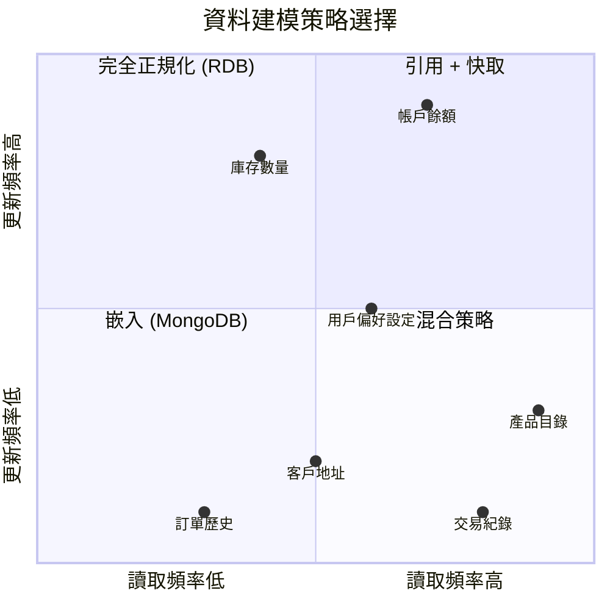

# M01-DOC-01: 資料模型哲學比較 (RDB vs MongoDB)

> **模組**: M01 - 關聯式資料庫 vs NoSQL
> **對象**: 具備 RDB 經驗的 Java Spring 開發者
> **目標**: 深入理解兩種資料模型的設計哲學差異，建立正確的 MongoDB 思維模式

---

## 目錄

1. [關聯式資料庫的建模哲學](#1-關聯式資料庫的建模哲學)
2. [MongoDB 的建模哲學](#2-mongodb-的建模哲學)
3. [銀行帳戶與交易：雙模型實戰比較](#3-銀行帳戶與交易雙模型實戰比較)
4. [ER 圖 vs 文件結構圖](#4-er-圖-vs-文件結構圖)
5. [關鍵差異對照表](#5-關鍵差異對照表)
6. [何時正規化？何時反正規化？](#6-何時正規化何時反正規化)

---

## 1. 關聯式資料庫的建模哲學

### 1.1 正規化 (Normalization)

關聯式資料庫的核心哲學是 **正規化 (Normalization)** — 將資料分解成多個相關的表格，消除冗餘，確保一致性。

**正規化的三大範式：**

| 範式 | 規則 | 目的 |
|------|------|------|
| **1NF** | 每個欄位都是原子值（不可再分割） | 消除重複群組 |
| **2NF** | 滿足 1NF，且所有非主鍵欄位完全依賴主鍵 | 消除部分依賴 |
| **3NF** | 滿足 2NF，且所有非主鍵欄位之間沒有傳遞依賴 | 消除傳遞依賴 |

**Spring JPA 範例 — 正規化的帳戶模型：**

```java
@Entity
@Table(name = "accounts")
public class Account {
    @Id
    @GeneratedValue(strategy = GenerationType.IDENTITY)
    private Long id;

    @Column(nullable = false, unique = true)
    private String accountNumber;

    @ManyToOne(fetch = FetchType.LAZY)
    @JoinColumn(name = "customer_id", nullable = false)
    private Customer customer;

    @ManyToOne(fetch = FetchType.LAZY)
    @JoinColumn(name = "branch_id", nullable = false)
    private Branch branch;

    @Enumerated(EnumType.STRING)
    private AccountType accountType;

    private BigDecimal balance;
}

@Entity
@Table(name = "customers")
public class Customer {
    @Id
    @GeneratedValue(strategy = GenerationType.IDENTITY)
    private Long id;
    private String name;
    private String email;

    @OneToMany(mappedBy = "customer")
    private List<Account> accounts;

    @OneToMany(mappedBy = "customer")
    private List<Address> addresses;
}

@Entity
@Table(name = "addresses")
public class Address {
    @Id
    @GeneratedValue(strategy = GenerationType.IDENTITY)
    private Long id;

    @ManyToOne(fetch = FetchType.LAZY)
    @JoinColumn(name = "customer_id")
    private Customer customer;

    private String street;
    private String city;
    private String zipCode;

    @Enumerated(EnumType.STRING)
    private AddressType type; // HOME, OFFICE, MAILING
}
```

### 1.2 參照完整性 (Referential Integrity)

RDB 透過 **外鍵約束 (Foreign Key Constraints)** 在資料庫層級強制保證資料一致性：

```sql
ALTER TABLE accounts
    ADD CONSTRAINT fk_accounts_customer
    FOREIGN KEY (customer_id) REFERENCES customers(id)
    ON DELETE RESTRICT
    ON UPDATE CASCADE;

ALTER TABLE transactions
    ADD CONSTRAINT fk_transactions_account
    FOREIGN KEY (account_id) REFERENCES accounts(id)
    ON DELETE RESTRICT;
```

**核心觀點**：資料庫負責守護資料完整性，而非應用程式。

### 1.3 Schema-on-Write（寫入時驗證結構）

RDB 採用 **Schema-on-Write** — 資料在寫入時必須符合預定義的 Schema：

```sql
CREATE TABLE accounts (
    id          BIGINT PRIMARY KEY AUTO_INCREMENT,
    account_no  VARCHAR(20) NOT NULL UNIQUE,
    customer_id BIGINT NOT NULL,
    branch_id   BIGINT NOT NULL,
    type        ENUM('SAVINGS', 'CHECKING', 'FIXED_DEPOSIT') NOT NULL,
    balance     DECIMAL(15,2) NOT NULL DEFAULT 0.00,
    created_at  TIMESTAMP DEFAULT CURRENT_TIMESTAMP,
    -- 寫入時強制驗證
    CONSTRAINT chk_balance CHECK (balance >= 0)
);
```

**意涵**：
- 結構變更（ALTER TABLE）成本高，大型表可能需要數小時
- 所有資料保證結構一致
- 應用程式可以安心假設資料格式

---

## 2. MongoDB 的建模哲學

### 2.1 反正規化 (Denormalization)

MongoDB 鼓勵 **反正規化** — 將相關資料嵌入同一份文件中，以匹配應用程式的存取模式。

**核心原則**：「一起讀取的資料，應該一起儲存」(Data that is accessed together should be stored together)。

### 2.2 嵌入 vs 引用 (Embedding vs Referencing)

這是 MongoDB 建模最重要的決策：

**嵌入 (Embedding) — 適合「擁有」關係、一起存取的資料：**

```java
@Document(collection = "customers")
public class CustomerDocument {
    @Id
    private String id;
    private String name;
    private String email;

    // 地址直接嵌入 — 不需要另一個 collection
    private List<Address> addresses;

    // 帳戶摘要嵌入 — 常見的讀取模式
    private List<AccountSummary> accountSummaries;

    @Data
    public static class Address {
        private String street;
        private String city;
        private String zipCode;
        private AddressType type;
    }

    @Data
    public static class AccountSummary {
        private String accountNumber;
        private AccountType type;
        private BigDecimal balance;
        private Instant lastActivity;
    }
}
```

對應的 MongoDB 文件結構：

```json
{
  "_id": ObjectId("64a1b2c3d4e5f6a7b8c9d0e1"),
  "name": "王大明",
  "email": "daming.wang@example.com",
  "addresses": [
    {
      "street": "信義路五段7號",
      "city": "台北市",
      "zipCode": "110",
      "type": "HOME"
    },
    {
      "street": "南京東路三段100號",
      "city": "台北市",
      "zipCode": "104",
      "type": "OFFICE"
    }
  ],
  "accountSummaries": [
    {
      "accountNumber": "ACC-2024-001",
      "type": "SAVINGS",
      "balance": NumberDecimal("150000.00"),
      "lastActivity": ISODate("2024-01-15T08:30:00Z")
    }
  ]
}
```

**引用 (Referencing) — 適合多對多關係、頻繁更新、大型子文件：**

```java
@Document(collection = "transactions")
public class TransactionDocument {
    @Id
    private String id;

    // 引用帳戶 — 交易量大，不適合嵌入帳戶中
    private String accountId;
    private String accountNumber; // 反正規化欄位，避免查詢時 JOIN

    private TransactionType type;
    private BigDecimal amount;
    private String currency;
    private String description;
    private Instant timestamp;
    private TransactionStatus status;

    // 轉帳對象（如適用）
    private String counterpartyAccountId;
    private String counterpartyName; // 反正規化，方便顯示
}
```

### 2.3 嵌入 vs 引用決策指南

| 考量因素 | 傾向嵌入 | 傾向引用 |
|----------|----------|----------|
| **關係類型** | 一對一、一對少量 | 一對多（無上限）、多對多 |
| **讀取模式** | 總是一起讀取 | 分別讀取 |
| **更新頻率** | 子資料不常更新 | 子資料頻繁更新 |
| **文件大小** | 嵌入後 < 16MB | 可能超過 16MB 限制 |
| **資料獨立性** | 子資料沒有獨立意義 | 子資料有獨立存取需求 |
| **成長性** | 陣列大小有合理上限 | 陣列可能無限成長 |

### 2.4 Schema-on-Read（讀取時解析結構）

MongoDB 採用 **Schema-on-Read** — 資料寫入時不強制結構，讀取時由應用程式解析：

```java
// 同一個 collection 中可以存在不同結構的文件
// 舊版客戶文件（沒有 email）
{
  "_id": ObjectId("..."),
  "name": "老客戶",
  "phone": "02-12345678"
}

// 新版客戶文件（有 email，有新欄位）
{
  "_id": ObjectId("..."),
  "name": "新客戶",
  "email": "new@example.com",
  "phone": "0912-345678",
  "preferences": {
    "language": "zh-TW",
    "notifications": true
  }
}
```

**Spring Data MongoDB 中處理 Schema 演進：**

```java
@Document(collection = "customers")
public class CustomerDocument {
    @Id
    private String id;
    private String name;

    // 新欄位 — 舊文件讀取時為 null，應用程式需處理
    private String email;

    // 可透過 @Field 映射不同的欄位名稱
    @Field("phone")
    private String phoneNumber;

    // 使用 Optional 或預設值處理缺失欄位
    private Preferences preferences;

    public String getEmailOrDefault() {
        return email != null ? email : "未提供";
    }
}
```

> **重要提醒**：雖然 MongoDB 是 Schema-on-Read，但在生產環境中建議使用 **Schema Validation** 來約束文件結構，避免寫入垃圾資料。

```javascript
db.createCollection("customers", {
  validator: {
    $jsonSchema: {
      bsonType: "object",
      required: ["name"],
      properties: {
        name: { bsonType: "string", description: "客戶姓名，必填" },
        email: { bsonType: "string", pattern: "^.+@.+$" },
        balance: { bsonType: "decimal", minimum: 0 }
      }
    }
  }
});
```

---

## 3. 銀行帳戶與交易：雙模型實戰比較

### 3.1 場景描述

設計一個銀行系統，需要管理：
- 客戶資訊（姓名、身分證、聯絡方式、地址）
- 帳戶資訊（帳號、類型、餘額、開戶分行）
- 交易紀錄（轉帳、存款、提款）
- 分行資訊

### 3.2 RDB 模型設計（正規化）

```sql
-- 5 張表，完全正規化
CREATE TABLE branches (
    id          BIGINT PRIMARY KEY,
    name        VARCHAR(100) NOT NULL,
    code        VARCHAR(10) NOT NULL UNIQUE,
    address     VARCHAR(200),
    city        VARCHAR(50)
);

CREATE TABLE customers (
    id          BIGINT PRIMARY KEY,
    name        VARCHAR(100) NOT NULL,
    id_number   VARCHAR(20) NOT NULL UNIQUE,
    email       VARCHAR(100),
    phone       VARCHAR(20),
    created_at  TIMESTAMP DEFAULT CURRENT_TIMESTAMP
);

CREATE TABLE customer_addresses (
    id          BIGINT PRIMARY KEY,
    customer_id BIGINT NOT NULL REFERENCES customers(id),
    type        ENUM('HOME','OFFICE','MAILING') NOT NULL,
    street      VARCHAR(200),
    city        VARCHAR(50),
    zip_code    VARCHAR(10)
);

CREATE TABLE accounts (
    id          BIGINT PRIMARY KEY,
    account_no  VARCHAR(20) NOT NULL UNIQUE,
    customer_id BIGINT NOT NULL REFERENCES customers(id),
    branch_id   BIGINT NOT NULL REFERENCES branches(id),
    type        ENUM('SAVINGS','CHECKING','FIXED_DEPOSIT') NOT NULL,
    balance     DECIMAL(15,2) NOT NULL DEFAULT 0.00,
    status      ENUM('ACTIVE','FROZEN','CLOSED') DEFAULT 'ACTIVE',
    opened_at   TIMESTAMP DEFAULT CURRENT_TIMESTAMP
);

CREATE TABLE transactions (
    id              BIGINT PRIMARY KEY,
    account_id      BIGINT NOT NULL REFERENCES accounts(id),
    type            ENUM('DEPOSIT','WITHDRAWAL','TRANSFER_IN','TRANSFER_OUT') NOT NULL,
    amount          DECIMAL(15,2) NOT NULL,
    balance_after   DECIMAL(15,2) NOT NULL,
    counter_account VARCHAR(20),
    description     VARCHAR(200),
    created_at      TIMESTAMP DEFAULT CURRENT_TIMESTAMP
);
```

**查詢客戶完整資訊需要 JOIN 多張表：**

```sql
SELECT c.name, c.email,
       a.account_no, a.type AS account_type, a.balance,
       b.name AS branch_name,
       ca.street, ca.city, ca.type AS address_type
FROM customers c
LEFT JOIN accounts a ON a.customer_id = c.id
LEFT JOIN branches b ON b.id = a.branch_id
LEFT JOIN customer_addresses ca ON ca.customer_id = c.id
WHERE c.id = 12345;
```

### 3.3 MongoDB 模型設計（反正規化 + 嵌入）

```java
// Collection 1: customers — 嵌入地址和帳戶摘要
@Document(collection = "customers")
public class CustomerDocument {
    @Id
    private String id;
    private String name;
    private String idNumber;
    private String email;
    private String phone;
    private Instant createdAt;

    // 嵌入：地址數量有限（最多3-5個）
    private List<Address> addresses;

    // 嵌入：帳戶摘要（反正規化，方便快速查看）
    private List<AccountSummary> accounts;

    @Data
    public static class Address {
        private AddressType type;
        private String street;
        private String city;
        private String zipCode;
    }

    @Data
    public static class AccountSummary {
        private String accountId;    // 引用 accounts collection
        private String accountNumber;
        private AccountType type;
        private BigDecimal balance;
        private String branchName;   // 反正規化
    }
}

// Collection 2: accounts — 完整帳戶資訊
@Document(collection = "accounts")
public class AccountDocument {
    @Id
    private String id;
    private String accountNumber;
    private AccountType type;
    private BigDecimal balance;
    private AccountStatus status;
    private Instant openedAt;

    // 反正規化：嵌入客戶基本資訊
    private CustomerRef customer;

    // 反正規化：嵌入分行資訊
    private BranchInfo branch;

    // 嵌入：最近 N 筆交易（方便快速查看）
    private List<RecentTransaction> recentTransactions;

    @Data
    public static class CustomerRef {
        private String customerId;
        private String name;
    }

    @Data
    public static class BranchInfo {
        private String branchCode;
        private String branchName;
    }

    @Data
    public static class RecentTransaction {
        private String transactionId;
        private TransactionType type;
        private BigDecimal amount;
        private Instant timestamp;
    }
}

// Collection 3: transactions — 完整交易紀錄（獨立 collection，因為量大）
@Document(collection = "transactions")
public class TransactionDocument {
    @Id
    private String id;
    private String accountId;
    private String accountNumber;   // 反正規化
    private TransactionType type;
    private BigDecimal amount;
    private BigDecimal balanceAfter;
    private String counterpartyAccount;
    private String counterpartyName; // 反正規化
    private String description;
    private Instant createdAt;
}
```

**查詢客戶完整資訊 — 單次讀取，無需 JOIN：**

```java
@Service
public class CustomerQueryService {

    private final MongoTemplate mongoTemplate;

    // 一次查詢就能取得客戶、地址、帳戶摘要
    public CustomerDocument getCustomerProfile(String customerId) {
        return mongoTemplate.findById(customerId, CustomerDocument.class);
        // 不需要 JOIN！所有資訊都在同一份文件中
    }
}
```

### 3.4 兩種模型的取捨

| 面向 | RDB 模型 | MongoDB 模型 |
|------|----------|-------------|
| **查詢客戶首頁** | 需要 4 個 JOIN | 單次查詢 |
| **更新分行名稱** | 改一處（branches 表） | 需更新多處（反正規化的副本） |
| **新增交易** | INSERT 一筆 | INSERT 一筆 + 更新帳戶的 recentTransactions |
| **資料一致性** | 資料庫保證 | 應用程式需處理 |
| **Schema 變更** | ALTER TABLE（可能鎖表） | 漸進式更新（無停機） |

---

## 4. ER 圖 vs 文件結構圖

### 4.1 RDB 實體關係圖 (ER Diagram)



### 4.2 MongoDB 文件結構圖



### 4.3 存取模式比較



---

## 5. 關鍵差異對照表

| 維度 | 關聯式資料庫 (RDB) | MongoDB |
|------|-------------------|---------|
| **資料模型** | 表格 (Tables) + 列 (Rows) | 集合 (Collections) + 文件 (Documents) |
| **設計原則** | 正規化，消除冗餘 | 反正規化，優化讀取模式 |
| **結構驗證** | Schema-on-Write（寫入時強制） | Schema-on-Read（讀取時解析） |
| **關聯處理** | JOIN（資料庫層級） | 嵌入 + 應用層級引用 |
| **參照完整性** | 外鍵約束（資料庫保證） | 應用程式負責 |
| **資料冗餘** | 極力避免 | 有策略地允許 |
| **查詢效能** | JOIN 密集時可能慢 | 單文件讀取快，跨集合查詢慢 |
| **寫入效能** | 單點寫入，索引更新 | 可能需要更新多處冗餘資料 |
| **Schema 變更** | ALTER TABLE（成本高） | 漸進式更新（成本低） |
| **交易支援** | 原生多表交易 | 4.0+ 支援多文件交易（有效能開銷） |
| **Spring 整合** | Spring Data JPA / Hibernate | Spring Data MongoDB |
| **適合場景** | 高一致性、複雜關聯查詢 | 高吞吐量、彈性結構、快速迭代 |

---

## 6. 何時正規化？何時反正規化？

### 6.1 正規化有利的場景

```
適合正規化 (RDB) 的信號：
  [x] 資料之間有嚴格的參照完整性需求
  [x] 同一份資料被多個實體引用（如：分行資訊被所有帳戶引用）
  [x] 需要頻繁更新某個實體（如：客戶手機號碼）
  [x] 需要複雜的跨實體分析查詢（如：報表、統計）
  [x] 資料一致性是業務核心需求（如：金融交易對帳）
  [x] 資料關聯模式穩定，不常變更
```

**範例**：核心銀行帳務系統 — 帳戶餘額必須精確、交易必須可追溯、對帳必須一致。

### 6.2 反正規化有利的場景

```
適合反正規化 (MongoDB) 的信號：
  [x] 明確的讀取模式（知道「哪些資料會一起被讀取」）
  [x] 讀多寫少的工作負載
  [x] 子資料的生命週期與父資料一致（如：訂單與訂單項目）
  [x] 需要低延遲的單次查詢回應
  [x] 資料結構多變或演進快速
  [x] 水平擴展（Sharding）是重要需求
```

**範例**：客戶 360 度視圖 — 在一個畫面中展示客戶所有資訊，嵌入式文件可以一次查詢取得。

### 6.3 決策矩陣



### 6.4 實務建議

> **給 Spring 開發者的轉換心法**：
>
> 1. **不要直接把 ER 圖搬到 MongoDB** — 如果你的 MongoDB collection 跟 RDB 的 table 一模一樣，代表你在用 MongoDB 做 RDB 的事。
>
> 2. **從 API / 畫面需求出發** — 你的前端需要什麼資料結構？那就是你 MongoDB 文件的結構。
>
> 3. **接受適度冗餘** — 冗餘不是罪，過度 JOIN 才是 MongoDB 的效能殺手。
>
> 4. **用 `$lookup` 但不要濫用** — MongoDB 的 `$lookup`（相當於 LEFT JOIN）效能遠不如 RDB 的 JOIN，應該是例外而非常態。

```java
// 反模式：在 MongoDB 中模擬 RDB 的 JOIN
// 這會產生多次查詢，效能差
public CustomerDTO getCustomerProfile_BAD(String customerId) {
    Customer customer = customerRepo.findById(customerId);
    List<Account> accounts = accountRepo.findByCustomerId(customerId);
    List<Address> addresses = addressRepo.findByCustomerId(customerId);
    // 手動組裝... 這不是 MongoDB 的正確用法
    return new CustomerDTO(customer, accounts, addresses);
}

// 正確做法：設計文件結構時就把需要的資料嵌入
public CustomerDocument getCustomerProfile_GOOD(String customerId) {
    return mongoTemplate.findById(customerId, CustomerDocument.class);
    // 一次查詢，所有資料都在文件中
}
```

---

## 延伸閱讀

- [MongoDB Data Modeling Guide](https://www.mongodb.com/docs/manual/core/data-modeling-introduction/)
- [Building with Patterns: A Summary](https://www.mongodb.com/blog/post/building-with-patterns-a-summary)
- [Spring Data MongoDB Reference](https://docs.spring.io/spring-data/mongodb/reference/)

---

> **下一篇**: [M01-DOC-02: CAP 定理與一致性模型](./M01-DOC-02-cap-consistency.md)
