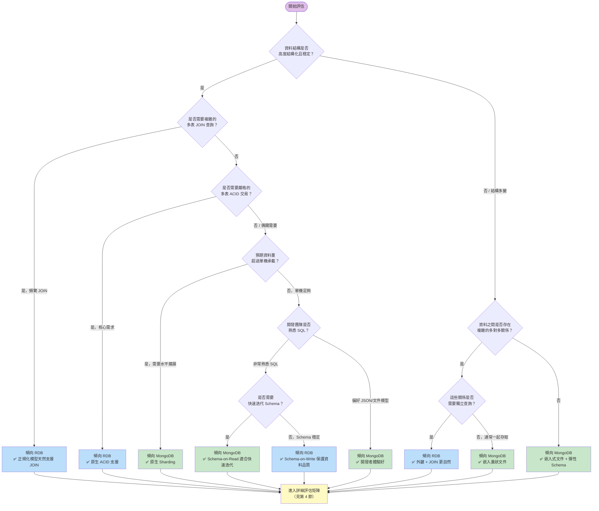
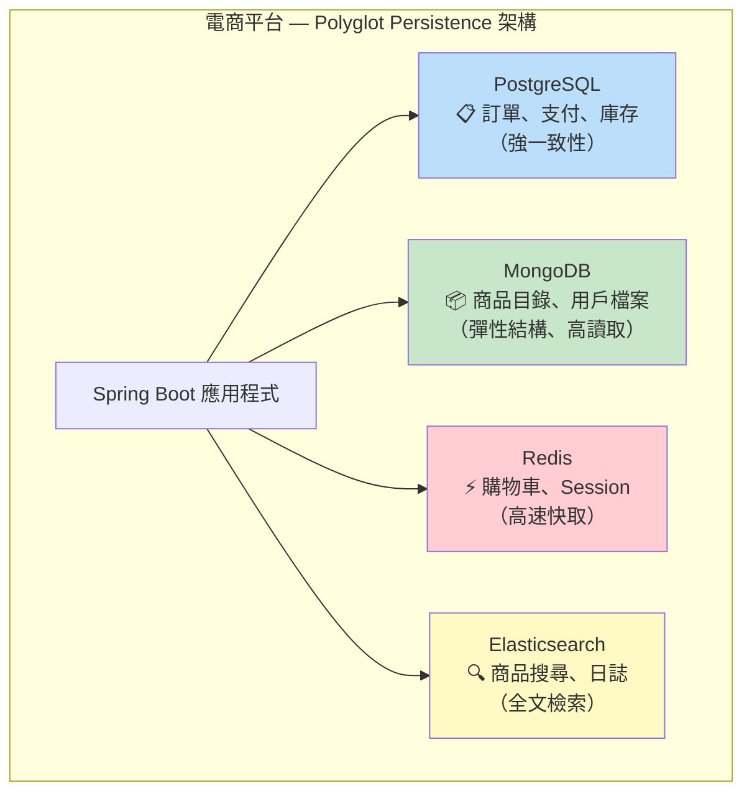
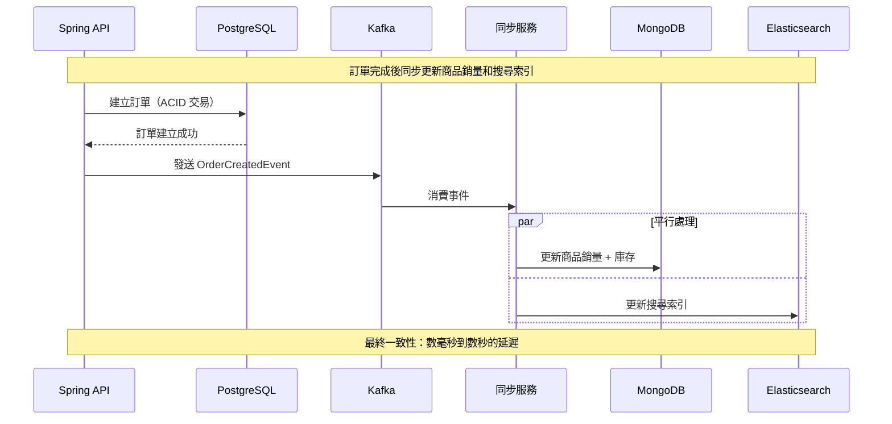
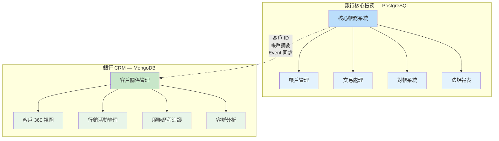
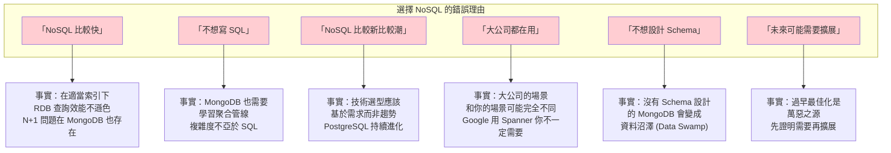
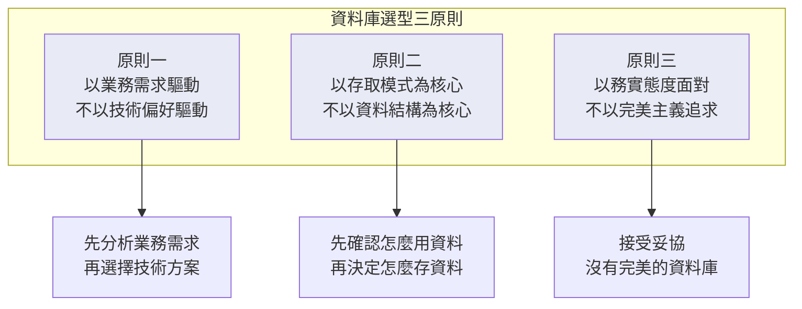

# M01-DOC-03: 資料庫選型決策框架

> **模組**: M01 - 關聯式資料庫 vs NoSQL
> **對象**: 具備 RDB 經驗的 Java Spring 開發者
> **目標**: 建立系統化的資料庫選型方法論，避免盲目跟風，做出適合業務場景的技術決策

---

## 目錄

1. [決策樹：RDB 還是 MongoDB？](#1-決策樹rdb-還是-mongodb)
2. [混合架構：Polyglot Persistence 策略](#2-混合架構polyglot-persistence-策略)
3. [真實案例：銀行核心 vs 銀行 CRM](#3-真實案例銀行核心-vs-銀行-crm)
4. [選型評估矩陣](#4-選型評估矩陣)
5. [反模式：選擇 NoSQL 的錯誤理由](#5-反模式選擇-nosql-的錯誤理由)
6. [總結與建議](#6-總結與建議)

---

## 1. 決策樹：RDB 還是 MongoDB？

### 1.1 快速決策流程圖



### 1.2 一句話總結

| 如果你的系統... | 選擇 |
|----------------|------|
| 像銀行帳本一樣嚴格 | **RDB** |
| 像 CMS 一樣靈活 | **MongoDB** |
| 像社群媒體一樣海量 | **MongoDB** |
| 像 ERP 一樣多表關聯 | **RDB** |
| 像 IoT 一樣多變 | **MongoDB** |
| 像電商一樣混合 | **兩者都用 (Polyglot)** |

---

## 2. 混合架構：Polyglot Persistence 策略

### 2.1 什麼是 Polyglot Persistence？

**Polyglot Persistence（多語言持久化）** 指在同一個系統中，針對不同資料特性使用不同的資料庫。這不是新概念 — 你可能已經在用 Redis 做快取、Elasticsearch 做搜尋了。



### 2.2 Spring Boot 中的 Polyglot Persistence 實作

```java
// build.gradle.kts — 同時使用多個資料庫
dependencies {
    // RDB
    implementation("org.springframework.boot:spring-boot-starter-data-jpa")
    runtimeOnly("org.postgresql:postgresql")

    // MongoDB
    implementation("org.springframework.boot:spring-boot-starter-data-mongodb")

    // Redis
    implementation("org.springframework.boot:spring-boot-starter-data-redis")
}
```

```yaml
# application.yml
spring:
  datasource:
    url: jdbc:postgresql://localhost:5432/ecommerce
    username: postgres
    password: secret
  data:
    mongodb:
      uri: mongodb://localhost:27017/ecommerce
    redis:
      host: localhost
      port: 6379
```

```java
// 訂單 — 使用 JPA + PostgreSQL（強一致性）
@Entity
@Table(name = "orders")
public class Order {
    @Id
    @GeneratedValue(strategy = GenerationType.IDENTITY)
    private Long id;
    private String orderNumber;
    private BigDecimal totalAmount;
    private OrderStatus status;

    @OneToMany(cascade = CascadeType.ALL, orphanRemoval = true)
    private List<OrderItem> items;
}

@Repository
public interface OrderRepository extends JpaRepository<Order, Long> {
    List<Order> findByCustomerIdAndStatus(String customerId, OrderStatus status);
}

// 商品目錄 — 使用 MongoDB（彈性結構、高讀取）
@Document(collection = "products")
public class ProductDocument {
    @Id
    private String id;
    private String name;
    private String category;
    private BigDecimal price;
    private Map<String, Object> specifications; // 不同商品有不同規格

    // 嵌入：變體（顏色、尺寸）
    private List<Variant> variants;

    // 嵌入：最近評價（反正規化）
    private List<RecentReview> recentReviews;
}

@Repository
public interface ProductRepository extends MongoRepository<ProductDocument, String> {
    List<ProductDocument> findByCategoryAndPriceRange(String category,
                                                       BigDecimal min, BigDecimal max);
}

// 購物車 — 使用 Redis（高速、暫時性資料）
@Service
public class CartService {

    private final RedisTemplate<String, CartItem> redisTemplate;

    public void addToCart(String userId, CartItem item) {
        String key = "cart:" + userId;
        redisTemplate.opsForList().rightPush(key, item);
        redisTemplate.expire(key, 7, TimeUnit.DAYS); // 7 天過期
    }
}
```

### 2.3 Polyglot Persistence 的挑戰

| 挑戰 | 說明 | 解決方案 |
|------|------|---------|
| **資料同步** | 跨資料庫的資料一致性 | Event-Driven Architecture (Kafka/RabbitMQ) |
| **交易管理** | 跨資料庫的交易 | Saga Pattern / 補償交易 |
| **運維複雜度** | 多個資料庫的部署和監控 | 容器化 (Docker/K8s)、集中監控 |
| **學習曲線** | 團隊需要掌握多種資料庫 | 制定使用規範、知識分享 |
| **查詢跨越** | 跨資料庫的聚合查詢 | 資料倉儲 / CQRS 模式 |

### 2.4 跨資料庫資料同步：Event-Driven 模式



```java
// 事件驅動的跨資料庫同步
@Service
public class OrderEventHandler {

    @KafkaListener(topics = "order-events")
    public void handleOrderCreated(OrderCreatedEvent event) {
        // 更新 MongoDB 中的商品銷量
        mongoTemplate.updateFirst(
            Query.query(Criteria.where("_id").is(event.getProductId())),
            new Update().inc("totalSold", event.getQuantity()),
            ProductDocument.class
        );

        // 更新 Elasticsearch 搜尋索引
        elasticsearchTemplate.update(event.getProductId(), /* ... */);
    }
}
```

---

## 3. 真實案例：銀行核心 vs 銀行 CRM

### 3.1 案例背景

一家銀行需要建置兩個系統：
1. **核心帳務系統 (Core Banking)** — 管理帳戶、交易、對帳
2. **客戶關係管理系統 (CRM)** — 管理客戶互動、行銷活動、服務歷程

### 3.2 核心帳務系統 — 選擇 RDB (PostgreSQL)

**選擇原因：**

```
核心帳務系統需求分析：
  [x] 嚴格 ACID 交易（轉帳不能出錯）          → RDB 原生支援
  [x] 複雜多表關聯（帳戶-交易-分行-幣別）       → JOIN 是核心操作
  [x] 固定 Schema（帳務欄位穩定不變）           → Schema-on-Write 保護品質
  [x] 法規合規（稽核軌跡、資料完整性）          → 外鍵約束 + 觸發器
  [x] 報表需求（複雜聚合查詢）                  → SQL 聚合函數強大
  [ ] 彈性結構需求                              → 不需要
  [ ] 水平擴展需求                              → 資料量可控
  [ ] 快速 Schema 迭代                          → Schema 穩定
```

**架構：**

```java
// 核心帳務 — PostgreSQL + Spring Data JPA
@Entity
@Table(name = "ledger_entries")
public class LedgerEntry {
    @Id
    @GeneratedValue(strategy = GenerationType.IDENTITY)
    private Long id;

    @ManyToOne(fetch = FetchType.LAZY)
    @JoinColumn(name = "account_id", nullable = false)
    private Account account;

    @Column(nullable = false, precision = 15, scale = 2)
    private BigDecimal debitAmount;

    @Column(nullable = false, precision = 15, scale = 2)
    private BigDecimal creditAmount;

    @Column(nullable = false, precision = 15, scale = 2)
    private BigDecimal runningBalance;

    @Column(nullable = false)
    private Instant entryDate;

    @ManyToOne(fetch = FetchType.LAZY)
    @JoinColumn(name = "transaction_id")
    private Transaction transaction;
}

// 複雜報表查詢
@Repository
public interface LedgerRepository extends JpaRepository<LedgerEntry, Long> {

    @Query("""
        SELECT new com.bank.dto.AccountStatement(
            l.account.accountNumber,
            l.entryDate,
            l.debitAmount,
            l.creditAmount,
            l.runningBalance,
            t.description
        )
        FROM LedgerEntry l
        JOIN l.transaction t
        WHERE l.account.id = :accountId
          AND l.entryDate BETWEEN :startDate AND :endDate
        ORDER BY l.entryDate DESC
    """)
    List<AccountStatement> getAccountStatement(
        @Param("accountId") Long accountId,
        @Param("startDate") Instant startDate,
        @Param("endDate") Instant endDate
    );
}
```

### 3.3 銀行 CRM 系統 — 選擇 MongoDB

**選擇原因：**

```
CRM 系統需求分析：
  [ ] 嚴格 ACID 交易                           → 不需要
  [ ] 複雜多表關聯                              → 客戶為中心的查詢模式
  [x] 彈性結構（不同客群有不同欄位）             → Schema-on-Read 完美適合
  [x] 快速迭代（行銷策略常變動）                 → 無需 ALTER TABLE
  [x] 嵌入式文件（客戶 360 度視圖）              → 一次查詢取得所有資訊
  [x] 大量非結構化資料（互動記錄、備註）          → 文件模型自然
  [x] 高讀取吞吐（客服人員查詢）                 → 讀取擴展容易
  [ ] 法規級別的資料完整性                       → 一般商業應用等級即可
```

**架構：**

```java
// CRM — MongoDB + Spring Data MongoDB
@Document(collection = "customer_profiles")
public class CustomerProfile {
    @Id
    private String id;
    private String customerId;  // 對應核心系統的客戶ID
    private String name;

    // 彈性結構：不同客群有不同的標籤和偏好
    private Map<String, Object> tags;
    private Map<String, Object> preferences;

    // 嵌入：互動歷史（最近 N 筆）
    private List<Interaction> recentInteractions;

    // 嵌入：行銷活動參與紀錄
    private List<CampaignParticipation> campaigns;

    // 嵌入：服務備註（客服人員的自由文字紀錄）
    private List<ServiceNote> serviceNotes;

    // 計算欄位（反正規化）
    private CustomerSegment segment;
    private int totalInteractions;
    private Instant lastContactDate;
    private BigDecimal estimatedLifetimeValue;

    @Data
    public static class Interaction {
        private String channel;       // PHONE, EMAIL, BRANCH, APP
        private String type;          // INQUIRY, COMPLAINT, SERVICE
        private String summary;
        private String agentId;
        private Instant timestamp;
        private Map<String, Object> metadata; // 額外資訊，結構不固定
    }

    @Data
    public static class CampaignParticipation {
        private String campaignId;
        private String campaignName;
        private Instant enrolledAt;
        private String response;      // ACCEPTED, DECLINED, NO_RESPONSE
        private Map<String, Object> customFields; // 每個活動有不同的欄位
    }

    @Data
    public static class ServiceNote {
        private String content;
        private String authorId;
        private String authorName;
        private Instant createdAt;
        private List<String> relatedProducts;
    }
}

// 客服人員查詢 — 一次取得客戶 360 度視圖
@Repository
public interface CustomerProfileRepository extends MongoRepository<CustomerProfile, String> {

    // 一次查詢就能取得客戶所有資訊，無需 JOIN
    Optional<CustomerProfile> findByCustomerId(String customerId);

    // 靈活查詢：根據標籤篩選客群
    @Query("{ 'tags.vipLevel': ?0, 'segment': ?1 }")
    List<CustomerProfile> findByVipLevelAndSegment(String vipLevel, CustomerSegment segment);

    // 全文搜索服務備註
    @Query("{ '$text': { '$search': ?0 } }")
    List<CustomerProfile> searchServiceNotes(String keyword);
}
```

### 3.4 兩個系統的比較總結



| 維度 | 核心帳務 (PostgreSQL) | CRM (MongoDB) |
|------|---------------------|---------------|
| **資料結構** | 高度結構化、穩定 | 半結構化、多變 |
| **一致性需求** | 強一致性、ACID | 最終一致性足夠 |
| **查詢模式** | 複雜 JOIN、聚合報表 | 以客戶為中心的文件查詢 |
| **Schema 變更** | 年度大改版 | 每個衝刺都可能調整 |
| **資料量** | 中等（百萬級帳戶） | 大（億級互動紀錄） |
| **擴展策略** | 垂直擴展（加記憶體、CPU） | 水平擴展（Sharding） |
| **團隊技能** | SQL 專家 | 全端開發者 |

---

## 4. 選型評估矩陣

### 4.1 評估維度與權重

在實際選型時，建議使用以下評估矩陣。每個維度 1-5 分，根據你的業務場景分配權重：

| 評估維度 | 權重建議 | RDB 強項場景 | MongoDB 強項場景 |
|---------|---------|-------------|-----------------|
| **資料結構複雜度** | 20% | 高度結構化、多表關聯 | 半結構化、巢狀、多變 |
| **查詢模式** | 20% | 複雜 JOIN、即席查詢、聚合報表 | 以文件為中心、已知查詢模式 |
| **一致性需求** | 15% | 強一致性、多表 ACID | 最終一致性可接受 |
| **擴展性需求** | 15% | 單機足夠或可垂直擴展 | 需要水平擴展 (TB/PB 級) |
| **開發速度** | 10% | Schema 穩定、不常變更 | 快速迭代、頻繁 Schema 變更 |
| **團隊經驗** | 10% | 團隊深諳 SQL 與 ORM | 團隊偏好 JSON/文件模型 |
| **生態系統** | 5% | 成熟的 BI 工具、報表引擎 | 現代開發工具鏈 |
| **運維能力** | 5% | 有 DBA 團隊 | DevOps 文化 |

### 4.2 評分範例：電商訂單系統

| 維度 | 權重 | RDB 得分 | MongoDB 得分 | RDB 加權 | MongoDB 加權 |
|------|------|---------|-------------|---------|-------------|
| 資料結構 | 20% | 4 | 3 | 0.80 | 0.60 |
| 查詢模式 | 20% | 4 | 3 | 0.80 | 0.60 |
| 一致性需求 | 15% | 5 | 3 | 0.75 | 0.45 |
| 擴展性 | 15% | 2 | 5 | 0.30 | 0.75 |
| 開發速度 | 10% | 3 | 4 | 0.30 | 0.40 |
| 團隊經驗 | 10% | 4 | 3 | 0.40 | 0.30 |
| 生態系統 | 5% | 4 | 3 | 0.20 | 0.15 |
| 運維能力 | 5% | 4 | 3 | 0.20 | 0.15 |
| **總分** | | | | **3.75** | **3.40** |

> 此範例中 RDB 稍勝（因為訂單需要強一致性），但差距不大 — 這正是考慮 Polyglot Persistence 的好時機：訂單用 RDB，商品目錄用 MongoDB。

### 4.3 評分範例：物聯網感測器資料平台

| 維度 | 權重 | RDB 得分 | MongoDB 得分 | RDB 加權 | MongoDB 加權 |
|------|------|---------|-------------|---------|-------------|
| 資料結構 | 20% | 2 | 5 | 0.40 | 1.00 |
| 查詢模式 | 20% | 2 | 4 | 0.40 | 0.80 |
| 一致性需求 | 15% | 2 | 4 | 0.30 | 0.60 |
| 擴展性 | 15% | 1 | 5 | 0.15 | 0.75 |
| 開發速度 | 10% | 2 | 5 | 0.20 | 0.50 |
| 團隊經驗 | 10% | 4 | 3 | 0.40 | 0.30 |
| 生態系統 | 5% | 3 | 4 | 0.15 | 0.20 |
| 運維能力 | 5% | 3 | 4 | 0.15 | 0.20 |
| **總分** | | | | **2.15** | **4.35** |

> 此範例中 MongoDB 明顯勝出 — IoT 資料結構多變、量大、不需要強一致性。

---

## 5. 反模式：選擇 NoSQL 的錯誤理由

### 5.1 錯誤理由清單



### 5.2 詳細分析

#### 反模式 1：「NoSQL 比較快」

```java
// 在 RDB 中，一個有索引的查詢：
// SELECT * FROM accounts WHERE account_no = 'ACC-2024-001';
// 平均回應時間：< 1ms

// 在 MongoDB 中，同樣有索引的查詢：
// db.accounts.findOne({ accountNumber: "ACC-2024-001" })
// 平均回應時間：< 1ms

// 結論：有索引的點查詢，兩者速度差不多
// 真正的差距在「存取模式匹配度」，而非資料庫本身的速度
```

**真相**：MongoDB 快的原因不是「引擎比較快」，而是「存取模式匹配時，一次查詢就能拿到所有資料，不需要 JOIN」。如果你的 MongoDB 文件設計不好（需要跨 collection 查詢），效能可能比 RDB 更差。

#### 反模式 2：「不想設計 Schema」

```java
// 錯誤做法：把 MongoDB 當成任意 JSON 儲存桶
// 第一天：
{ "name": "王大明", "phone": "0912345678" }

// 第二天：另一個開發者寫入
{ "Name": "李小華", "tel": "0987654321", "email": "li@example.com" }

// 第三天：又一個開發者...
{ "customer_name": "張三", "contact": { "phone": "0911111111" } }

// 三天後你的 collection 就是一團亂 — 資料沼澤
```

```java
// 正確做法：MongoDB 也要設計 Schema，只是執行方式不同
// 1. 定義清楚的 Java 類別
@Document(collection = "customers")
public class CustomerDocument {
    @Id
    private String id;

    @Indexed
    @Field("name")
    private String name;  // 統一欄位名

    @Field("phone")
    private String phone; // 統一欄位名

    private String email;
}

// 2. 使用 MongoDB Schema Validation
db.createCollection("customers", {
  validator: {
    $jsonSchema: {
      bsonType: "object",
      required: ["name"],
      properties: {
        name: { bsonType: "string" },
        phone: { bsonType: "string", pattern: "^09[0-9]{8}$" }
      }
    }
  }
});
```

#### 反模式 3：「未來可能需要擴展」

```
你的資料量估算：
  - 用戶數：10,000
  - 每日交易：5,000 筆
  - 年度資料量：約 2GB

PostgreSQL 單機承載能力：
  - 輕鬆處理 TB 級資料
  - 百萬級 TPS（適當調優後）

結論：你可能未來 5 年都不需要水平擴展
       但現在就為「未來可能」而選擇 MongoDB
       卻失去了 SQL 的便利性和 ACID 的保證
```

> **YAGNI 原則 (You Ain't Gonna Need It)**：不要為了「可能需要」的功能而增加系統複雜度。等到真正需要時再遷移，成本可能比你想像的低。

### 5.3 同樣也有選擇 RDB 的錯誤理由

公平起見，以下是堅持 RDB 的錯誤理由：

| 錯誤理由 | 事實 |
|---------|------|
| 「我們只會 SQL」 | 技術債不應該決定架構 |
| 「RDB 比較安全」 | MongoDB 的安全功能同樣完善 |
| 「NoSQL 不成熟」 | MongoDB 已有 15+ 年歷史，廣泛用於生產環境 |
| 「結構化資料就應該用 RDB」 | 結構化資料也可以用 MongoDB，關鍵在存取模式 |
| 「我們有 DBA」 | 有 DBA 不代表所有場景都適合 RDB |

---

## 6. 總結與建議

### 6.1 核心原則



### 6.2 快速參考表

| 場景 | 推薦方案 | 信心等級 |
|------|---------|---------|
| 金融核心帳務 | RDB (PostgreSQL) | 高 — RDB 是自然選擇 |
| 金融 CRM / 行銷 | MongoDB | 高 — 文件模型完美匹配 |
| 電商訂單 + 支付 | RDB | 高 — ACID 是核心需求 |
| 電商商品目錄 | MongoDB | 高 — 彈性結構、高讀取 |
| IoT 感測器資料 | MongoDB / 時序 DB | 高 — 量大、多變 |
| 內容管理系統 (CMS) | MongoDB | 高 — 文件結構天然匹配 |
| ERP 系統 | RDB | 高 — 複雜關聯、報表需求 |
| 社群平台（動態、留言） | MongoDB | 中高 — 讀多寫少、彈性結構 |
| 遊戲用戶檔案 | MongoDB | 高 — 每個用戶結構不同 |
| 人力資源系統 | RDB | 中 — 結構穩定但不複雜 |
| 日誌與監控 | MongoDB / Elasticsearch | 高 — 大量寫入、時序查詢 |
| 保險保單管理 | MongoDB + RDB | 中 — 混合方案最佳 |

### 6.3 給 Spring 開發者的遷移路徑建議

```
第 1 步：不要急著遷移
  → 先理解 MongoDB 的設計哲學（本模組的目標）
  → 不要把 JPA Entity 直接搬到 MongoDB

第 2 步：選一個非核心系統試水
  → CMS、日誌系統、快取層
  → 低風險，可以學習和犯錯

第 3 步：設計文件模型
  → 從存取模式出發
  → 畫出文件結構圖
  → 決定嵌入 vs 引用

第 4 步：逐步引入 Polyglot Persistence
  → 核心交易繼續用 RDB
  → 適合的場景引入 MongoDB
  → 用事件驅動同步資料

第 5 步：持續評估與調整
  → 監控效能指標
  → 收集開發者回饋
  → 根據實際數據調整架構
```

### 6.4 最後的忠告

> **沒有最好的資料庫，只有最適合的資料庫。**
>
> 選型不是技術信仰之爭。PostgreSQL 是一把優秀的瑞士刀，MongoDB 是一把同樣優秀的瑞士刀 — 只是刀片組合不同。
>
> 真正的高手不是只用一種工具，而是知道什麼時候該用哪一種。
>
> **When all you have is a hammer, everything looks like a nail.**
> **當你手上只有錘子，所有東西看起來都像釘子。**

---

## 延伸閱讀

- [MongoDB vs PostgreSQL: 15 Critical Differences](https://www.mongodb.com/compare/mongodb-postgresql)
- [Martin Fowler: Polyglot Persistence](https://martinfowler.com/bliki/PolyglotPersistence.html)
- [Designing Data-Intensive Applications (Martin Kleppmann)](https://dataintensive.net/)
- [Spring Data MongoDB + Spring Data JPA 混合使用](https://docs.spring.io/spring-data/mongodb/reference/)

---

> **上一篇**: [M01-DOC-02: CAP 定理與一致性模型](./M01-DOC-02-cap-consistency.md)
> **下一篇**: M02 - MongoDB 基礎操作（即將推出）
