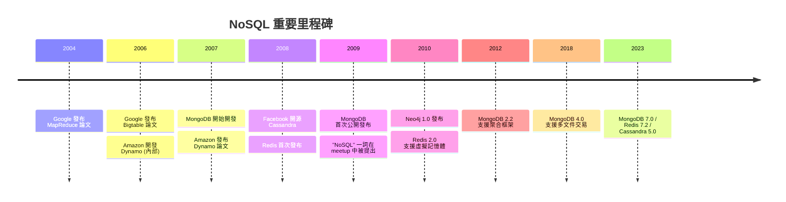
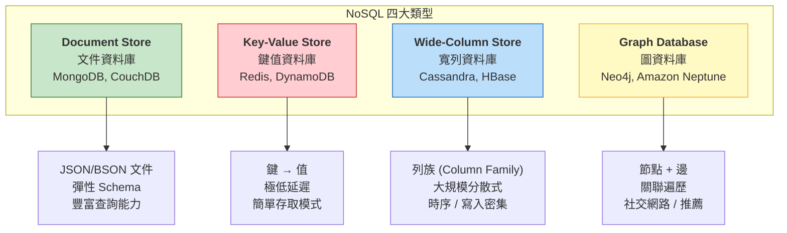
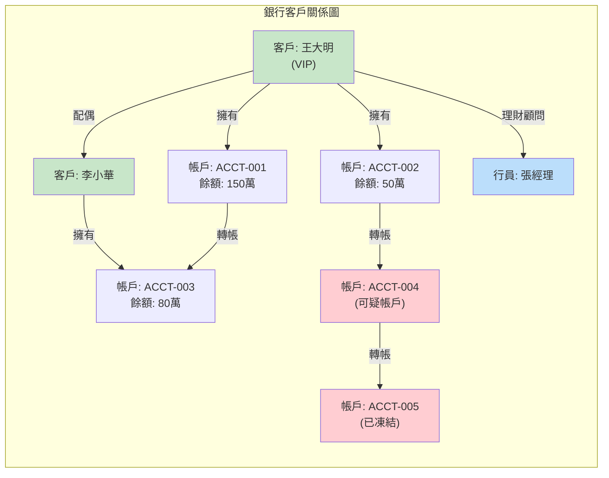
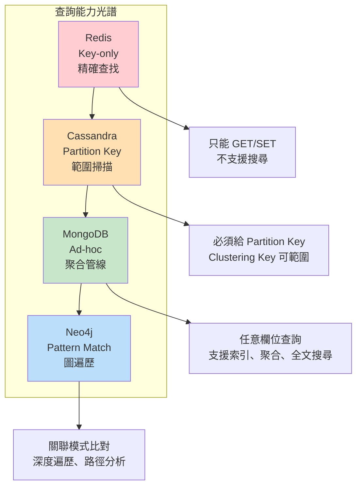
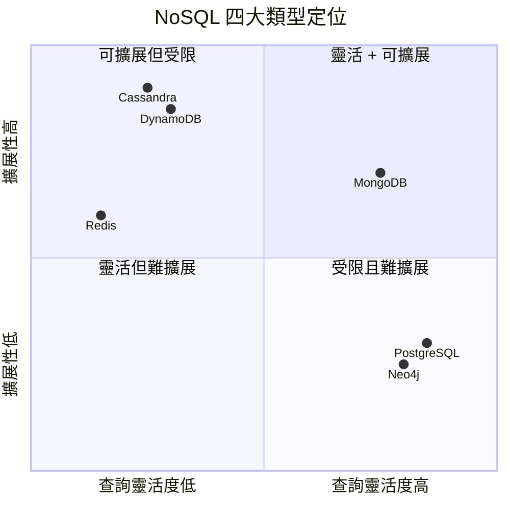
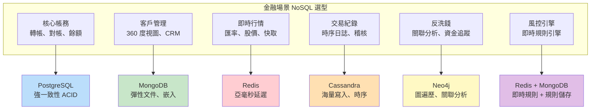

# M02-DOC-01: NoSQL 四大類型全景圖

> **模組**: M02 - NoSQL 資料庫全景
> **對象**: 具備 RDB 經驗的 Java Spring 開發者
> **目標**: 全面理解 NoSQL 四大類型的資料模型、適用場景與取捨，建立正確的技術選型視野

---

## 目錄

1. [NoSQL 的定義與興起背景](#1-nosql-的定義與興起背景)
2. [四大類型全景圖](#2-四大類型全景圖)
3. [Document Store — MongoDB](#3-document-store--mongodb)
4. [Key-Value Store — Redis](#4-key-value-store--redis)
5. [Wide-Column Store — Cassandra](#5-wide-column-store--cassandra)
6. [Graph Database — Neo4j](#6-graph-database--neo4j)
7. [四大類型綜合比較](#7-四大類型綜合比較)
8. [金融場景中的 NoSQL 選型建議](#8-金融場景中的-nosql-選型建議)

---

## 1. NoSQL 的定義與興起背景

### 1.1 什麼是 NoSQL？

NoSQL 是 **Not Only SQL** 的縮寫，泛指所有不以關聯式模型（Relational Model）為核心的資料庫系統。NoSQL 並非「反 SQL」，而是「不僅僅是 SQL」— 它代表了資料庫技術的多樣化發展。

### 1.2 NoSQL 興起的三大推力

| 推力 | 說明 | 具體案例 |
|------|------|---------|
| **Web 2.0 資料爆發** | 社群媒體、UGC 帶來的海量非結構化資料 | Facebook 每日數十億則動態、Twitter 每秒數千則推文 |
| **水平擴展需求** | 單機 RDB 無法應對 PB 級資料量 | Google Bigtable (2006)、Amazon Dynamo (2007) 論文 |
| **敏捷開發文化** | 固定 Schema 無法跟上快速迭代的產品需求 | 微服務架構下每個服務需要獨立的資料模型 |

### 1.3 NoSQL 發展時間線



---

## 2. 四大類型全景圖

### 2.1 NoSQL 四大類型概覽



### 2.2 一句話定位

| 類型 | 一句話 | 代表 |
|------|--------|------|
| **Document Store** | 「像 JSON 一樣儲存、像 SQL 一樣查詢」 | MongoDB |
| **Key-Value Store** | 「給我 Key，立刻回你 Value」 | Redis |
| **Wide-Column Store** | 「為海量寫入和時序資料而生」 | Cassandra |
| **Graph Database** | 「資料之間的關係才是主角」 | Neo4j |

---

## 3. Document Store -- MongoDB

### 3.1 資料模型

Document Store 以 **文件 (Document)** 為基本單位，文件通常以 JSON/BSON 格式儲存，支援巢狀結構和陣列。

```json
{
  "_id": ObjectId("64a1b2c3d4e5f6a7b8c9d0e1"),
  "accountNumber": "ACCT-2024-001",
  "customerName": "王大明",
  "type": "SAVINGS",
  "balance": NumberDecimal("1500000.00"),
  "addresses": [
    { "type": "HOME", "city": "台北市", "district": "信義區" },
    { "type": "OFFICE", "city": "新北市", "district": "板橋區" }
  ],
  "recentTransactions": [
    { "type": "DEPOSIT", "amount": NumberDecimal("50000.00"), "date": ISODate("2024-01-15") },
    { "type": "TRANSFER_OUT", "amount": NumberDecimal("10000.00"), "date": ISODate("2024-01-16") }
  ]
}
```

### 3.2 Spring Data MongoDB 範例

以下是 M02 實驗中使用的 Document Store 模型：

```java
@Document("products")
public class ProductDocument {
    @Id
    private String id;
    private String name;
    private String category;
    private BigDecimal price;
    private Map<String, Object> specifications; // 彈性欄位
}

public interface ProductMongoRepository extends MongoRepository<ProductDocument, String> {
    List<ProductDocument> findByCategory(String category);       // 依分類查詢
    List<ProductDocument> findByNameContaining(String keyword);  // 模糊搜尋
}
```

### 3.3 適用場景

- **客戶 360 度視圖**：嵌入地址、帳戶摘要、互動紀錄
- **商品目錄**：不同商品有不同規格（`Map<String, Object> specifications`）
- **內容管理系統 (CMS)**：文章結構多變，嵌入評論與標籤
- **保險保單**：不同險種結構差異大，Schema-on-Read 完美匹配

### 3.4 優缺點

| 優點 | 缺點 |
|------|------|
| 彈性 Schema，快速迭代 | 反正規化帶來資料冗餘 |
| 豐富的 ad-hoc 查詢能力 | 多文件交易有效能開銷 (~30%) |
| 嵌入式文件減少 JOIN | 跨 Collection 查詢 (`$lookup`) 效能不如 RDB JOIN |
| 原生水平擴展 (Sharding) | 缺乏外鍵約束，完整性由應用層負責 |
| 聚合管線 (Aggregation Pipeline) 強大 | 16MB 單文件大小限制 |

---

## 4. Key-Value Store -- Redis

### 4.1 資料模型

Key-Value Store 是最簡單的 NoSQL 類型 — 每筆資料就是一個 **鍵 (Key)** 對應一個 **值 (Value)**。

```
Key                          Value
─────────────────────        ─────────────────────
"session:user-12345"    →    "{\"token\":\"abc\",\"expiry\":1706000000}"
"rate:USD-TWD"          →    "31.25"
"product:laptop-001"    →    "Laptop Pro|electronics|35000"
"cart:user-67890"       →    [item1, item2, item3]  (Redis List)
"leaderboard:daily"     →    {user1: 950, user2: 880}  (Redis Sorted Set)
```

### 4.2 Spring Data Redis 範例

以下是 M02 實驗中使用的 Key-Value 服務：

```java
@Service
public class RedisProductService {

    private final StringRedisTemplate redisTemplate;

    public RedisProductService(StringRedisTemplate redisTemplate) {
        this.redisTemplate = redisTemplate;
    }

    public void save(String key, String value) {
        redisTemplate.opsForValue().set(key, value);
    }

    public String findByKey(String key) {
        return redisTemplate.opsForValue().get(key);       // 精確查找
    }

    public void delete(String key) {
        redisTemplate.delete(key);
    }

    public Boolean exists(String key) {
        return redisTemplate.hasKey(key);
    }
}
```

### 4.3 查詢限制

```java
// Redis 只能透過精確的 Key 查詢
String laptop = redisService.findByKey("product:laptop");   // OK
String unknown = redisService.findByKey("product:unknown");  // null

// 以下查詢在 Redis 中不可能做到：
// redisService.findByCategory("electronics");      // 無法按 Value 內容查詢
// redisService.findByPriceRange(1000, 5000);       // 無法範圍查詢
// redisService.findByNameContaining("Laptop");     // 無法模糊查詢
```

### 4.4 適用場景

- **Session 管理**：`session:{sessionId}` -> 使用者資訊
- **快取層 (Cache)**：加速慢查詢的回應時間
- **即時行情**：`rate:USD-TWD` -> 最新匯率
- **分散式鎖**：`lock:transfer:{txId}` -> 防止重複處理
- **排行榜**：Redis Sorted Set 天然適合排名場景

### 4.5 優缺點

| 優點 | 缺點 |
|------|------|
| 亞毫秒級延遲 (< 1ms) | 只能透過 Key 查詢 |
| 記憶體操作，極高吞吐 | 資料量受限於記憶體大小 |
| 豐富的資料結構 (List, Set, Sorted Set, Hash) | 持久化機制非預設啟用 |
| Pub/Sub 即時訊息 | 複雜查詢完全無法勝任 |
| 簡單易用，學習曲線低 | 單機架構下非同步複製可能丟資料 |

---

## 5. Wide-Column Store -- Cassandra

### 5.1 資料模型

Wide-Column Store 以 **列族 (Column Family)** 為核心，資料按 **Partition Key** 分散儲存在叢集中。每一行可以有不同數量的欄位。

```cql
-- Cassandra CQL (Cassandra Query Language)
CREATE TABLE products (
    category TEXT,          -- Partition Key (決定資料存在哪個節點)
    id TEXT,                -- Clustering Key (同一 Partition 內的排序依據)
    name TEXT,
    price DECIMAL,
    PRIMARY KEY (category, id)
);

-- 寫入
INSERT INTO products (category, id, name, price)
VALUES ('electronics', 'laptop-1', 'Laptop Pro', 35000);

-- 查詢必須包含 Partition Key
SELECT * FROM products WHERE category = 'electronics';                    -- OK
SELECT * FROM products WHERE category = 'electronics' AND id = 'laptop-1'; -- OK
-- SELECT * FROM products WHERE name = 'Laptop Pro';                      -- 失敗！
```

### 5.2 Spring + Cassandra 範例

以下是 M02 實驗中使用的 Cassandra 服務：

```java
@Service
public class CassandraProductService {

    private final CqlSession cqlSession;

    public CassandraProductService(CqlSession cqlSession) {
        this.cqlSession = cqlSession;
    }

    public void save(String id, String name, String category, BigDecimal price) {
        cqlSession.execute(SimpleStatement.newInstance(
                "INSERT INTO products (category, id, name, price) VALUES (?, ?, ?, ?)",
                category, id, name, price));
    }

    public Row findByCategoryAndId(String category, String id) {
        ResultSet rs = cqlSession.execute(SimpleStatement.newInstance(
                "SELECT * FROM products WHERE category = ? AND id = ?",
                category, id));
        return rs.one();
    }

    public List<Row> findByCategory(String category) {
        ResultSet rs = cqlSession.execute(SimpleStatement.newInstance(
                "SELECT * FROM products WHERE category = ?",
                category));
        return rs.all();
    }
}
```

### 5.3 適用場景

- **時序資料**：IoT 感測器數據、交易紀錄按時間戳排序
- **事件日誌**：應用程式日誌、稽核軌跡
- **訊息流**：聊天記錄（Partition Key = 聊天室 ID）
- **大規模寫入**：每秒數十萬筆寫入的場景

### 5.4 優缺點

| 優點 | 缺點 |
|------|------|
| 線性水平擴展，無單點故障 | 查詢模式受限，必須包含 Partition Key |
| 極高寫入吞吐量 | Ad-hoc 查詢困難，需要預先設計資料模型 |
| 可調一致性 (Tunable Consistency) | 缺乏 JOIN、子查詢、聚合函數 |
| 多資料中心複製 | 資料模型設計門檻高 |
| 適合時序和追加型資料 | 讀取效能不如 MongoDB（非文件型查詢） |

---

## 6. Graph Database -- Neo4j

### 6.1 資料模型

Graph Database 以 **節點 (Node)** 和 **邊 (Edge/Relationship)** 為核心，天然適合表達實體之間的複雜關聯。



### 6.2 Cypher 查詢範例

```cypher
// 找到所有與可疑帳戶有直接或間接交易的客戶（反洗錢偵測）
MATCH path = (suspect:Account {status: "FROZEN"})
              <-[:TRANSFER*1..3]-
              (related:Account)
              <-[:OWNS]-
              (customer:Customer)
RETURN customer.name, length(path) AS distance
ORDER BY distance;

// 社交圈分析：找到客戶的 2 度以內關聯人
MATCH (c:Customer {name: "王大明"})-[:KNOWS|SPOUSE|COLLEAGUE*1..2]-(related:Customer)
RETURN related.name, labels(related);
```

### 6.3 適用場景

- **反洗錢 (AML)**：追蹤可疑資金流向的多層關聯
- **詐欺偵測**：分析異常交易網路
- **社交網路**：好友推薦、影響力分析
- **推薦引擎**：「買了 A 的人也買了 B」
- **知識圖譜**：企業關聯圖、法規遵循知識庫

### 6.4 優缺點

| 優點 | 缺點 |
|------|------|
| 關聯遍歷效能極高 (O(1) per hop) | 不適合大量聚合計算 |
| 直覺的資料模型 | 水平擴展困難 |
| Cypher 查詢語言表達力強 | 不適合簡單 CRUD 場景 |
| 適合深度關聯分析 | 批量寫入效能不如其他 NoSQL |
| 視覺化友善 | 生態系統相對較小 |

---

## 7. 四大類型綜合比較

### 7.1 核心維度比較表

| 維度 | Document (MongoDB) | Key-Value (Redis) | Wide-Column (Cassandra) | Graph (Neo4j) |
|------|-------------------|-------------------|------------------------|---------------|
| **資料模型** | JSON/BSON 文件 | Key -> Value | 列族 (Column Family) | 節點 + 邊 |
| **查詢彈性** | 高 (ad-hoc) | 極低 (key-only) | 低 (partition-key) | 高 (pattern matching) |
| **讀取延遲** | 低 (ms 級) | 極低 (sub-ms) | 低 (ms 級) | 中 (依遍歷深度) |
| **寫入吞吐** | 高 | 極高 | 極高 | 中 |
| **水平擴展** | 原生 Sharding | Cluster 模式 | 線性擴展 | 困難 |
| **一致性模型** | 可調 (Tunable) | 非同步複製 | 可調 (Tunable) | ACID (單機) |
| **Schema 彈性** | 高 | 極高 (無 Schema) | 中 (需 CQL Schema) | 中 |
| **聚合分析** | 強 (Agg Pipeline) | 弱 | 弱 | 中 (圖演算法) |
| **交易支援** | 多文件交易 (4.0+) | 有限 (MULTI) | 輕量交易 (LWT) | 完整 ACID |
| **最大優勢** | 查詢靈活度 | 極低延遲 | 寫入擴展性 | 關聯遍歷 |
| **最大劣勢** | 跨 Collection 查詢慢 | 無法內容查詢 | 查詢模式受限 | 擴展性 |
| **學習曲線** | 中 | 低 | 高 | 中高 |
| **Spring 整合** | Spring Data MongoDB | Spring Data Redis | Spring Data Cassandra | Spring Data Neo4j |

### 7.2 查詢能力對比圖



### 7.3 擴展性 vs 查詢靈活度



---

## 8. 金融場景中的 NoSQL 選型建議

### 8.1 金融業務場景對應



### 8.2 場景分析表

| 金融場景 | 推薦資料庫 | 選型理由 | 一致性需求 |
|---------|-----------|---------|-----------|
| **核心帳務** | PostgreSQL | ACID 交易、外鍵約束、複雜報表 | 強一致性 |
| **客戶 CRM** | MongoDB | 彈性 Schema、嵌入式文件、快速迭代 | 最終一致性 |
| **匯率/行情快取** | Redis | 亞毫秒讀取、自動過期 (TTL)、Pub/Sub 推送 | 最終一致性 |
| **交易流水帳** | Cassandra | 海量追加寫入、按時間查詢、多資料中心 | 最終一致性 |
| **反洗錢偵測** | Neo4j | 多層關聯遍歷、資金流向分析 | 批次一致性 |
| **Session 管理** | Redis | 快速存取、自動過期、叢集分散 | 最終一致性 |
| **法規文件管理** | MongoDB | 非結構化文件、全文搜尋、版本管理 | 最終一致性 |
| **即時風控** | Redis + MongoDB | Redis 做即時判斷、MongoDB 存規則與歷史 | 混合 |

### 8.3 選型決策矩陣

在為金融場景選型時，建議依照以下維度評分 (1-5 分)：

| 評估維度 | MongoDB | Redis | Cassandra | Neo4j |
|---------|---------|-------|-----------|-------|
| **查詢靈活度** | 5 | 1 | 2 | 4 |
| **寫入擴展性** | 4 | 4 | 5 | 2 |
| **讀取延遲** | 4 | 5 | 3 | 3 |
| **資料一致性** | 4 | 2 | 3 | 5 |
| **Schema 彈性** | 5 | 5 | 2 | 3 |
| **運維複雜度** | 3 | 4 | 2 | 3 |
| **Spring 生態** | 5 | 5 | 4 | 4 |
| **金融合規性** | 4 | 2 | 3 | 3 |

### 8.4 給金融 Spring 開發者的建議

> **核心帳務留給 RDB，周邊場景擁抱 NoSQL。**
>
> 大多數金融機構不需要「全面遷移到 NoSQL」，而是需要 **Polyglot Persistence** — 讓對的資料庫做對的事。
>
> 1. **不要用 MongoDB 做核心帳務** — RDB 的 ACID 在這裡是不可替代的
> 2. **不要用 Redis 做持久化儲存** — Redis 是快取，不是資料庫（除非你很清楚在做什麼）
> 3. **不要用 Cassandra 做即席查詢** — 如果你不知道 Partition Key，Cassandra 幫不了你
> 4. **不要用 Neo4j 做簡單 CRUD** — 殺雞不要用牛刀
>
> **每種 NoSQL 都有它的甜蜜點 (Sweet Spot)，找到它，善用它。**

---

## 延伸閱讀

- [MongoDB Official Documentation](https://www.mongodb.com/docs/)
- [Redis Documentation](https://redis.io/docs/)
- [Apache Cassandra Documentation](https://cassandra.apache.org/doc/latest/)
- [Neo4j Documentation](https://neo4j.com/docs/)
- [Martin Fowler: NoSQL Distilled](https://martinfowler.com/books/nosql.html)

---

> **下一篇**: [M02-DOC-02: MongoDB vs Redis vs Cassandra 深度比較](./M02-DOC-02-mongodb-vs-redis-vs-cassandra.md)
