# M02-DOC-02: MongoDB vs Redis vs Cassandra 深度比較

> **模組**: M02 - NoSQL 資料庫全景
> **對象**: 具備 RDB 經驗的 Java Spring 開發者
> **目標**: 深入比較三大 NoSQL 資料庫的架構、查詢模式與一致性模型，建立實務選型能力

---

## 目錄

1. [架構與設計哲學](#1-架構與設計哲學)
2. [資料模型差異](#2-資料模型差異)
3. [查詢模式差異](#3-查詢模式差異)
4. [M02 實驗程式碼解析](#4-m02-實驗程式碼解析)
5. [一致性模型比較](#5-一致性模型比較)
6. [效能特性比較](#6-效能特性比較)
7. [選型決策矩陣](#7-選型決策矩陣)

---

## 1. 架構與設計哲學

### 1.1 三者的核心設計理念

| 資料庫 | 核心理念 | 設計目標 |
|--------|---------|---------|
| **MongoDB** | 「資料即文件」 | 用最接近應用程式的資料結構儲存，最大化查詢靈活度 |
| **Redis** | 「資料即記憶體」 | 用記憶體換取極致速度，簡單但極快 |
| **Cassandra** | 「資料即分區」 | 為大規模分散式寫入而生，犧牲查詢靈活度換取線性擴展 |

### 1.2 架構圖比較

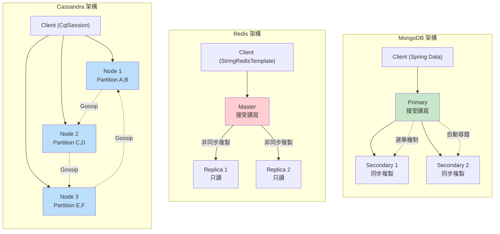

### 1.3 架構差異分析

| 維度 | MongoDB | Redis | Cassandra |
|------|---------|-------|-----------|
| **拓撲** | Replica Set (主從) | Master-Replica | Peer-to-Peer (無主) |
| **寫入節點** | 僅 Primary | 僅 Master | 任何節點 |
| **讀取節點** | Primary 或 Secondary | Master 或 Replica | 任何節點 |
| **容錯機制** | 自動選舉新 Primary | 哨兵 (Sentinel) 切換 | 無單點故障 |
| **資料分片** | Sharding (手動配置) | Cluster (Hash Slot) | 一致性雜湊 (自動) |
| **CAP 定位** | CP (預設) | AP | AP (可調為 CP) |

---

## 2. 資料模型差異

### 2.1 同一筆資料在三種資料庫中的表示

**場景**：儲存一個金融商品資訊

#### MongoDB (Document)

```json
{
  "_id": "fund-001",
  "name": "富邦台灣科技基金",
  "category": "equity-fund",
  "price": NumberDecimal("25.67"),
  "currency": "TWD",
  "specifications": {
    "riskLevel": "RR4",
    "managementFee": "1.5%",
    "custodianBank": "台灣銀行",
    "benchmarkIndex": "台灣加權指數"
  },
  "nav_history": [
    { "date": "2024-01-15", "nav": 25.67 },
    { "date": "2024-01-14", "nav": 25.42 },
    { "date": "2024-01-13", "nav": 25.55 }
  ]
}
```

#### Redis (Key-Value)

```
KEY: "product:fund-001"
VALUE: "{\"name\":\"富邦台灣科技基金\",\"category\":\"equity-fund\",\"price\":25.67}"

KEY: "nav:fund-001:2024-01-15"
VALUE: "25.67"

KEY: "nav:fund-001:2024-01-14"
VALUE: "25.42"

KEY: "category:equity-fund"
VALUE: (Redis Set) {"fund-001", "fund-002", "fund-003"}
```

#### Cassandra (Wide-Column)

```cql
CREATE TABLE financial_products (
    category TEXT,            -- Partition Key
    id TEXT,                  -- Clustering Key
    name TEXT,
    price DECIMAL,
    currency TEXT,
    risk_level TEXT,
    management_fee TEXT,
    PRIMARY KEY (category, id)
);

CREATE TABLE nav_history (
    product_id TEXT,          -- Partition Key
    date DATE,                -- Clustering Key (DESC)
    nav DECIMAL,
    PRIMARY KEY (product_id, date)
) WITH CLUSTERING ORDER BY (date DESC);
```

### 2.2 資料模型特性比較

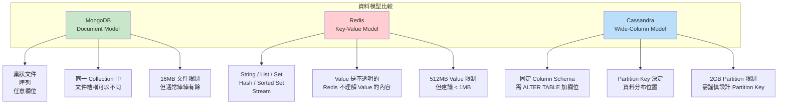

---

## 3. 查詢模式差異

### 3.1 查詢能力分級

| 查詢類型 | MongoDB | Redis | Cassandra |
|---------|---------|-------|-----------|
| **主鍵查找** | findById() | GET key | WHERE pk = ? AND ck = ? |
| **單欄位查詢** | findByCategory() | 不支援 | 僅 Partition Key |
| **範圍查詢** | findByPriceBetween() | ZRANGEBYSCORE (限 Sorted Set) | WHERE ck > ? AND ck < ? |
| **模糊搜尋** | findByNameContaining() | 不支援 | 不支援 |
| **多條件查詢** | findByCategoryAndPriceGreaterThan() | 不支援 | 僅 PK + CK 組合 |
| **聚合分析** | aggregate([{$group}, {$sort}]) | 不支援 | COUNT/SUM (有限) |
| **全文搜尋** | $text / Atlas Search | 不支援 | 需搭配 Elasticsearch |
| **關聯查詢** | $lookup (LEFT JOIN) | 不支援 | 不支援 |

### 3.2 查詢流程比較

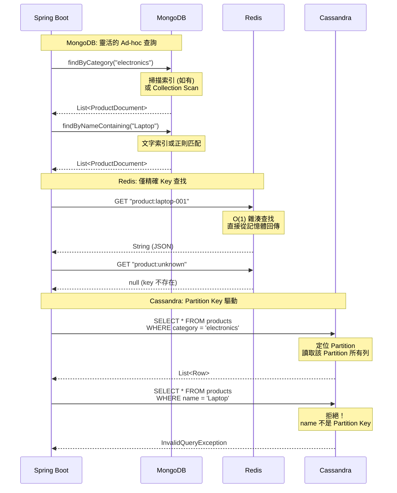

### 3.3 查詢模式總結

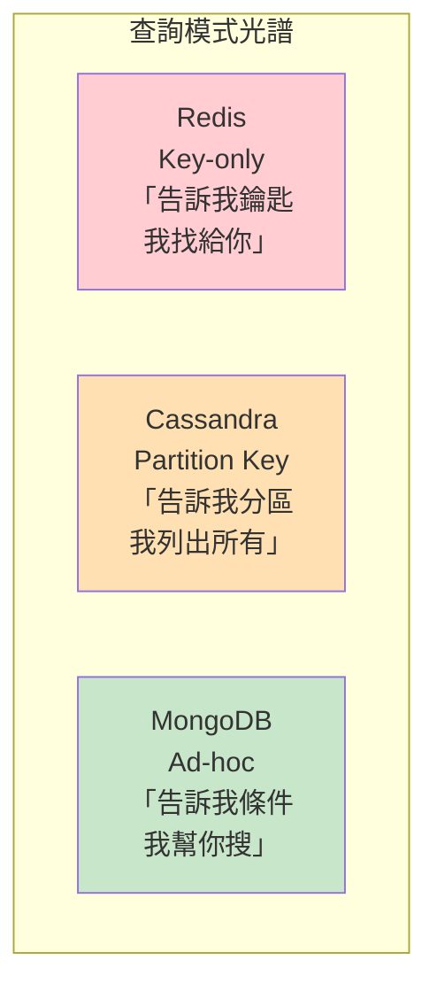

> **給 Spring 開發者的直覺**：
> - **MongoDB** 就像你的 JPA Repository，`findByXxx()` 的方法命名查詢幾乎都能用
> - **Redis** 就像一個 `HashMap`，只有 `get(key)` 和 `put(key, value)`
> - **Cassandra** 就像一個「只能用 Partition Key 當 WHERE 條件」的 SQL

---

## 4. M02 實驗程式碼解析

### 4.1 實驗設計：同一份產品資料，三種存取模式

M02 實驗的核心設計是將同一份產品資料分別存入 MongoDB、Redis、Cassandra，然後比較三者的存取差異。

```java
@Test
@DisplayName("Query pattern differences across three NoSQL types")
void queryPatternComparison() {
    // 同一筆產品資料存入三個資料庫
    var product = new ProductDocument("Laptop Pro", "electronics", new BigDecimal("35000"));
    ProductDocument saved = mongoRepository.save(product);
    redisService.save("product:" + saved.getId(), saved.getName());
    cassandraService.save(saved.getId(), saved.getName(), saved.getCategory(), saved.getPrice());

    // MongoDB: 可以用任何欄位查詢
    assertThat(mongoRepository.findByCategory("electronics")).isNotEmpty();
    assertThat(mongoRepository.findByNameContaining("Laptop")).isNotEmpty();

    // Redis: 只能用精確的 Key 查詢
    assertThat(redisService.findByKey("product:" + saved.getId())).isNotNull();
    // 無法: redisService.findByCategory("electronics")

    // Cassandra: 必須包含 Partition Key
    assertThat(cassandraService.findByCategory("electronics")).isNotEmpty();
    assertThat(cassandraService.findByCategoryAndId("electronics", saved.getId())).isNotNull();
}
```

### 4.2 Schema 彈性比較實驗

```java
@Test
@DisplayName("Schema flexibility comparison across three NoSQL types")
void schemaFlexibilityComparison() {
    // MongoDB: 同一 Collection 中，文件結構可以不同
    var basicProduct = new ProductDocument("Mouse", "electronics", new BigDecimal("500"));
    var richProduct = new ProductDocument("Laptop Pro", "electronics", new BigDecimal("35000"),
            Map.of("cpu", "M3 Pro", "ram", "18GB", "storage", "512GB SSD"));

    mongoRepository.saveAll(List.of(basicProduct, richProduct));

    ProductDocument foundBasic = mongoRepository.findById(basicProduct.getId()).orElseThrow();
    ProductDocument foundRich = mongoRepository.findById(richProduct.getId()).orElseThrow();

    // 不同文件可以有不同欄位 — Schema 彈性
    assertThat(foundBasic.getSpecifications()).isNull();
    assertThat(foundRich.getSpecifications()).containsKeys("cpu", "ram", "storage");

    // Redis: 任何字串都能存 — 完全無 Schema
    redisService.save("simple", "just a string");
    redisService.save("json", "{\"complex\":true,\"nested\":{\"key\":\"value\"}}");

    // Cassandra: 固定 Column Schema — 新增欄位需要 ALTER TABLE
    cassandraService.save("p1", "Mouse", "electronics", new BigDecimal("500"));
    Row row = cassandraService.findByCategoryAndId("electronics", "p1");
    assertThat(row.getString("name")).isEqualTo("Mouse");
}
```

### 4.3 三種 Repository 層程式碼比較

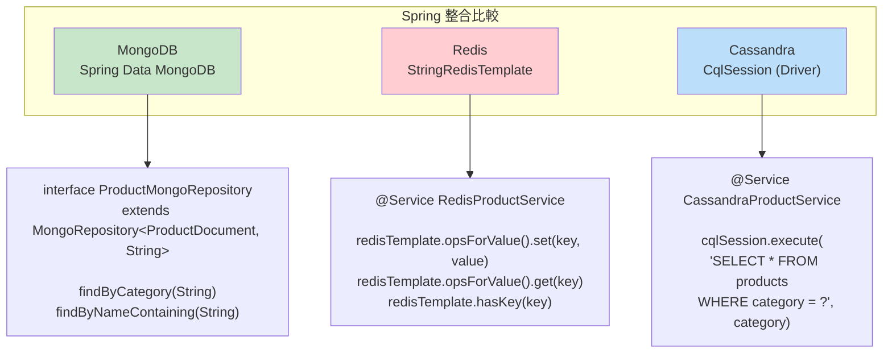

**MongoDB** — 宣告式 Repository，自動生成查詢：

```java
public interface ProductMongoRepository extends MongoRepository<ProductDocument, String> {
    List<ProductDocument> findByCategory(String category);
    List<ProductDocument> findByNameContaining(String keyword);
}
```

**Redis** — 程式化操作，Key-Value 語義：

```java
@Service
public class RedisProductService {
    private final StringRedisTemplate redisTemplate;

    public void save(String key, String value) {
        redisTemplate.opsForValue().set(key, value);
    }

    public String findByKey(String key) {
        return redisTemplate.opsForValue().get(key);
    }
}
```

**Cassandra** — CQL 語句，類似 SQL 但受限更多：

```java
@Service
public class CassandraProductService {
    private final CqlSession cqlSession;

    public List<Row> findByCategory(String category) {
        ResultSet rs = cqlSession.execute(SimpleStatement.newInstance(
                "SELECT * FROM products WHERE category = ?",
                category));
        return rs.all();
    }
}
```

---

## 5. 一致性模型比較

### 5.1 三者的一致性保證

| 面向 | MongoDB | Redis | Cassandra |
|------|---------|-------|-----------|
| **預設一致性** | 強一致性 (Primary 讀寫) | 最終一致性 | 最終一致性 |
| **複製方式** | 同步 (majority) 或非同步 | 非同步複製 | 可調 Quorum |
| **調控機制** | Write Concern + Read Concern | 無 (固定非同步) | Consistency Level |
| **交易支援** | 多文件 ACID (4.0+) | MULTI/EXEC (限單節點) | 輕量交易 (LWT) |
| **衝突解決** | 單 Primary 無寫入衝突 | Last Write Wins | Last Write Wins / LWT |

### 5.2 MongoDB 的可調一致性

MongoDB 透過 **Write Concern** 和 **Read Concern** 組合，讓你精細控制一致性等級：

```java
// 金融交易場景：強一致性
@Service
public class FinancialProductService {

    private final MongoTemplate mongoTemplate;

    public void updateFundNav(String fundId, BigDecimal newNav) {
        // Write Concern: majority — 寫入多數節點才確認
        mongoTemplate.setWriteConcern(WriteConcern.MAJORITY);
        mongoTemplate.updateFirst(
            Query.query(Criteria.where("_id").is(fundId)),
            Update.update("price", newNav)
                   .push("nav_history", new NavEntry(LocalDate.now(), newNav)),
            ProductDocument.class
        );
    }

    public ProductDocument getFundInfo(String fundId) {
        // Read Concern: majority — 只讀取已被多數節點確認的資料
        Query query = Query.query(Criteria.where("_id").is(fundId))
            .withReadConcern(ReadConcern.MAJORITY);
        return mongoTemplate.findOne(query, ProductDocument.class);
    }
}
```

### 5.3 Redis 的非同步複製

Redis 採用 **非同步複製** — Master 寫入後立即回傳成功，再非同步同步到 Replica：

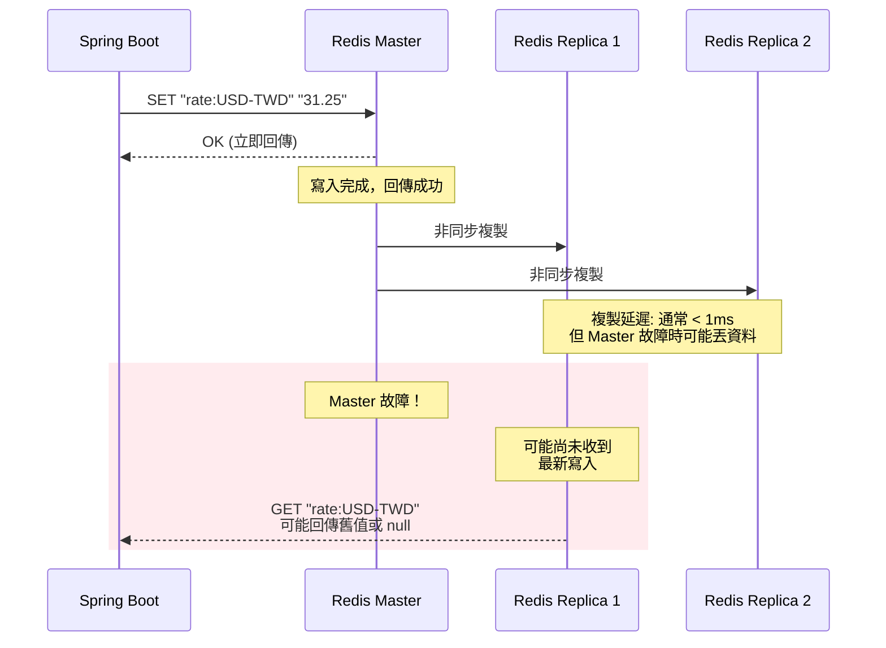

> **金融場景風險**：如果你用 Redis 儲存即時匯率，Master 故障時 Replica 可能回傳過時的匯率。這在大多數場景可接受（因為匯率本身就在變動），但不能用於結帳定價。

### 5.4 Cassandra 的可調一致性

Cassandra 使用 **Consistency Level** 控制每次讀寫需要多少節點參與：

```
Consistency Level    | 節點數 (3 節點叢集)    | 效果
─────────────────────┼──────────────────────┼────────────────
ONE                  | 1 個節點確認           | 最快，但可能讀到舊資料
QUORUM               | 2 個節點確認 (多數)    | 平衡速度與一致性
ALL                  | 3 個節點全部確認       | 最慢，強一致性
LOCAL_QUORUM         | 本地資料中心多數       | 跨資料中心場景
```

```java
// Cassandra: 調整一致性等級
SimpleStatement statement = SimpleStatement.newInstance(
    "SELECT * FROM products WHERE category = ?", "electronics")
    .setConsistencyLevel(ConsistencyLevel.QUORUM);  // 多數節點確認

cqlSession.execute(statement);
```

### 5.5 一致性模型視覺化

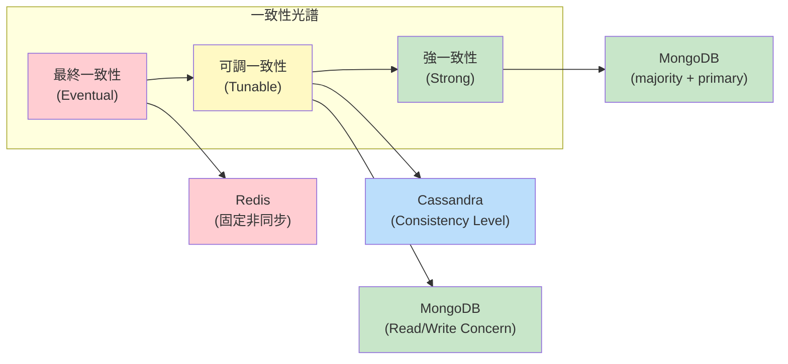

---

## 6. 效能特性比較

### 6.1 延遲特性

| 操作 | MongoDB | Redis | Cassandra |
|------|---------|-------|-----------|
| **點查詢 (by ID/Key)** | 0.5 - 2 ms | 0.1 - 0.5 ms | 1 - 5 ms |
| **範圍查詢 (100 筆)** | 2 - 10 ms | N/A (不支援) | 5 - 20 ms |
| **單筆寫入** | 1 - 5 ms | 0.1 - 0.5 ms | 1 - 3 ms |
| **批量寫入 (1000 筆)** | 10 - 50 ms | 5 - 20 ms (Pipeline) | 10 - 30 ms |
| **聚合查詢** | 10 - 1000 ms (依複雜度) | N/A | 有限支援 |

> **註**: 以上數據為典型值，實際效能受硬體、網路、資料量、索引設計等因素影響。

### 6.2 吞吐量特性

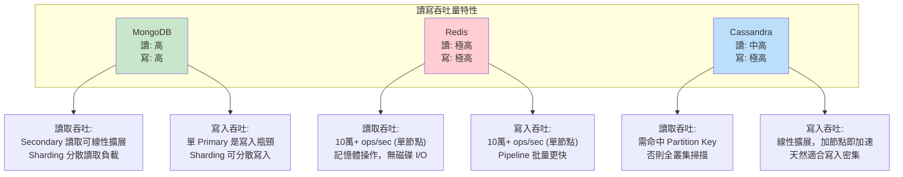

### 6.3 讀寫模式適配

| 工作負載類型 | 最佳選擇 | 原因 |
|-------------|---------|------|
| **讀多寫少** (95/5) | MongoDB | 靈活查詢 + Secondary 讀取分散負載 |
| **寫多讀少** (20/80) | Cassandra | 線性寫入擴展，追加寫入最佳化 |
| **讀寫均衡** (50/50) | MongoDB / Cassandra | 依查詢複雜度決定 |
| **極低延遲** (< 1ms) | Redis | 記憶體操作，亞毫秒回應 |
| **大量即時寫入** | Cassandra | 無鎖寫入，線性擴展 |
| **複雜查詢 + 聚合** | MongoDB | 聚合管線，ad-hoc 查詢 |

### 6.4 金融場景延遲分析

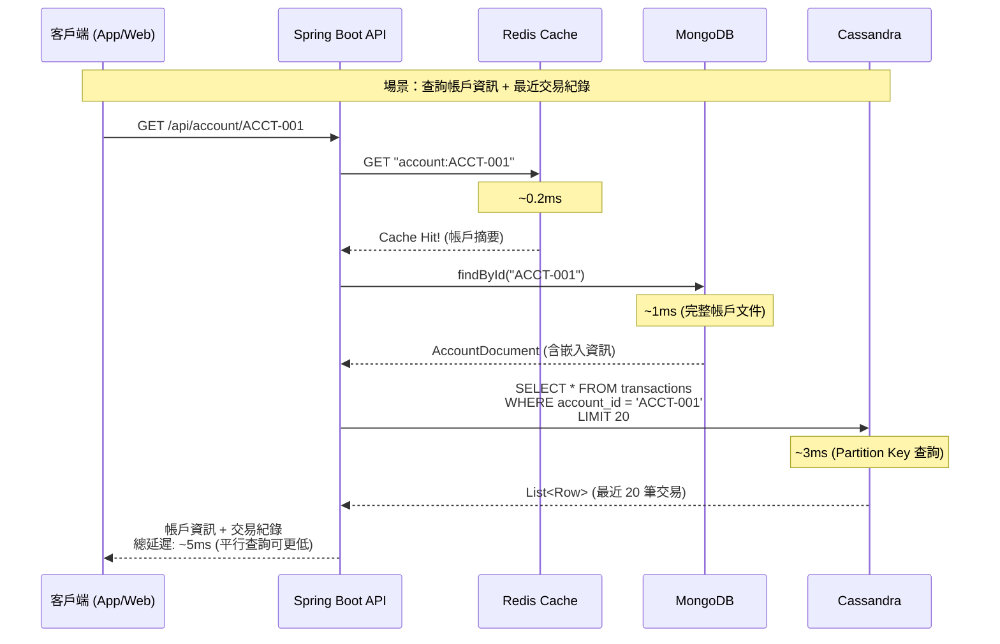

---

## 7. 選型決策矩陣

### 7.1 場景對應表

| 你的需求是... | 選 MongoDB | 選 Redis | 選 Cassandra |
|-------------|-----------|---------|-------------|
| 靈活查詢，不確定未來查詢模式 | **首選** | 不適合 | 不適合 |
| 極低延遲 (< 1ms) | 不夠快 | **首選** | 不夠快 |
| 海量寫入 (> 10 萬/秒) | 可以 | 可以 (記憶體限制) | **首選** |
| 複雜聚合分析 | **首選** | 不支援 | 有限 |
| 快取 / Session | 可以但非最佳 | **首選** | 不適合 |
| 時序資料 (IoT / 日誌) | 可以 | 不適合 | **首選** |
| 文件結構多變 | **首選** | 不在意結構 | 不適合 |
| 多資料中心部署 | 支援 | 支援 (Enterprise) | **首選** |

### 7.2 組合使用建議

在實際金融系統中，三者經常組合使用：

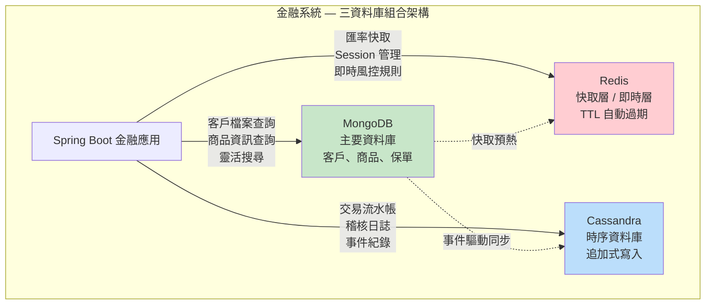

### 7.3 決策流程圖

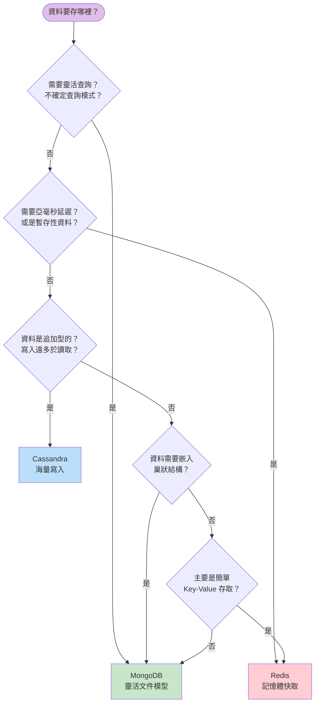

### 7.4 不要這樣選

| 錯誤選擇 | 原因 | 正確做法 |
|---------|------|---------|
| 用 Redis 當主資料庫 | 記憶體昂貴、重啟可能丟資料 | Redis 做快取，MongoDB/RDB 做持久化 |
| 用 Cassandra 做即席查詢 | 沒有 Partition Key 就沒有好效能 | 用 MongoDB 做靈活查詢 |
| 用 MongoDB 做高頻率計數器 | 頻繁 inc 操作在高並行下有鎖競爭 | 用 Redis INCR 或 Cassandra Counter |
| 用 Redis 做大量資料儲存 | 10GB 資料需要 10GB 記憶體 | 用 MongoDB 或 Cassandra |
| 用 Cassandra 存小量關聯資料 | 殺雞用牛刀，運維複雜度高 | 用 PostgreSQL 或 MongoDB |

### 7.5 給 Spring 開發者的心法

> **MongoDB 是你的「萬能工具箱」** — 大多數場景都能勝任，查詢靈活度最接近 RDB。
>
> **Redis 是你的「加速器」** — 放在任何資料庫前面都能提速，但不要讓它獨自承擔持久化責任。
>
> **Cassandra 是你的「寫入引擎」** — 當你的資料像河流一樣不斷湧入時，Cassandra 是最佳選擇。
>
> **三者不是互相取代的關係，而是互補的關係。** 在真實的金融系統中，你很可能會同時使用至少兩種。

---

## 延伸閱讀

- [MongoDB vs Redis vs Cassandra: A Comparison](https://www.mongodb.com/compare)
- [Redis Persistence Explained](https://redis.io/docs/management/persistence/)
- [Cassandra Data Modeling Best Practices](https://cassandra.apache.org/doc/latest/cassandra/data_modeling/)
- [Spring Data - Multiple Database Support](https://docs.spring.io/spring-data/)

---

> **上一篇**: [M02-DOC-01: NoSQL 四大類型全景圖](./M02-DOC-01-nosql-four-types.md)
> **下一篇**: [M02-DOC-03: 金融場景 Polyglot Persistence 架構](./M02-DOC-03-polyglot-persistence.md)
