# M02-DOC-03: 金融場景 Polyglot Persistence 架構

> **模組**: M02 - NoSQL 資料庫全景
> **對象**: 具備 RDB 經驗的 Java Spring 開發者
> **目標**: 理解 Polyglot Persistence 的設計原則，掌握 Cache-Aside 模式，並學會在金融場景中正確搭配多種資料庫

---

## 目錄

1. [Polyglot Persistence 的定義與原則](#1-polyglot-persistence-的定義與原則)
2. [金融業務場景拆解](#2-金融業務場景拆解)
3. [每個場景的資料庫選型](#3-每個場景的資料庫選型)
4. [Cache-Aside Pattern 深入解析](#4-cache-aside-pattern-深入解析)
5. [M02 CacheAsideService 實作解析](#5-m02-cacheasideservice-實作解析)
6. [金融 Polyglot 完整架構圖](#6-金融-polyglot-完整架構圖)
7. [實作考量](#7-實作考量)
8. [Anti-Patterns：過度使用 Polyglot 的風險](#8-anti-patterns過度使用-polyglot-的風險)

---

## 1. Polyglot Persistence 的定義與原則

### 1.1 什麼是 Polyglot Persistence？

**Polyglot Persistence（多語言持久化）** 是一種架構策略：**根據不同資料的特性和存取模式，選擇最適合的資料庫**，而非用單一資料庫處理所有場景。

這個概念由 Martin Fowler 在 2011 年提出，靈感來自「Polyglot Programming（多語言程式設計）」— 就像我們不會只用一種程式語言寫所有東西，我們也不應該只用一種資料庫儲存所有資料。

### 1.2 核心原則

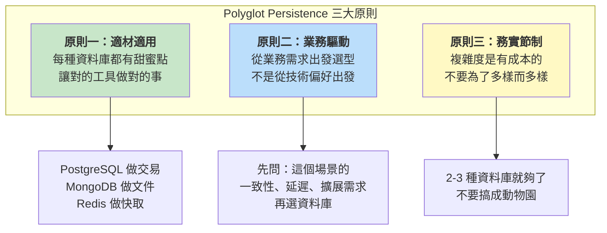

### 1.3 從單體到 Polyglot 的演進

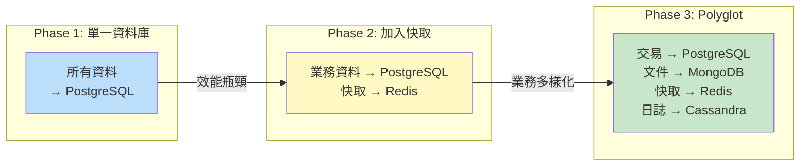

> **重要提醒**：大部分 Spring Boot 應用從 Phase 1 開始就好。只在有明確需求時才演進到 Phase 2 或 Phase 3。過早引入 Polyglot 是常見的反模式。

---

## 2. 金融業務場景拆解

### 2.1 典型金融機構的業務場景

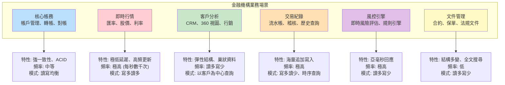

### 2.2 各場景的資料特性分析

| 場景 | 資料結構 | 一致性需求 | 延遲要求 | 資料量 | 讀寫比 |
|------|---------|-----------|---------|--------|--------|
| **核心帳務** | 高度結構化 | 強一致性 | < 50ms | 中 (GB) | 50:50 |
| **即時行情** | 簡單 Key-Value | 最終一致性 | < 1ms | 小 (MB) | 20:80 |
| **客戶分析** | 半結構化文件 | 最終一致性 | < 100ms | 大 (TB) | 90:10 |
| **交易紀錄** | 時序、追加 | 最終一致性 | < 50ms | 極大 (PB) | 10:90 |
| **風控引擎** | 規則 + 狀態 | 混合 | < 5ms | 小 (MB) | 80:20 |
| **文件管理** | 非結構化 | 最終一致性 | < 500ms | 中 (GB) | 95:5 |

---

## 3. 每個場景的資料庫選型

### 3.1 核心帳務 -- PostgreSQL

**選型理由**: 強一致性 ACID 交易，複雜多表 JOIN，外鍵約束保護資料完整性。

```java
// PostgreSQL + Spring Data JPA
@Entity
@Table(name = "accounts")
public class Account {
    @Id
    @GeneratedValue(strategy = GenerationType.IDENTITY)
    private Long id;

    @Column(nullable = false, unique = true)
    private String accountNumber;

    @Column(nullable = false, precision = 15, scale = 2)
    private BigDecimal balance;

    @Enumerated(EnumType.STRING)
    private AccountStatus status;

    @ManyToOne(fetch = FetchType.LAZY)
    @JoinColumn(name = "customer_id")
    private Customer customer;
}

@Service
@Transactional
public class CoreBankingService {

    public TransferResult transfer(String from, String to, BigDecimal amount) {
        Account debit = accountRepo.findByAccountNumberForUpdate(from);
        Account credit = accountRepo.findByAccountNumberForUpdate(to);

        if (debit.getBalance().compareTo(amount) < 0) {
            throw new InsufficientFundsException();
        }

        debit.setBalance(debit.getBalance().subtract(amount));
        credit.setBalance(credit.getBalance().add(amount));

        accountRepo.save(debit);
        accountRepo.save(credit);
        return TransferResult.success();
    }
}
```

### 3.2 客戶 CRM -- MongoDB

**選型理由**: 半結構化文件、嵌入式巢狀結構、Schema 靈活可快速迭代。

```java
// MongoDB + Spring Data MongoDB
@Document(collection = "customer_profiles")
public class CustomerProfile {
    @Id
    private String id;
    private String customerId;
    private String name;

    // 嵌入式地址 — 不需要另一個 collection
    private List<Address> addresses;

    // 彈性欄位 — 不同客群有不同標籤
    private Map<String, Object> tags;

    // 嵌入式互動紀錄 — 最近 50 筆
    private List<Interaction> recentInteractions;

    // 計算欄位 (反正規化)
    private BigDecimal estimatedLifetimeValue;
}

// 一次查詢取得客戶 360 度視圖 — 無需 JOIN
public CustomerProfile getCustomer360(String customerId) {
    return mongoTemplate.findOne(
        Query.query(Criteria.where("customerId").is(customerId)),
        CustomerProfile.class
    );
}
```

### 3.3 即時行情 / 快取 -- Redis

**選型理由**: 亞毫秒延遲、TTL 自動過期、Pub/Sub 即時推送。

```java
// Redis + StringRedisTemplate
@Service
public class MarketDataService {

    private final StringRedisTemplate redisTemplate;

    // 更新匯率 — 每秒數千次
    public void updateExchangeRate(String pair, BigDecimal rate) {
        String key = "rate:" + pair;
        redisTemplate.opsForValue().set(key, rate.toPlainString());
        redisTemplate.expire(key, Duration.ofSeconds(30)); // 30 秒後過期

        // Pub/Sub 通知所有訂閱者
        redisTemplate.convertAndSend("market-updates", pair + ":" + rate);
    }

    // 讀取匯率 — 亞毫秒回應
    public BigDecimal getExchangeRate(String pair) {
        String value = redisTemplate.opsForValue().get("rate:" + pair);
        return value != null ? new BigDecimal(value) : null;
    }

    // Session 管理
    public void createSession(String sessionId, String userData) {
        redisTemplate.opsForValue().set(
            "session:" + sessionId, userData,
            Duration.ofMinutes(30)  // 30 分鐘過期
        );
    }
}
```

### 3.4 交易紀錄 -- Cassandra

**選型理由**: 海量追加寫入、時序查詢、線性擴展、多資料中心複製。

```cql
-- Cassandra Schema: 以帳戶 ID 為 Partition Key，時間戳為 Clustering Key
CREATE TABLE transaction_log (
    account_id TEXT,
    timestamp TIMESTAMP,
    transaction_id UUID,
    type TEXT,
    amount DECIMAL,
    balance_after DECIMAL,
    description TEXT,
    PRIMARY KEY (account_id, timestamp)
) WITH CLUSTERING ORDER BY (timestamp DESC);

-- 查詢某帳戶最近 30 天交易
SELECT * FROM transaction_log
WHERE account_id = 'ACCT-001'
  AND timestamp > '2024-01-01'
LIMIT 100;
```

```java
@Service
public class TransactionLogService {

    private final CqlSession cqlSession;

    // 寫入交易紀錄 — 追加式寫入
    public void logTransaction(String accountId, String type,
                                BigDecimal amount, BigDecimal balanceAfter) {
        cqlSession.execute(SimpleStatement.newInstance(
            "INSERT INTO transaction_log " +
            "(account_id, timestamp, transaction_id, type, amount, balance_after) " +
            "VALUES (?, toTimestamp(now()), uuid(), ?, ?, ?)",
            accountId, type, amount, balanceAfter));
    }

    // 查詢交易紀錄 — Partition Key 查詢
    public List<Row> getRecentTransactions(String accountId, int limit) {
        return cqlSession.execute(SimpleStatement.newInstance(
            "SELECT * FROM transaction_log WHERE account_id = ? LIMIT ?",
            accountId, limit)).all();
    }
}
```

---

## 4. Cache-Aside Pattern 深入解析

### 4.1 什麼是 Cache-Aside？

**Cache-Aside（旁路快取）** 是最常見的快取策略，也叫 **Lazy Loading**。核心邏輯：

1. **讀取時**：先查快取，命中就直接回傳；未命中就查資料庫，回傳結果並寫入快取
2. **寫入時**：先寫資料庫，再失效快取（而非更新快取）

### 4.2 Cache Miss 流程

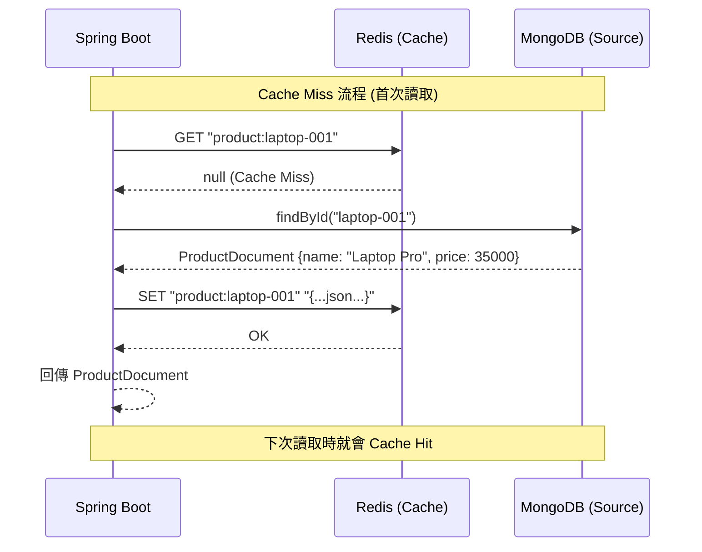

### 4.3 Cache Hit 流程

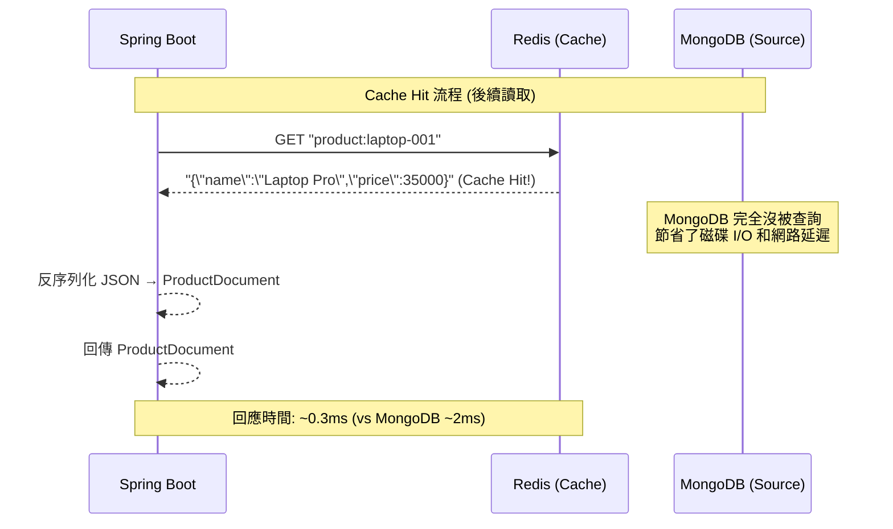

### 4.4 寫入失效流程

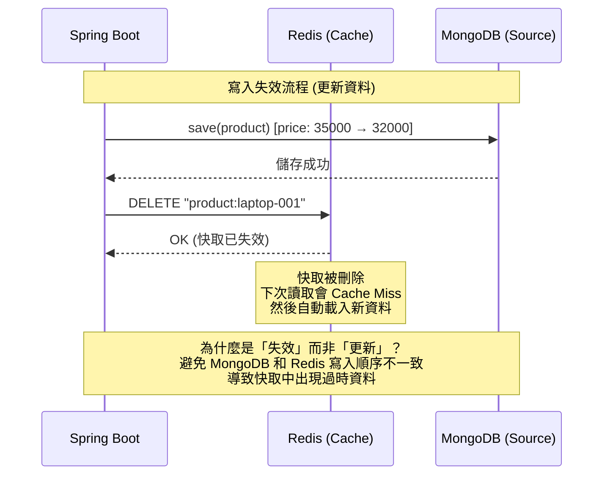

### 4.5 為什麼是「失效」而非「更新」？

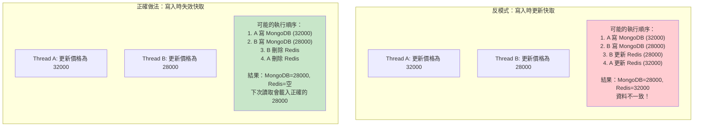

---

## 5. M02 CacheAsideService 實作解析

### 5.1 完整原始碼

以下是 M02 實驗中的 `CacheAsideService`，實作了完整的 Cache-Aside 模式：

```java
@Service
public class CacheAsideService {

    private static final String CACHE_PREFIX = "product:";

    private final ProductMongoRepository mongoRepository;
    private final StringRedisTemplate redisTemplate;
    private final ObjectMapper objectMapper;

    public CacheAsideService(ProductMongoRepository mongoRepository,
                             StringRedisTemplate redisTemplate) {
        this.mongoRepository = mongoRepository;
        this.redisTemplate = redisTemplate;
        this.objectMapper = new ObjectMapper();
    }

    /**
     * 讀取：Cache-Aside 核心邏輯
     * 1. 先查 Redis 快取
     * 2. Cache Miss → 查 MongoDB
     * 3. 回填快取
     */
    public ProductDocument findById(String id) {
        String cacheKey = CACHE_PREFIX + id;

        // Step 1: 查 Redis
        String cached = redisTemplate.opsForValue().get(cacheKey);
        if (cached != null) {
            return deserialize(cached);  // Cache Hit — 直接回傳
        }

        // Step 2: Cache Miss — 查 MongoDB
        ProductDocument product = mongoRepository.findById(id).orElse(null);
        if (product != null) {
            // Step 3: 回填快取
            redisTemplate.opsForValue().set(cacheKey, serialize(product));
        }
        return product;
    }

    /**
     * 寫入：先寫 MongoDB，再失效 Redis 快取
     */
    public ProductDocument save(ProductDocument product) {
        // Step 1: 寫入 MongoDB (Source of Truth)
        ProductDocument saved = mongoRepository.save(product);
        // Step 2: 失效快取 (不是更新！)
        redisTemplate.delete(CACHE_PREFIX + saved.getId());
        return saved;
    }

    /**
     * 檢查是否已快取
     */
    public boolean isCached(String id) {
        return Boolean.TRUE.equals(redisTemplate.hasKey(CACHE_PREFIX + id));
    }

    private String serialize(ProductDocument product) {
        try {
            return objectMapper.writeValueAsString(product);
        } catch (JsonProcessingException e) {
            throw new RuntimeException("Failed to serialize product", e);
        }
    }

    private ProductDocument deserialize(String json) {
        try {
            return objectMapper.readValue(json, ProductDocument.class);
        } catch (JsonProcessingException e) {
            throw new RuntimeException("Failed to deserialize product", e);
        }
    }
}
```

### 5.2 測試案例解析

M02 實驗包含三個測試案例，驗證 Cache-Aside 的完整行為：

**測試一：Cache Miss — 首次讀取**

```java
@Test
@DisplayName("Cache miss: fetch from MongoDB and populate Redis")
void cacheMissFetchesFromMongoAndCaches() {
    // Given: 產品只存在 MongoDB 中
    var product = mongoRepository.save(
            new ProductDocument("Laptop Pro", "electronics", new BigDecimal("35000")));
    assertThat(cacheAsideService.isCached(product.getId())).isFalse();

    // When: 透過 Cache-Aside 讀取
    ProductDocument result = cacheAsideService.findById(product.getId());

    // Then: 產品被回傳，且已被快取
    assertThat(result).isNotNull();
    assertThat(result.getName()).isEqualTo("Laptop Pro");
    assertThat(cacheAsideService.isCached(product.getId())).isTrue();
}
```

**測試二：Cache Hit — 快取命中**

```java
@Test
@DisplayName("Cache hit: return from Redis without hitting MongoDB")
void cacheHitReturnsFromRedis() {
    // Given: 產品已被快取 (透過首次讀取)
    var product = mongoRepository.save(
            new ProductDocument("Laptop Pro", "electronics", new BigDecimal("35000")));
    cacheAsideService.findById(product.getId()); // 預熱快取

    // When: 從 MongoDB 刪除 (模擬 MongoDB 不可用)
    mongoRepository.deleteById(product.getId());

    // Then: 仍然從快取回傳
    ProductDocument cached = cacheAsideService.findById(product.getId());
    assertThat(cached).isNotNull();
    assertThat(cached.getName()).isEqualTo("Laptop Pro");
}
```

**測試三：寫入失效 — 更新後快取被清除**

```java
@Test
@DisplayName("Write invalidation: update MongoDB and invalidate Redis cache")
void writeInvalidatesCacheOnUpdate() {
    // Given: 產品已被快取
    var product = mongoRepository.save(
            new ProductDocument("Laptop Pro", "electronics", new BigDecimal("35000")));
    cacheAsideService.findById(product.getId()); // 預熱快取
    assertThat(cacheAsideService.isCached(product.getId())).isTrue();

    // When: 透過 Cache-Aside 更新
    product.setPrice(new BigDecimal("32000"));
    cacheAsideService.save(product);

    // Then: 快取被失效
    assertThat(cacheAsideService.isCached(product.getId())).isFalse();

    // And: 下次讀取會從 MongoDB 載入新資料
    ProductDocument updated = cacheAsideService.findById(product.getId());
    assertThat(updated.getPrice()).isEqualByComparingTo(new BigDecimal("32000"));
    assertThat(cacheAsideService.isCached(product.getId())).isTrue();
}
```

### 5.3 金融場景的 Cache-Aside 增強版

在生產環境中，Cache-Aside 需要更多防護機制：

```java
@Service
public class EnhancedCacheAsideService {

    private static final String CACHE_PREFIX = "product:";
    private static final Duration CACHE_TTL = Duration.ofMinutes(30);
    private static final String NULL_SENTINEL = "__NULL__";

    private final ProductMongoRepository mongoRepository;
    private final StringRedisTemplate redisTemplate;
    private final ObjectMapper objectMapper;

    public ProductDocument findById(String id) {
        String cacheKey = CACHE_PREFIX + id;

        String cached = redisTemplate.opsForValue().get(cacheKey);

        // 防止快取穿透 (Cache Penetration)
        // 如果之前查過且 MongoDB 中不存在，快取一個 null 標記
        if (NULL_SENTINEL.equals(cached)) {
            return null;
        }

        if (cached != null) {
            return deserialize(cached);
        }

        // Cache Miss — 加分散式鎖防止快取擊穿 (Cache Stampede)
        String lockKey = "lock:" + cacheKey;
        Boolean locked = redisTemplate.opsForValue()
            .setIfAbsent(lockKey, "1", Duration.ofSeconds(10));

        if (Boolean.TRUE.equals(locked)) {
            try {
                // 雙重檢查：另一個執行緒可能已經填充了快取
                cached = redisTemplate.opsForValue().get(cacheKey);
                if (cached != null && !NULL_SENTINEL.equals(cached)) {
                    return deserialize(cached);
                }

                ProductDocument product = mongoRepository.findById(id).orElse(null);
                if (product != null) {
                    // 加入 TTL 防止快取雪崩 (Cache Avalanche)
                    // 加入隨機偏移，避免大量快取同時過期
                    Duration ttl = CACHE_TTL.plusSeconds(
                        ThreadLocalRandom.current().nextInt(0, 300));
                    redisTemplate.opsForValue().set(cacheKey, serialize(product), ttl);
                } else {
                    // 快取 null 結果，防止反覆查詢不存在的 ID
                    redisTemplate.opsForValue().set(cacheKey, NULL_SENTINEL,
                        Duration.ofMinutes(5));
                }
                return product;
            } finally {
                redisTemplate.delete(lockKey);
            }
        } else {
            // 沒拿到鎖，短暫等待後重試
            try { Thread.sleep(50); } catch (InterruptedException ignored) {}
            return findById(id); // 重試
        }
    }
}
```

---

## 6. 金融 Polyglot 完整架構圖

### 6.1 整體架構

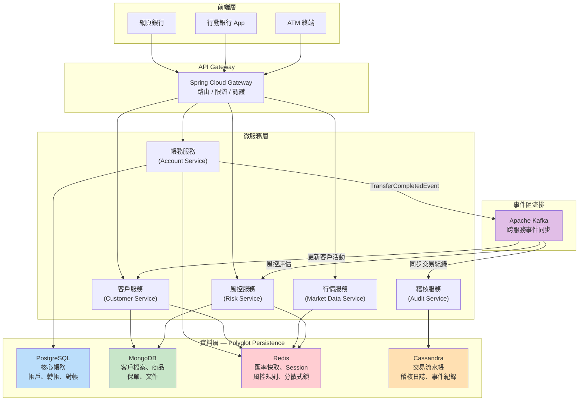

### 6.2 資料流動圖

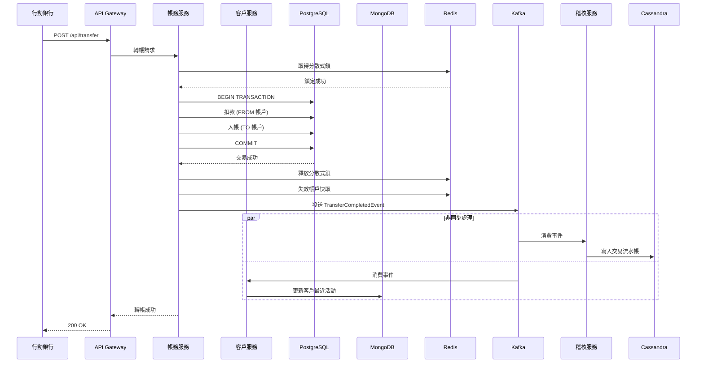

### 6.3 各資料庫的職責邊界

| 資料庫 | 職責 | 不該做的事 |
|--------|------|-----------|
| **PostgreSQL** | 帳戶餘額、轉帳交易、對帳、法規報表 | 儲存非結構化文件、高頻率快取 |
| **MongoDB** | 客戶檔案、商品目錄、保單文件、CRM | 替代 PostgreSQL 做核心帳務 |
| **Redis** | 匯率快取、Session、分散式鎖、風控規則 | 作為主要持久化儲存 |
| **Cassandra** | 交易流水帳、稽核日誌、事件紀錄 | 即席查詢、複雜聚合分析 |

---

## 7. 實作考量

### 7.1 資料一致性

Polyglot 架構中最大的挑戰是跨資料庫的資料一致性。

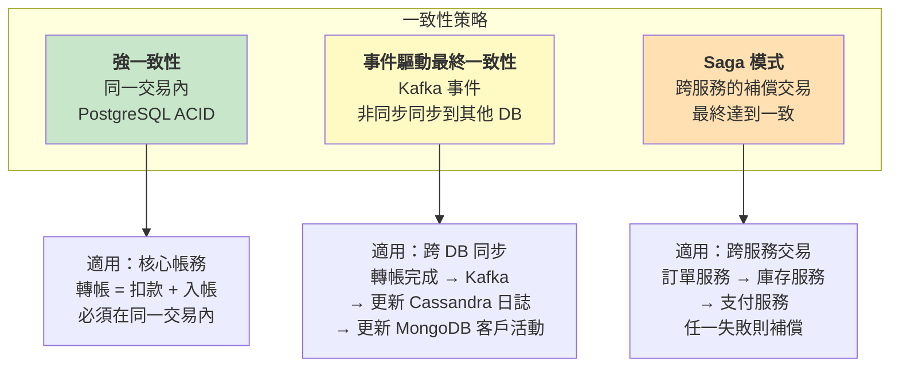

**實務建議**：

```
Rule 1: 同一個微服務內，盡量只用一個主資料庫 + Redis 快取
Rule 2: 跨微服務的資料同步，用事件驅動 (Kafka)
Rule 3: 需要強一致性的操作，限制在同一個 PostgreSQL 交易中
Rule 4: 接受最終一致性的場景（稽核、分析），用非同步事件同步
```

### 7.2 運維複雜度

| 考量 | 單一 DB | 2 種 DB | 3 種 DB | 4+ 種 DB |
|------|--------|---------|---------|----------|
| **部署複雜度** | 低 | 中 | 高 | 很高 |
| **監控面板** | 1 個 | 2 個 | 3 個 | N 個 |
| **備份策略** | 統一 | 分別制定 | 分別制定 | 分別制定 |
| **故障排查** | 單點 | 需判斷哪個 DB | 交叉排查 | 極度困難 |
| **團隊技能** | 專精 1 種 | 至少 2 種 | 至少 3 種 | 稀有人才 |
| **DevOps 需求** | 低 | 中 | 高 | 極高 |

**Spring Boot 中的多資料庫配置**：

```yaml
# application.yml — Polyglot 配置
spring:
  datasource:
    url: jdbc:postgresql://pg-primary:5432/banking
    username: ${PG_USER}
    password: ${PG_PASSWORD}
  data:
    mongodb:
      uri: mongodb://mongo-rs1:27017,mongo-rs2:27017/banking?replicaSet=rs0
    redis:
      host: redis-primary
      port: 6379
      password: ${REDIS_PASSWORD}

# Cassandra 需要額外配置
cassandra:
  contact-points: cass-node1,cass-node2,cass-node3
  local-datacenter: dc1
  keyspace: banking_audit
```

### 7.3 團隊技能

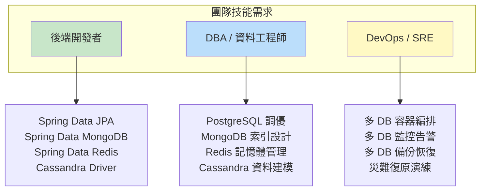

> **務實建議**：如果你的團隊只有 5 個人，Polyglot 的上限大概是 2 種資料庫 (PostgreSQL + MongoDB 或 PostgreSQL + Redis)。每多一種資料庫，就需要至少一個人深入了解它。

---

## 8. Anti-Patterns：過度使用 Polyglot 的風險

### 8.1 Anti-Pattern 清單

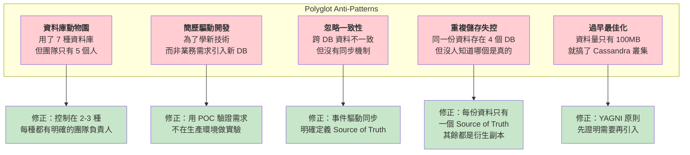

### 8.2 Anti-Pattern 1：資料庫動物園

```
錯誤場景：
  一個中小型金融科技公司 (FinTech Startup)
  團隊 8 人
  使用了：PostgreSQL, MongoDB, Redis, Cassandra, Neo4j,
          Elasticsearch, InfluxDB

結果：
  - 每個 DB 都沒有人真正精通
  - 故障排查耗時 3 倍
  - 運維成本失控
  - 資料一致性問題頻發

正確做法：
  PostgreSQL (核心業務)
  + Redis (快取)
  + MongoDB (文件/CRM)  ← 只在確實需要時才加
  = 3 種，足以覆蓋 90% 場景
```

### 8.3 Anti-Pattern 2：忽略 Source of Truth

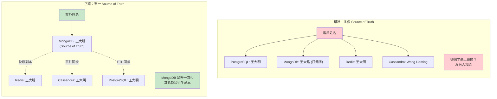

### 8.4 健康的 Polyglot 架構檢查清單

```
評估你的 Polyglot 架構是否健康：

  [x] 每種資料庫都有明確的職責邊界
  [x] 每份資料都有唯一的 Source of Truth
  [x] 跨 DB 資料同步有明確的機制 (事件驅動 / ETL)
  [x] 團隊中每種 DB 至少有一個熟悉的人
  [x] 有統一的監控和告警機制
  [x] 有各 DB 的備份和災難復原計畫
  [x] 新增一種 DB 需要經過架構評審
  [x] 有文件記錄每種 DB 的選型理由

  如果你有 3 項以上沒打勾，
  先停下來整頓現有架構，不要再加新的 DB。
```

### 8.5 給 Spring 開發者的 Polyglot 起步建議

> **Step 1**: 用 PostgreSQL 跑起來
> - 所有業務都先用 PostgreSQL
> - 這是你的安全底線
>
> **Step 2**: 引入 Redis 做快取
> - 這幾乎沒有爭議，Redis 快取是標配
> - 用 Cache-Aside 模式（就像 M02 實驗那樣）
> - `spring-boot-starter-data-redis` 就搞定
>
> **Step 3**: 評估是否需要 MongoDB
> - 如果你有「文件型資料」或「彈性 Schema 需求」
> - 用 M02 的評估方法分析場景
> - `spring-boot-starter-data-mongodb` 加入
>
> **Step 4**: 評估是否需要 Cassandra
> - 只有在「海量時序寫入」場景才考慮
> - 大多數團隊不需要 Cassandra
> - 如果只是日誌，MongoDB TTL Collection 可能就夠了
>
> **記住：每多一種資料庫，運維複雜度不是線性增長，而是指數增長。**

---

## 延伸閱讀

- [Martin Fowler: Polyglot Persistence](https://martinfowler.com/bliki/PolyglotPersistence.html)
- [Cache-Aside Pattern - Microsoft](https://learn.microsoft.com/en-us/azure/architecture/patterns/cache-aside)
- [Designing Data-Intensive Applications (Martin Kleppmann)](https://dataintensive.net/)
- [Spring Data - Multi-Store Support](https://docs.spring.io/spring-data/)
- [Netflix: Polyglot Persistence at Scale](https://netflixtechblog.com/)

---

> **上一篇**: [M02-DOC-02: MongoDB vs Redis vs Cassandra 深度比較](./M02-DOC-02-mongodb-vs-redis-vs-cassandra.md)
> **下一篇**: M03 - MongoDB 環境建置與基礎操作
