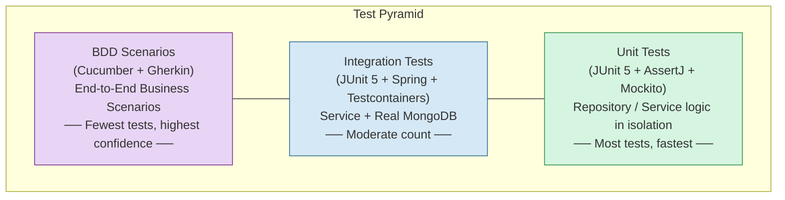
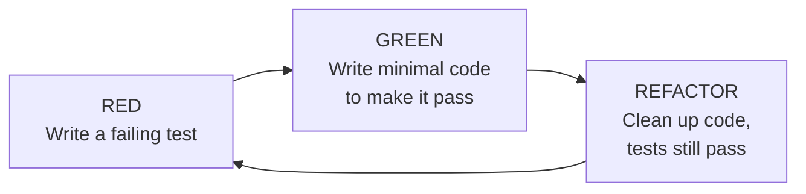
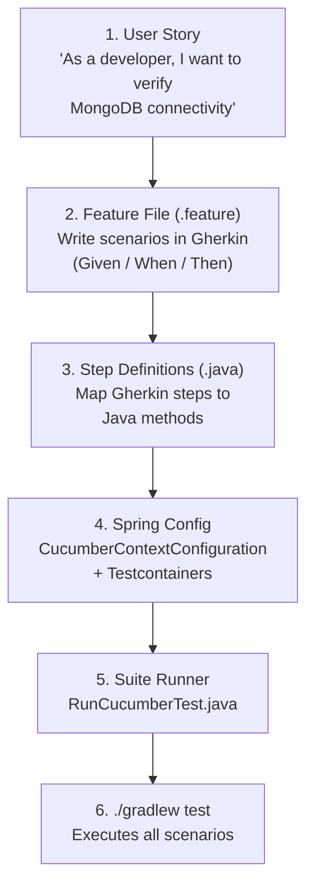
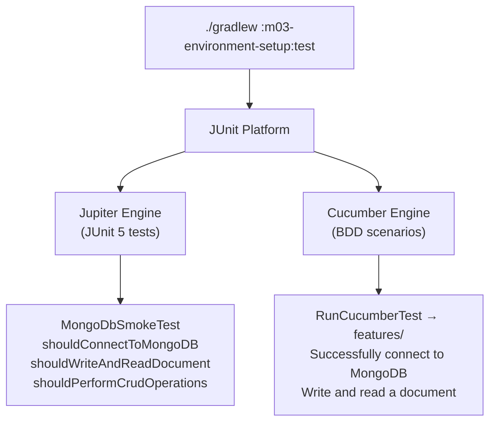
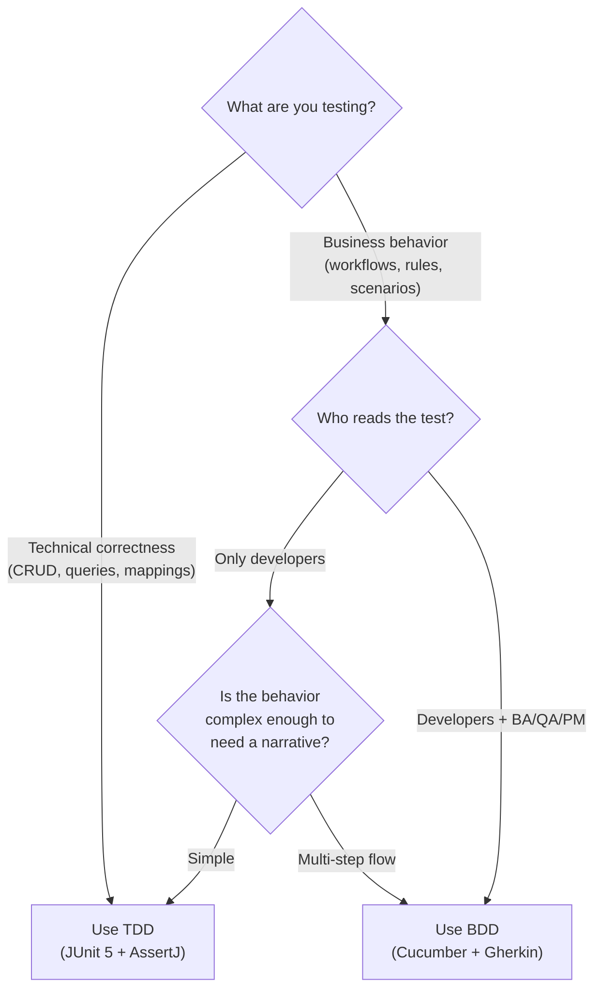
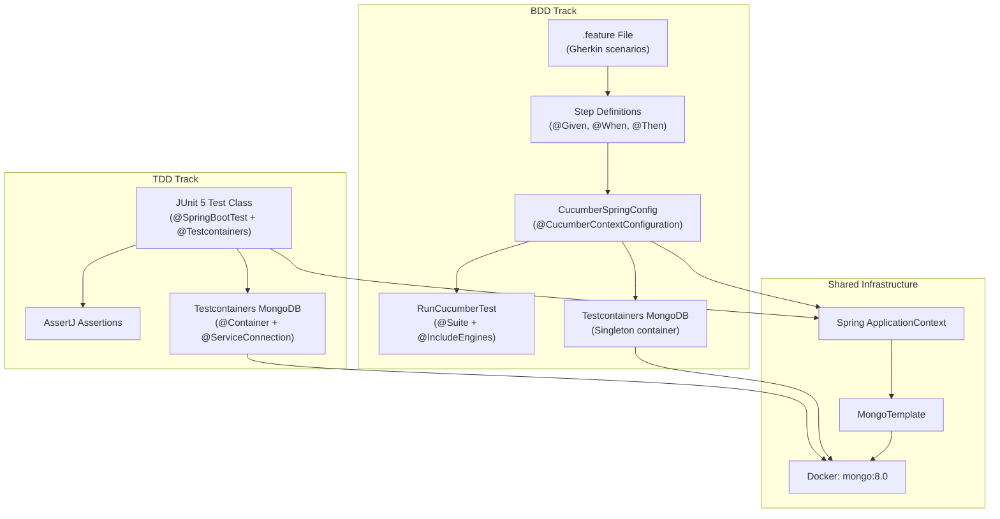

# BDD + TDD Dual-Track Testing Workflow

## Overview

This project uses two complementary testing approaches:

- **TDD (Test-Driven Development)** with JUnit 5 + AssertJ for developer-facing tests that verify
  technical correctness at the unit and integration level.
- **BDD (Behavior-Driven Development)** with Cucumber + Gherkin for stakeholder-facing tests that
  verify business scenarios in plain English.

Both tracks run on the **JUnit 5 Platform**, which means `./gradlew test` executes everything --
JUnit tests and Cucumber scenarios -- in a single pass.

---

## The Test Pyramid



| Layer | Framework | What It Tests | Speed | Count |
|---|---|---|---|---|
| **Unit** | JUnit 5 + AssertJ (+ Mockito) | Repository methods, domain logic, mappings | Fast (no DB) | Many |
| **Integration** | JUnit 5 + Spring Boot + Testcontainers | Service layer with a real MongoDB container | Medium (~3-5s container startup) | Moderate |
| **BDD** | Cucumber + Gherkin + Spring Boot + Testcontainers | Full business scenarios end-to-end | Slow (full context + container) | Few |

> **Coming from the JPA world?** In a typical Spring + JPA project, you might use `@DataJpaTest`
> for repository tests with H2. In MongoDB, the equivalent is `@SpringBootTest` with Testcontainers,
> because there is no lightweight in-memory MongoDB. This means even "unit-level" repository tests
> start a container, but the singleton pattern (see DOC-02) keeps this efficient.

---

## Directory Structure Conventions

```
m03-environment-setup/
├── src/
│   ├── main/java/com/mongodb/course/m03/
│   │   └── M03Application.java                    # Spring Boot entry point
│   └── test/
│       ├── java/com/mongodb/course/m03/
│       │   ├── MongoDbSmokeTest.java               # TDD: JUnit 5 integration test
│       │   └── bdd/
│       │       ├── CucumberSpringConfig.java        # BDD: Spring context + container
│       │       ├── MongoConnectionSteps.java        # BDD: Step definitions
│       │       └── RunCucumberTest.java             # BDD: Suite runner
│       └── resources/
│           └── features/
│               └── mongodb-connection.feature       # BDD: Gherkin scenarios
```

### Naming Conventions

| Category | Location | Naming Pattern | Example |
|---|---|---|---|
| TDD unit tests | `src/test/java/.../` | `*Test.java` | `OrderRepositoryTest.java` |
| TDD integration tests | `src/test/java/.../` | `*IntegrationTest.java` or `*Test.java` | `MongoDbSmokeTest.java` |
| BDD step definitions | `src/test/java/.../bdd/` | `*Steps.java` | `MongoConnectionSteps.java` |
| BDD Spring config | `src/test/java/.../bdd/` | `CucumberSpringConfig.java` | -- |
| BDD suite runner | `src/test/java/.../bdd/` | `RunCucumberTest.java` | -- |
| BDD feature files | `src/test/resources/features/` | `*.feature` | `mongodb-connection.feature` |

---

## Track 1: TDD with JUnit 5 + AssertJ

### The TDD Cycle



### Example: TDD Integration Test

This is the actual `MongoDbSmokeTest` from this module. Each test method follows a clear
Arrange-Act-Assert structure:

```java
@Testcontainers
@SpringBootTest
class MongoDbSmokeTest {

    @Container
    @ServiceConnection
    static MongoDBContainer mongoDBContainer = new MongoDBContainer("mongo:8.0");

    @Autowired
    private MongoTemplate mongoTemplate;

    @Test
    void shouldConnectToMongoDB() {
        // Act
        Document result = mongoTemplate.getDb().runCommand(new Document("ping", 1));

        // Assert
        assertThat(result.getDouble("ok")).isEqualTo(1.0);
    }

    @Test
    void shouldWriteAndReadDocument() {
        // Arrange
        Document doc = new Document("name", "smoke-test")
                .append("status", "passed")
                .append("module", "m03");

        // Act
        mongoTemplate.insert(doc, "smoke_tests");

        // Assert
        Document found = mongoTemplate.findById(
                doc.getObjectId("_id"), Document.class, "smoke_tests");
        assertThat(found).isNotNull();
        assertThat(found.getString("name")).isEqualTo("smoke-test");
        assertThat(found.getString("status")).isEqualTo("passed");
    }

    @Test
    void shouldPerformCrudOperations() {
        // Create
        Document doc = new Document("item", "widget").append("qty", 25);
        mongoTemplate.insert(doc, "inventory");

        // Read
        Document found = mongoTemplate.findById(
                doc.getObjectId("_id"), Document.class, "inventory");
        assertThat(found).isNotNull();
        assertThat(found.getInteger("qty")).isEqualTo(25);

        // Update
        found.put("qty", 50);
        mongoTemplate.save(found, "inventory");
        Document updated = mongoTemplate.findById(
                doc.getObjectId("_id"), Document.class, "inventory");
        assertThat(updated.getInteger("qty")).isEqualTo(50);

        // Delete
        mongoTemplate.remove(updated, "inventory");
        Document deleted = mongoTemplate.findById(
                doc.getObjectId("_id"), Document.class, "inventory");
        assertThat(deleted).isNull();
    }
}
```

### AssertJ Fluent Assertions

AssertJ provides readable, chainable assertions that are far more expressive than JUnit's built-in
`assertEquals`. Here is a quick comparison:

```java
// JUnit 5 built-in (works, but less readable)
assertEquals("smoke-test", found.getString("name"));
assertNotNull(found);

// AssertJ (reads like English)
assertThat(found).isNotNull();
assertThat(found.getString("name")).isEqualTo("smoke-test");
```

Common AssertJ patterns you will use with MongoDB documents:

```java
// Check existence
assertThat(found).isNotNull();
assertThat(found).isNull();

// String assertions
assertThat(found.getString("status")).isEqualTo("active");
assertThat(found.getString("name")).startsWith("order-");
assertThat(found.getString("name")).containsIgnoringCase("test");

// Numeric assertions
assertThat(found.getInteger("qty")).isGreaterThan(0);
assertThat(found.getDouble("price")).isBetween(10.0, 100.0);

// Collection assertions (for embedded arrays)
assertThat(found.getList("tags", String.class))
        .hasSize(3)
        .contains("mongodb", "spring");

// Boolean assertions
assertThat(found.getBoolean("active")).isTrue();
```

---

## Track 2: BDD with Cucumber + Gherkin

### The BDD Workflow



### Step 1: Write the Feature File

Feature files live in `src/test/resources/features/` and use the Gherkin language. Each scenario
describes a business behavior in plain English:

```gherkin
# src/test/resources/features/mongodb-connection.feature

Feature: MongoDB Connection Verification
  As a developer
  I want to verify MongoDB container connectivity
  So that I can build integration tests on a working infrastructure

  Scenario: Successfully connect to MongoDB
    Given a MongoDB container is running
    When I execute a ping command
    Then the response status is ok

  Scenario: Write and read a document
    Given a MongoDB container is running
    When I insert a document with name "test-doc" into collection "bdd_tests"
    Then I can read the document with name "test-doc" from collection "bdd_tests"
```

### Gherkin Syntax Quick Reference

| Keyword | Purpose | Example |
|---|---|---|
| `Feature:` | High-level description of the tested capability | `Feature: MongoDB Connection Verification` |
| `Scenario:` | One specific test case | `Scenario: Successfully connect to MongoDB` |
| `Given` | Precondition (setup) | `Given a MongoDB container is running` |
| `When` | Action being tested | `When I execute a ping command` |
| `Then` | Expected outcome (assertion) | `Then the response status is ok` |
| `And` / `But` | Additional steps (same role as the preceding keyword) | `And the document count is 1` |
| `"string"` | Parameterized values | `"test-doc"`, `"bdd_tests"` |

> **For the RDB developer:** Think of a Feature file as a living specification. Unlike a Javadoc
> comment that gets stale, the Feature file is executed as part of the build. If the behavior changes
> and the Feature is not updated, the build breaks.

### Step 2: Write Step Definitions

Each Gherkin step is mapped to a Java method using annotations. Cucumber matches the step text to
the annotation value using exact match or regex/Cucumber expressions:

```java
package com.mongodb.course.m03.bdd;

import org.bson.Document;
import org.springframework.beans.factory.annotation.Autowired;
import org.springframework.data.mongodb.core.MongoTemplate;
import org.springframework.data.mongodb.core.query.Criteria;
import org.springframework.data.mongodb.core.query.Query;

import io.cucumber.java.en.Given;
import io.cucumber.java.en.Then;
import io.cucumber.java.en.When;

import static org.assertj.core.api.Assertions.assertThat;

public class MongoConnectionSteps {

    @Autowired                           // Spring-injected (via Cucumber-Spring integration)
    private MongoTemplate mongoTemplate;

    private Document pingResult;         // State shared between steps within a scenario
    private Document insertedDocument;

    @Given("a MongoDB container is running")
    public void aMongoDbContainerIsRunning() {
        assertThat(mongoTemplate).isNotNull();
    }

    @When("I execute a ping command")
    public void iExecuteAPingCommand() {
        pingResult = mongoTemplate.getDb().runCommand(new Document("ping", 1));
    }

    @Then("the response status is ok")
    public void theResponseStatusIsOk() {
        assertThat(pingResult.getDouble("ok")).isEqualTo(1.0);
    }

    @When("I insert a document with name {string} into collection {string}")
    public void iInsertADocumentWithNameIntoCollection(String name, String collection) {
        insertedDocument = new Document("name", name).append("source", "bdd-test");
        mongoTemplate.insert(insertedDocument, collection);
    }

    @Then("I can read the document with name {string} from collection {string}")
    public void iCanReadTheDocumentWithNameFromCollection(String name, String collection) {
        Query query = new Query(Criteria.where("name").is(name));
        Document found = mongoTemplate.findOne(query, Document.class, collection);
        assertThat(found).isNotNull();
        assertThat(found.getString("name")).isEqualTo(name);
    }
}
```

Key points:
- Step definitions are **plain Java classes** (no annotations on the class itself).
- Cucumber-Spring automatically injects `@Autowired` dependencies.
- **Instance fields** (like `pingResult`) hold state between steps within a single scenario.
  Cucumber creates a **new instance** of the step class for each scenario, so state does not leak.
- `{string}` in the annotation is a **Cucumber Expression** that captures quoted values from Gherkin.

### Step 3: Configure Cucumber-Spring Integration

The `CucumberSpringConfig` class bridges Cucumber with Spring Boot's test infrastructure:

```java
package com.mongodb.course.m03.bdd;

import org.springframework.boot.test.context.SpringBootTest;
import org.springframework.boot.testcontainers.service.connection.ServiceConnection;
import org.testcontainers.containers.MongoDBContainer;
import org.testcontainers.junit.jupiter.Container;

import io.cucumber.spring.CucumberContextConfiguration;

@CucumberContextConfiguration      // 1. Tell Cucumber to use this class for Spring context
@SpringBootTest                    // 2. Load the full Spring ApplicationContext
public class CucumberSpringConfig {

    @Container
    @ServiceConnection             // 3. Auto-inject MongoDB URI into Spring properties
    static MongoDBContainer mongoDBContainer = new MongoDBContainer("mongo:8.0");

    static {
        mongoDBContainer.start();  // 4. Singleton pattern: start once for all scenarios
    }
}
```

### Why `@CucumberContextConfiguration`?

Cucumber does not natively understand Spring. The `cucumber-spring` library provides this annotation
to tell Cucumber: "Use this class to bootstrap the Spring ApplicationContext." Without it, `@Autowired`
in step definitions would not work.

Rules for `@CucumberContextConfiguration`:
- Exactly **one** class in your glue path must have this annotation.
- It must also have `@SpringBootTest` (or `@ContextConfiguration`).
- It is the right place to set up shared test infrastructure (like the Testcontainers container).

### Step 4: Create the Suite Runner

The `RunCucumberTest` class tells JUnit 5 to discover and run Cucumber scenarios:

```java
package com.mongodb.course.m03.bdd;

import org.junit.platform.suite.api.ConfigurationParameter;
import org.junit.platform.suite.api.IncludeEngines;
import org.junit.platform.suite.api.SelectClasspathResource;
import org.junit.platform.suite.api.Suite;

import static io.cucumber.junit.platform.engine.Constants.GLUE_PROPERTY_NAME;
import static io.cucumber.junit.platform.engine.Constants.PLUGIN_PROPERTY_NAME;

@Suite                                          // 1. JUnit Platform Suite
@IncludeEngines("cucumber")                     // 2. Use the Cucumber engine (not JUnit Jupiter)
@SelectClasspathResource("features")            // 3. Look for .feature files in src/test/resources/features/
@ConfigurationParameter(
    key = GLUE_PROPERTY_NAME,
    value = "com.mongodb.course.m03.bdd")       // 4. Package containing step definitions + config
@ConfigurationParameter(
    key = PLUGIN_PROPERTY_NAME,
    value = "pretty")                           // 5. Human-readable console output
public class RunCucumberTest {
    // No body needed. The annotations do all the work.
}
```

### Annotation Breakdown

| Annotation | Purpose |
|---|---|
| `@Suite` | Marks this as a JUnit Platform Suite (from `junit-platform-suite`) |
| `@IncludeEngines("cucumber")` | Tells the suite to use the Cucumber test engine (from `cucumber-junit-platform-engine`) |
| `@SelectClasspathResource("features")` | Points to the directory containing `.feature` files |
| `@ConfigurationParameter(GLUE_PROPERTY_NAME, ...)` | The Java package where Cucumber looks for step definitions and `@CucumberContextConfiguration` |
| `@ConfigurationParameter(PLUGIN_PROPERTY_NAME, ...)` | Output format. `"pretty"` prints readable results. Other options: `"json:target/cucumber.json"`, `"html:target/cucumber.html"` |

---

## How Both Tracks Run Together

Both TDD tests and BDD scenarios execute via `./gradlew test` because they both run on the
JUnit 5 Platform:



The Gradle `test` task discovers:
1. **JUnit Jupiter Engine** finds `MongoDbSmokeTest` (annotated with `@Test`).
2. **Cucumber Engine** finds `RunCucumberTest` (annotated with `@Suite` + `@IncludeEngines("cucumber")`),
   which loads the `.feature` files and executes them through step definitions.

---

## When to Use BDD vs. TDD



### Use TDD (JUnit 5) When:

- Testing repository methods (save, find, delete)
- Verifying query correctness (filters, projections, sorts)
- Testing domain logic and mappings
- Testing error handling and edge cases
- You need fast feedback during development

### Use BDD (Cucumber) When:

- Describing end-to-end business scenarios
- The test serves as living documentation for non-developers
- The scenario involves multiple steps across different components
- You want to communicate test intent in plain English

### In This Course:

Most modules use **both tracks**:
- TDD tests cover the technical "does it work correctly?" questions.
- BDD scenarios cover the business "does it behave as specified?" questions.

---

## Writing Your First BDD Scenario: A Walkthrough

Here is the step-by-step process for adding a new BDD scenario to any module:

### Step 1: Write the Scenario (RED)

Create or edit a `.feature` file:

```gherkin
# src/test/resources/features/order-management.feature

Feature: Order Management
  As an e-commerce platform
  I want to manage customer orders in MongoDB
  So that order data is persisted reliably

  Scenario: Create a new order
    Given an empty orders collection
    When I create an order for customer "C-001" with total 99.99
    Then the order is saved with status "PENDING"
    And the order has a generated ID
```

### Step 2: Run and See It Fail

```bash
./gradlew :m03-environment-setup:test
```

Cucumber will report `undefined` steps -- this is your "red" phase.

### Step 3: Generate Step Skeletons

Cucumber's output includes suggested method signatures. Copy them into a new step class:

```java
public class OrderManagementSteps {

    @Given("an empty orders collection")
    public void anEmptyOrdersCollection() {
        // TODO: implement
        throw new io.cucumber.java.PendingException();
    }

    @When("I create an order for customer {string} with total {double}")
    public void iCreateAnOrderForCustomerWithTotal(String customerId, Double total) {
        // TODO: implement
        throw new io.cucumber.java.PendingException();
    }

    // ... etc.
}
```

### Step 4: Implement Step Definitions (GREEN)

```java
public class OrderManagementSteps {

    @Autowired
    private MongoTemplate mongoTemplate;

    private Document savedOrder;

    @Given("an empty orders collection")
    public void anEmptyOrdersCollection() {
        mongoTemplate.dropCollection("orders");
    }

    @When("I create an order for customer {string} with total {double}")
    public void iCreateAnOrderForCustomerWithTotal(String customerId, double total) {
        Document order = new Document("customerId", customerId)
                .append("total", total)
                .append("status", "PENDING");
        savedOrder = mongoTemplate.insert(order, "orders");
    }

    @Then("the order is saved with status {string}")
    public void theOrderIsSavedWithStatus(String expectedStatus) {
        Document found = mongoTemplate.findById(
                savedOrder.getObjectId("_id"), Document.class, "orders");
        assertThat(found).isNotNull();
        assertThat(found.getString("status")).isEqualTo(expectedStatus);
    }

    @Then("the order has a generated ID")
    public void theOrderHasAGeneratedId() {
        assertThat(savedOrder.getObjectId("_id")).isNotNull();
    }
}
```

### Step 5: Run and See It Pass

```bash
./gradlew :m03-environment-setup:test
```

All scenarios should pass. Refactor if needed.

---

## Advanced: Cucumber Expressions vs. Regular Expressions

Cucumber supports two pattern syntaxes for step matching:

### Cucumber Expressions (Recommended)

```java
@When("I insert a document with name {string} into collection {string}")
public void insertDoc(String name, String collection) { ... }

@When("I create {int} orders")
public void createOrders(int count) { ... }

@When("the total is {double}")
public void checkTotal(double total) { ... }
```

Built-in parameter types: `{string}`, `{int}`, `{float}`, `{double}`, `{word}`, `{bigdecimal}`, `{biginteger}`, `{byte}`, `{short}`, `{long}`.

### Regular Expressions (For Complex Patterns)

```java
@When("^I insert (\\d+) documents? into \"([^\"]+)\"$")
public void insertDocs(int count, String collection) { ... }
```

Use regular expressions when you need optional words (`documents?`), alternation, or complex
pattern matching. For most cases, Cucumber Expressions are simpler and more readable.

---

## Summary



| Aspect | TDD Track | BDD Track |
|---|---|---|
| **Language** | Java | Gherkin (plain English) + Java |
| **Audience** | Developers | Developers + Business Analysts + QA |
| **Test location** | `src/test/java/**/*Test.java` | `src/test/resources/features/*.feature` |
| **Assertions** | AssertJ | AssertJ (inside step definitions) |
| **Container setup** | `@Container` + `@ServiceConnection` | `static { container.start() }` in `CucumberSpringConfig` |
| **Execution** | JUnit Jupiter Engine | Cucumber JUnit Platform Engine |
| **Run command** | `./gradlew test` | `./gradlew test` (same command) |
