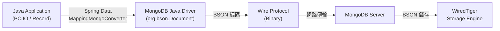
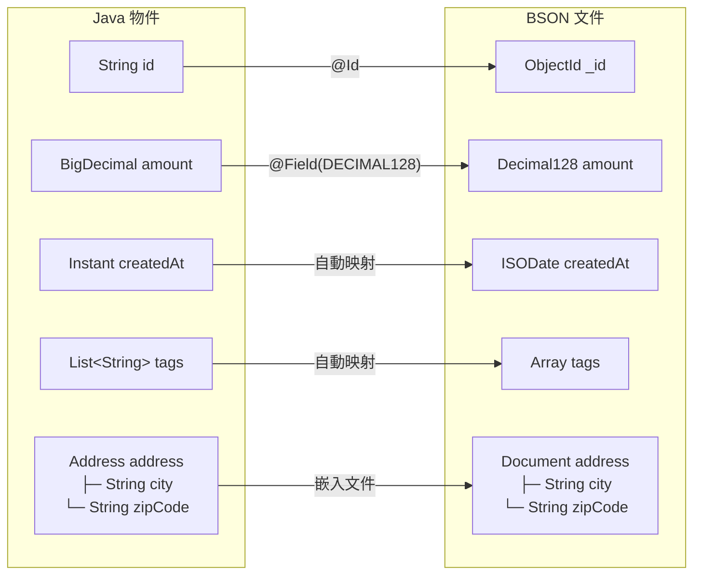
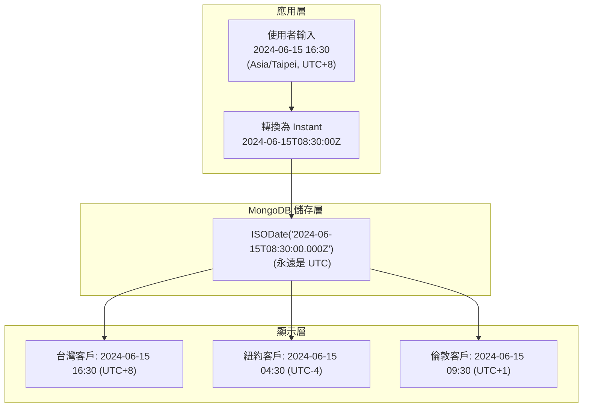
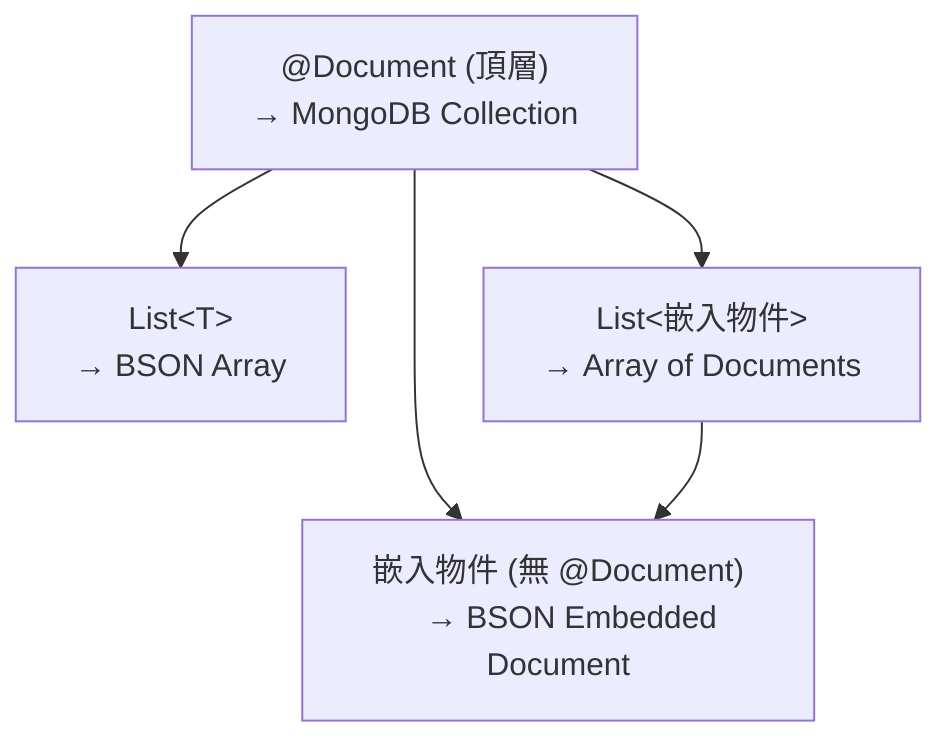
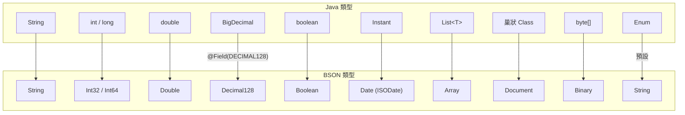

# M04-DOC-02: BSON 資料類型與 Java 映射

> **模組**: M04 - Document Thinking
> **對象**: 具備 RDB 經驗的 Java Spring 開發者
> **目標**: 深入理解 BSON 資料類型體系，掌握 Java 類型與 BSON 的精確映射，避免金融場景中的精度陷阱

---

## 目錄

1. [BSON 簡介](#1-bson-簡介)
2. [BSON 類型完整對照表](#2-bson-類型完整對照表)
3. [Spring Data MongoDB 映射機制](#3-spring-data-mongodb-映射機制)
4. [金融精度問題：Decimal128 vs Double](#4-金融精度問題decimal128-vs-double)
5. [M04 Lab 程式碼解析：BsonTypeDemoDocument](#5-m04-lab-程式碼解析bsontypedemodocument)
6. [時間類型最佳實踐](#6-時間類型最佳實踐)
7. [嵌入文件與陣列映射](#7-嵌入文件與陣列映射)
8. [常見映射問題與解決方案](#8-常見映射問題與解決方案)
9. [類型映射 Checklist](#9-類型映射-checklist)

---

## 1. BSON 簡介

### 1.1 什麼是 BSON？

BSON（Binary JSON）是 MongoDB 內部用來儲存和傳輸資料的二進位序列化格式。它是 JSON 的超集，在 JSON 的基礎上增加了更多的資料類型和更高效的編碼方式。

```mermaid
flowchart LR
    subgraph JSON["JSON"]
        J1["String"]
        J2["Number"]
        J3["Boolean"]
        J4["Array"]
        J5["Object"]
        J6["null"]
    end

    subgraph BSON["BSON (超集)"]
        B1["String"]
        B2["Int32 / Int64"]
        B3["Double"]
        B4["Decimal128 ✨"]
        B5["Boolean"]
        B6["Array"]
        B7["Document"]
        B8["ObjectId ✨"]
        B9["ISODate ✨"]
        B10["Binary ✨"]
        B11["null"]
        B12["Regex ✨"]
    end

    JSON -->|"擴展"| BSON
```



### 1.2 BSON vs JSON

| 特性 | JSON | BSON |
|------|------|------|
| **格式** | 文字 (UTF-8) | 二進位 |
| **數字類型** | 只有 Number | Int32, Int64, Double, Decimal128 |
| **日期類型** | 無原生支援 | ISODate |
| **二進位資料** | 需 Base64 編碼 | 原生 Binary 類型 |
| **ObjectId** | 無 | 12-byte 唯一識別碼 |
| **大小** | 較小（文字） | 稍大（含類型資訊） |
| **解析速度** | 需要解析文字 | 直接記憶體映射，更快 |
| **可讀性** | 人類可讀 | 需要工具解碼 |

### 1.3 BSON 在 MongoDB 生態系統中的角色



---

## 2. BSON 類型完整對照表

### 2.1 核心類型映射

| BSON Type | BSON Number | Java Type | Spring Data Annotation | 備註 |
|-----------|-------------|-----------|----------------------|------|
| **ObjectId** | 7 | `String` | `@Id` | 自動生成 24 位十六進位字串 |
| **String** | 2 | `String` | — | UTF-8 編碼 |
| **Int32** | 16 | `int` / `Integer` | — | 32-bit 有號整數 |
| **Int64** | 18 | `long` / `Long` | — | 64-bit 有號整數 |
| **Double** | 1 | `double` / `Double` | — | 64-bit IEEE 754 浮點數 |
| **Decimal128** | 19 | `BigDecimal` | `@Field(targetType = DECIMAL128)` | 128-bit 十進位浮點數 |
| **Boolean** | 8 | `boolean` / `Boolean` | — | true / false |
| **Date** | 9 | `Instant` / `LocalDateTime` | — | UTC 毫秒時間戳 |
| **Array** | 4 | `List<T>` | — | 有序集合 |
| **Document** | 3 | 巢狀 Class | `@Document` (頂層) | 嵌入子文件 |
| **Binary** | 5 | `byte[]` | — | 二進位資料 |
| **Null** | 10 | `null` | — | 空值 |
| **Regular Expression** | 11 | `Pattern` | — | 正規表示式 |
| **Timestamp** | 17 | `BsonTimestamp` | — | 內部用，replica set 操作日誌 |

### 2.2 特殊類型說明

**ObjectId 結構：**

```
|  4 bytes  |  5 bytes   | 3 bytes  |
| timestamp | random     | counter  |
| (秒)      | (機器+進程) | (遞增)    |
```

- 總共 12 bytes，表示為 24 位十六進位字串
- 內含時間戳，具有自然排序性
- 在 Spring Data 中，`@Id` 標注的 `String` 欄位會自動轉換

**Decimal128：**

- IEEE 754-2008 標準的 128-bit 十進位浮點數
- 有效位數：34 位
- 指數範圍：-6176 到 6111
- 專為金融計算設計，無精度損失

---

## 3. Spring Data MongoDB 映射機制

### 3.1 轉換管線

Spring Data MongoDB 使用 `MappingMongoConverter` 作為核心轉換器，負責 Java 物件與 BSON 文件之間的雙向映射：

```mermaid
flowchart TB
    subgraph WRITE["寫入路徑 (Java → MongoDB)"]
        direction LR
        W1["Java Object
        (POJO / Record)"] --> W2["MappingMongoConverter
        .write()"]
        W2 --> W3["org.bson.Document
        (BSON Document)"]
        W3 --> W4["MongoDB Driver
        encode to BSON bytes"]
        W4 --> W5["MongoDB Server
        儲存"]
    end

    subgraph READ["讀取路徑 (MongoDB → Java)"]
        direction RL
        R5["MongoDB Server
        讀取"] --> R4["MongoDB Driver
        decode BSON bytes"]
        R4 --> R3["org.bson.Document
        (BSON Document)"]
        R3 --> R2["MappingMongoConverter
        .read()"]
        R2 --> R1["Java Object
        (POJO / Record)"]
    end
```



### 3.2 核心註解

| 註解 | 用途 | 範例 |
|------|------|------|
| `@Document` | 標記頂層文件，指定 collection 名稱 | `@Document("bank_customers")` |
| `@Id` | 標記主鍵欄位，映射到 `_id` | `@Id private String id;` |
| `@Field` | 自訂欄位名稱或指定目標 BSON 類型 | `@Field("acct_no")` |
| `@Field(targetType = ...)` | 強制指定 BSON 儲存類型 | `@Field(targetType = FieldType.DECIMAL128)` |
| `@Transient` | 標記不需要持久化的欄位 | `@Transient private String computed;` |
| `@Version` | 樂觀鎖版本欄位 | `@Version private Long version;` |
| `@Indexed` | 建立索引 | `@Indexed(unique = true)` |
| `@DBRef` | 引用另一個 collection 的文件 | `@DBRef private Account account;` |

### 3.3 命名策略

Spring Data MongoDB 預設使用 **原始欄位名稱** 作為 BSON 欄位名稱（不像 JPA 預設使用 snake_case）：

```java
public class BankCustomer {
    private String customerName;    // → BSON field: "customerName"
    private String accountNumber;   // → BSON field: "accountNumber"

    @Field("acct_type")
    private String accountType;     // → BSON field: "acct_type" (自訂)
}
```

### 3.4 `_class` 欄位

Spring Data MongoDB 預設會在文件中加入 `_class` 欄位，儲存 Java 類別的完整名稱，用於多型反序列化：

```json
{
  "_id": "sa-001",
  "_class": "com.mongodb.course.m04.java23.SavingsAccount",
  "name": "My Savings",
  "value": 50000,
  "interestRate": 2.5
}
```

> **注意**：`_class` 欄位對於多型（polymorphic）場景至關重要。當同一個 collection 儲存不同子類型時，`_class` 決定了反序列化的目標類別。

---

## 4. 金融精度問題：Decimal128 vs Double

### 4.1 為什麼金融計算不能用 Double？

IEEE 754 雙精度浮點數（Double）使用二進位表示十進位小數，導致某些十進位數字無法精確表示：

```java
// ❌ 精度損失示範
double a = 0.1;
double b = 0.2;
System.out.println(a + b);  // 輸出: 0.30000000000000004（不是 0.3！）

// 金融場景災難
double balance = 1000000.00;
double fee = 0.01;
// 經過 100 萬次微小交易後，累積誤差可能達到數元甚至數十元
```

### 4.2 Decimal128 如何解決

Decimal128 使用十進位浮點數表示法，能精確表示十進位小數：

```java
// ✅ 精確計算
BigDecimal a = new BigDecimal("0.1");
BigDecimal b = new BigDecimal("0.2");
System.out.println(a.add(b));  // 輸出: 0.3（精確！）

// 金融場景安全
BigDecimal balance = new BigDecimal("1000000.00");
BigDecimal fee = new BigDecimal("0.01");
// 無論多少次計算，結果都是精確的
```

### 4.3 精度對照表

| 數值 | Double 儲存值 | Decimal128 儲存值 | 誤差 |
|------|-------------|-----------------|------|
| 0.1 | 0.1000000000000000055511... | 0.1 | 5.55e-18 |
| 0.3 | 0.2999999999999999888977... | 0.3 | 1.11e-17 |
| 99999.99 | 99999.99000000000524... | 99999.99 | 5.24e-10 |
| 0.01 + 0.02 | 0.03000000000000000444... | 0.03 | 4.44e-18 |

### 4.4 Spring Data 中使用 Decimal128

```java
@Document("financial_transactions")
public class FinancialTransaction {

    @Id
    private String id;

    // ✅ 正確：使用 BigDecimal + @Field 標注
    @Field(targetType = FieldType.DECIMAL128)
    private BigDecimal amount;

    @Field(targetType = FieldType.DECIMAL128)
    private BigDecimal fee;

    @Field(targetType = FieldType.DECIMAL128)
    private BigDecimal tax;

    // ❌ 錯誤：使用 double 儲存金額
    // private double amount;  // 永遠不要這樣做！
}
```

### 4.5 在 MongoDB Shell 中驗證

```javascript
// 使用 NumberDecimal 確保精度
db.transactions.insertOne({
  amount: NumberDecimal("99999.99"),  // ✅ Decimal128
  badAmount: 99999.99                 // ❌ Double
});

// 查看儲存結果
db.transactions.findOne();
// {
//   amount: NumberDecimal("99999.99"),        // 精確
//   badAmount: 99999.99000000000524...        // 有精度損失
// }
```

### 4.6 測試驗證

M04 Lab 中的 `BsonTypeMappingTest` 驗證了 `BigDecimal` 正確映射到 BSON `Decimal128`：

```java
// 來源: BsonTypeMappingTest.bigDecimalToDecimal128()
var doc = new BsonTypeDemoDocument(
        new BigDecimal("99999.99"), Instant.now(), List.of(), new Address("Taipei", "100"));
repository.save(doc);

// 讀取原始 BSON 驗證類型
Document raw = mongoTemplate.getCollection("bson_type_demo")
        .find(new Document("_id", doc.getId())).first();
assertThat(raw.get("amount")).isInstanceOf(Decimal128.class);
assertThat(((Decimal128) raw.get("amount")).bigDecimalValue())
        .isEqualByComparingTo(new BigDecimal("99999.99"));
```

---

## 5. M04 Lab 程式碼解析：BsonTypeDemoDocument

### 5.1 完整類別結構

```java
// 來源: com.mongodb.course.m04.bson.BsonTypeDemoDocument
@Document("bson_type_demo")
public class BsonTypeDemoDocument {

    @Id
    private String id;                    // → ObjectId

    @Field(targetType = FieldType.DECIMAL128)
    private BigDecimal amount;            // → Decimal128

    private Instant createdAt;            // → ISODate

    private List<String> tags;            // → Array

    private Address address;              // → Embedded Document

    public static class Address {
        private String city;              // → String
        private String zipCode;           // → String
    }
}
```

### 5.2 各欄位映射圖解



### 5.3 儲存到 MongoDB 後的實際文件

```json
{
  "_id": "665a2b3c4d5e6f7a8b9c0d1e",
  "amount": NumberDecimal("99999.99"),
  "createdAt": ISODate("2024-06-15T08:30:00.000Z"),
  "tags": ["java", "mongodb", "spring"],
  "address": {
    "city": "Taipei",
    "zipCode": "100"
  },
  "_class": "com.mongodb.course.m04.bson.BsonTypeDemoDocument"
}
```

### 5.4 測試覆蓋

M04 Lab 的 `BsonTypeMappingTest` 包含四個測試案例，分別驗證每種類型的映射：

| 測試方法 | 驗證內容 | Java Type | BSON Type |
|---------|---------|-----------|-----------|
| `bigDecimalToDecimal128()` | 金額精度 | `BigDecimal` | `Decimal128` |
| `instantToISODate()` | 時間映射 | `Instant` | `Date (ISODate)` |
| `listToBsonArray()` | 陣列映射 | `List<String>` | `Array` |
| `nestedObjectToEmbeddedDocument()` | 嵌入文件 | `Address` | `Document` |

---

## 6. 時間類型最佳實踐

### 6.1 MongoDB 的時間儲存

MongoDB 內部使用 UTC 毫秒時間戳（自 1970-01-01 起的毫秒數）來儲存日期時間。這意味著：

- **精度為毫秒**：微秒和奈秒會被截斷
- **永遠是 UTC**：不儲存時區資訊

### 6.2 Instant vs LocalDateTime

| 特性 | `Instant` | `LocalDateTime` |
|------|-----------|-----------------|
| **時區** | 永遠是 UTC | 無時區資訊 |
| **語意** | 絕對時間點 | 本地時間 |
| **BSON 儲存** | UTC 毫秒時間戳 | UTC 毫秒時間戳 |
| **讀取行為** | 直接還原 UTC 時間 | 假設為 UTC 還原 |
| **推薦** | 強烈推薦 | 需要謹慎使用 |

### 6.3 推薦做法

```java
// ✅ 推薦：使用 Instant 表示絕對時間點
@Document("transactions")
public class Transaction {

    private Instant createdAt;      // 交易建立時間 (UTC)
    private Instant settledAt;      // 結算時間 (UTC)

    // 在應用層轉換為使用者的時區
    public ZonedDateTime getCreatedAtInZone(ZoneId zone) {
        return createdAt.atZone(zone);
    }
}
```

```java
// ⚠️ 謹慎使用：LocalDateTime 會失去時區語意
@Document("schedules")
public class Schedule {

    // 如果確實需要表示「當地時間」（如營業時間），可以使用
    private LocalDateTime businessHoursStart;  // 09:00 (當地時間)
    private String timezone;                    // "Asia/Taipei"
}
```

### 6.4 精度注意事項

```java
// ⚠️ 注意：MongoDB 只儲存毫秒精度
Instant now = Instant.now();
// now = 2024-06-15T08:30:00.123456789Z (奈秒精度)

// 儲存到 MongoDB 後讀回
// found = 2024-06-15T08:30:00.123Z (只剩毫秒)

// 測試中需要截斷比較
assertThat(found.getCreatedAt())
    .isEqualTo(now.truncatedTo(ChronoUnit.MILLIS));
```

### 6.5 時區處理架構



---

## 7. 嵌入文件與陣列映射

### 7.1 嵌入文件 (Embedded Document)

巢狀的 Java 物件會自動映射為 BSON 嵌入文件：

```java
// Java 定義
public class BsonTypeDemoDocument {
    private Address address;  // 巢狀物件

    public static class Address {
        private String city;
        private String zipCode;
    }
}
```

```json
// BSON 儲存結果
{
  "address": {
    "city": "Taipei",
    "zipCode": "100"
  }
}
```

**驗證測試：**

```java
// 來源: BsonTypeMappingTest.nestedObjectToEmbeddedDocument()
Document raw = mongoTemplate.getCollection("bson_type_demo")
        .find(new Document("_id", doc.getId())).first();
assertThat(raw.get("address")).isInstanceOf(Document.class);

Document address = (Document) raw.get("address");
assertThat(address.getString("city")).isEqualTo("Taipei");
```

### 7.2 陣列 (Array)

Java 的 `List` 類型自動映射為 BSON Array：

```java
// Java 定義
public class BsonTypeDemoDocument {
    private List<String> tags;  // 字串陣列
}
```

```json
// BSON 儲存結果
{
  "tags": ["java", "mongodb", "spring"]
}
```

### 7.3 嵌入文件陣列

結合嵌入文件和陣列，可以表達「一對多」的嵌入關係：

```java
// 來源: BankCustomerDocument
public class BankCustomerDocument {
    private List<Account> accounts = new ArrayList<>();  // 嵌入文件陣列

    public static class Account {
        private String accountNumber;
        private String type;

        @Field(targetType = FieldType.DECIMAL128)
        private BigDecimal balance;

        private List<Transaction> transactions = new ArrayList<>();  // 二層巢狀
    }
}
```

```json
// BSON 儲存結果
{
  "accounts": [
    {
      "accountNumber": "ACC-001",
      "type": "savings",
      "balance": NumberDecimal("50000.00"),
      "transactions": [
        {
          "type": "deposit",
          "amount": NumberDecimal("50000.00"),
          "timestamp": ISODate("2024-01-15T10:30:00Z")
        }
      ]
    }
  ]
}
```

### 7.4 映射層級關係



---

## 8. 常見映射問題與解決方案

### 8.1 BigDecimal 預設映射為 String

**問題**：如果不加 `@Field(targetType = FieldType.DECIMAL128)`，Spring Data MongoDB 會將 `BigDecimal` 映射為 BSON `String`，導致無法進行數值查詢和聚合。

```java
// ❌ 預設行為：BigDecimal → String
private BigDecimal amount;
// 儲存為: { "amount": "99999.99" }  ← 字串，無法做 $gt, $sum 等操作

// ✅ 正確做法：明確指定 Decimal128
@Field(targetType = FieldType.DECIMAL128)
private BigDecimal amount;
// 儲存為: { "amount": NumberDecimal("99999.99") }  ← 數值，支援所有數值操作
```

### 8.2 Enum 預設映射為 String

```java
public enum AccountType {
    SAVINGS, CHECKING, FIXED_DEPOSIT
}

// 預設行為：Enum → String
private AccountType type;
// 儲存為: { "type": "SAVINGS" }

// 如果需要儲存為數值
@Field(targetType = FieldType.INT32)
private AccountType type;
// 儲存為: { "type": 0 }  ← 不推薦，可讀性差
```

### 8.3 null 欄位的處理

MongoDB 對 `null` 值的處理有兩種策略：

```java
// 策略 1：儲存 null 欄位（預設行為）
// { "name": "Alice", "email": null }

// 策略 2：不儲存 null 欄位
// 透過自訂 MappingMongoConverter 設定
@Configuration
public class MongoConfig {
    @Bean
    public MappingMongoConverter mappingMongoConverter(
            MongoDatabaseFactory factory, MongoMappingContext context) {
        var converter = new MappingMongoConverter(
                new DefaultDbRefResolver(factory), context);
        converter.setMapKeyDotReplacement("_");
        // 不寫入 null 值的欄位
        converter.afterPropertiesSet();
        return converter;
    }
}
```

### 8.4 `_id` 欄位特殊行為

```java
// 情況 1：String id — 自動轉換為 ObjectId（如果值為 null）
@Id
private String id;
// 儲存時如果 id 為 null，MongoDB 自動產生 ObjectId
// 讀取時自動轉換為 24 位十六進位字串

// 情況 2：String id — 如果手動賦值，按原值儲存
customer.setId("custom-id-001");
// 儲存為: { "_id": "custom-id-001" }  ← 字串，不是 ObjectId

// 情況 3：ObjectId id — 直接使用 ObjectId 類型
@Id
private ObjectId id;
// 儲存為: { "_id": ObjectId("665a...") }
```

### 8.5 集合類型選擇

| Java Collection | BSON 映射 | 保留順序 | 允許重複 |
|----------------|-----------|---------|---------|
| `List<T>` | Array | 是 | 是 |
| `Set<T>` | Array | 否 | 否 |
| `Map<String, T>` | Document | — | Key 唯一 |

---

## 9. 類型映射 Checklist

在設計 MongoDB 文件的 Java 映射時，請逐項確認：

| # | 檢查項目 | 正確做法 |
|---|---------|---------|
| 1 | 金額欄位是否使用 `BigDecimal`？ | `@Field(targetType = FieldType.DECIMAL128)` |
| 2 | 時間欄位是否使用 `Instant`？ | 避免 `LocalDateTime`，除非有特定理由 |
| 3 | 是否了解毫秒精度限制？ | 測試中使用 `truncatedTo(MILLIS)` |
| 4 | `@Id` 欄位的行為是否符合預期？ | null → 自動 ObjectId；手動值 → 按原值儲存 |
| 5 | 嵌入物件是否正確巢狀？ | 無需 `@Document`，直接作為欄位 |
| 6 | 陣列初始化是否避免 null？ | `new ArrayList<>()` 初始化 |
| 7 | Enum 映射方式是否明確？ | 預設為 String，通常最佳選擇 |
| 8 | 是否考慮了 `_class` 欄位？ | 多型場景必須保留 |

### 類型映射速查圖



---

## 參考資源

- [BSON Specification](https://bsonspec.org/)
- [MongoDB BSON Types](https://www.mongodb.com/docs/manual/reference/bson-types/)
- [Spring Data MongoDB - Type Mapping](https://docs.spring.io/spring-data/mongodb/reference/mongodb/mapping.html)
- [IEEE 754-2008 Decimal128](https://en.wikipedia.org/wiki/Decimal128_floating-point_format)
- [M04 Lab 原始碼](../src/main/java/com/mongodb/course/m04/bson/)
