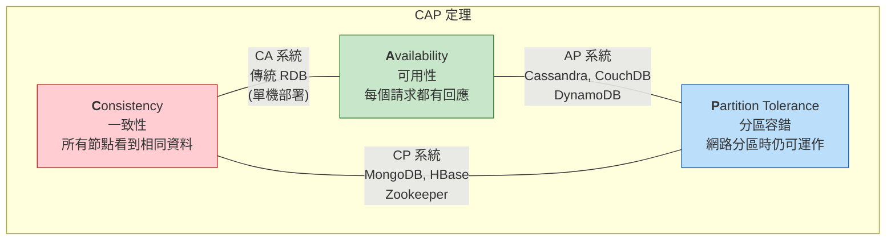
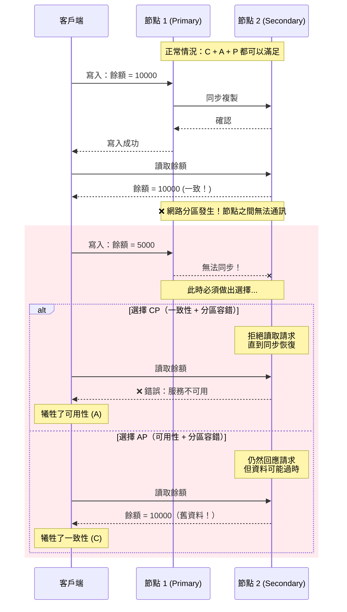
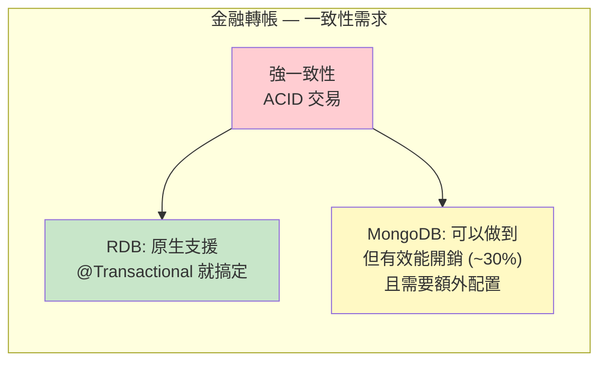
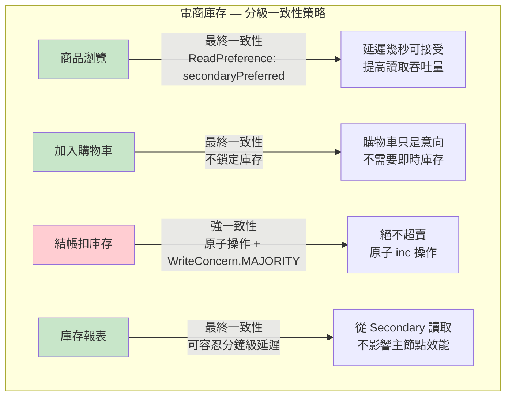
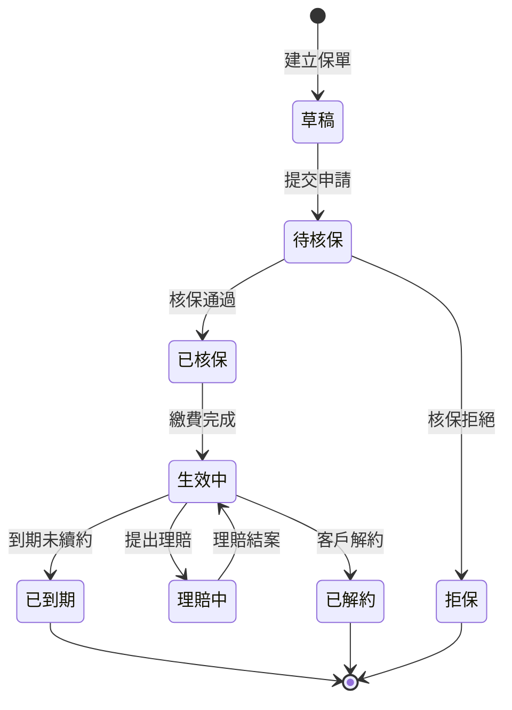
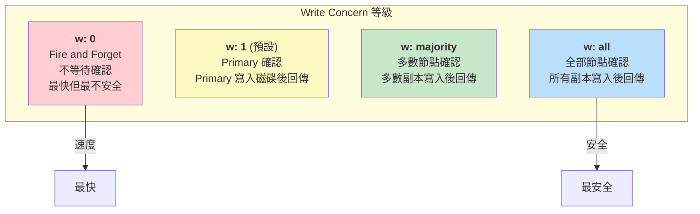
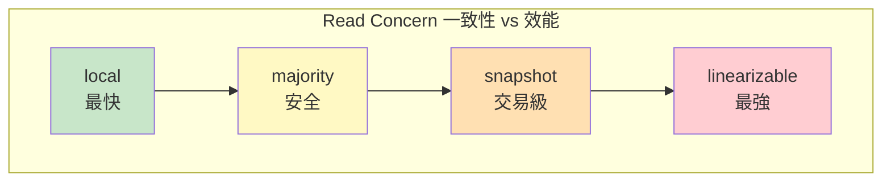
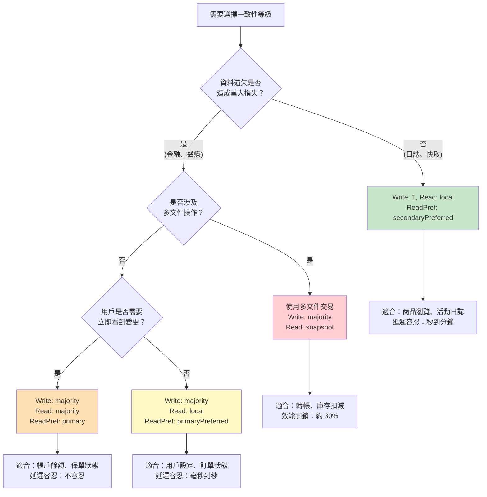

# M01-DOC-02: CAP 定理與一致性模型

> **模組**: M01 - 關聯式資料庫 vs NoSQL
> **對象**: 具備 RDB 經驗的 Java Spring 開發者
> **目標**: 理解分散式系統中的一致性取捨，以及 MongoDB 如何讓你精細控制一致性等級

---

## 目錄

1. [ACID vs BASE 比較](#1-acid-vs-base-比較)
2. [CAP 定理深入解析](#2-cap-定理深入解析)
3. [金融場景：轉帳的一致性需求](#3-金融場景轉帳的一致性需求)
4. [電商場景：庫存的最終一致性](#4-電商場景庫存的最終一致性)
5. [保險場景：保單狀態一致性](#5-保險場景保單狀態一致性)
6. [MongoDB 的 Write Concern 與 Read Concern](#6-mongodb-的-write-concern-與-read-concern)
7. [一致性等級選擇實務指南](#7-一致性等級選擇實務指南)

---

## 1. ACID vs BASE 比較

### 1.1 ACID (傳統 RDB)

| 特性 | 全名 | 說明 | 範例 |
|------|------|------|------|
| **A** | Atomicity（原子性） | 交易中的所有操作要嘛全部成功，要嘛全部失敗 | 轉帳時扣款和入帳必須同時完成 |
| **C** | Consistency（一致性） | 交易前後，資料庫始終處於有效狀態 | 轉帳後兩帳戶餘額總和不變 |
| **I** | Isolation（隔離性） | 並行交易互不干擾 | 兩筆同時轉帳不會產生競態條件 |
| **D** | Durability（持久性） | 一旦提交，資料永久保存 | 系統崩潰後交易紀錄不會遺失 |

**Spring JPA 中的 ACID 範例：**

```java
@Service
@Transactional  // Spring 幫你管理 ACID 交易
public class TransferService {

    @Transactional(isolation = Isolation.SERIALIZABLE)
    public void transfer(Long fromAccountId, Long toAccountId, BigDecimal amount) {
        Account from = accountRepo.findByIdForUpdate(fromAccountId); // SELECT ... FOR UPDATE
        Account to = accountRepo.findByIdForUpdate(toAccountId);

        if (from.getBalance().compareTo(amount) < 0) {
            throw new InsufficientFundsException();
        }

        from.setBalance(from.getBalance().subtract(amount));
        to.setBalance(to.getBalance().add(amount));

        accountRepo.save(from);
        accountRepo.save(to);
        // 如果任何一步失敗，全部回滾 — 這就是 Atomicity
    }
}
```

### 1.2 BASE (NoSQL / 分散式系統)

| 特性 | 全名 | 說明 | 範例 |
|------|------|------|------|
| **BA** | Basically Available（基本可用） | 系統保證基本可用性，但可能回傳不完整的資料 | 即使部分節點故障，系統仍可回應 |
| **S** | Soft State（軟狀態） | 系統狀態可能隨時間變化，即使沒有新輸入 | 副本之間的資料同步有延遲 |
| **E** | Eventually Consistent（最終一致性） | 系統最終會達到一致狀態，但不保證立即一致 | 寫入主節點後，副本在幾毫秒到幾秒後同步 |

### 1.3 完整對照表

| 維度 | ACID (RDB) | BASE (NoSQL) |
|------|-----------|-------------|
| **一致性模型** | 強一致性 (Strong Consistency) | 最終一致性 (Eventual Consistency) |
| **可用性** | 可能因鎖定而降低 | 高可用性優先 |
| **效能** | 鎖定機制影響並行度 | 無鎖定或輕量鎖定，高並行 |
| **擴展性** | 垂直擴展為主 | 水平擴展為主 |
| **適用場景** | 金融交易、庫存扣減 | 社群動態、日誌、快取 |
| **資料正確性** | 任何時間點都正確 | 短暫不一致，最終正確 |
| **Spring 整合** | `@Transactional` 完整支援 | 需手動控制一致性等級 |
| **故障處理** | 交易回滾 | 補償機制、衝突解決 |

> **關鍵洞察**：ACID 和 BASE 不是非黑即白的選擇。MongoDB 允許你在這個光譜上精細調整 — 從強一致性到最終一致性，透過 Write Concern 和 Read Concern 組合來控制。

---

## 2. CAP 定理深入解析

### 2.1 什麼是 CAP 定理？

CAP 定理（又稱 Brewer 定理）指出：**在一個分散式系統中，不可能同時完美保證以下三個特性，最多只能滿足其中兩個**。

| 特性 | 說明 |
|------|------|
| **C - Consistency（一致性）** | 所有節點在同一時間看到相同的資料 |
| **A - Availability（可用性）** | 每個請求都會收到回應（不保證是最新資料） |
| **P - Partition Tolerance（分區容錯）** | 系統在網路分區時仍能繼續運作 |

### 2.2 CAP 定理視覺化



### 2.3 為什麼不能三者兼得？



### 2.4 各資料庫在 CAP 中的定位

| 資料庫 | CAP 選擇 | 說明 |
|--------|----------|------|
| **PostgreSQL** (單機) | CA | 不處理分區（單機沒有分區問題） |
| **PostgreSQL** (主從) | CP | 同步複製時犧牲可用性 |
| **MongoDB** | CP (預設) | 主節點故障時短暫不可用，進行選舉 |
| **Cassandra** | AP | 多主架構，最終一致性 |
| **DynamoDB** | AP | 高可用優先 |
| **Redis Cluster** | AP | 非同步複製，高可用 |

> **MongoDB 的定位**：MongoDB 預設是 **CP 系統** — 在網路分區時，只有 Primary 節點接受寫入，確保一致性。但透過調整 Read Preference，可以向 AP 方向移動（允許從 Secondary 讀取可能過時的資料）。

---

## 3. 金融場景：轉帳的一致性需求

### 3.1 場景分析

**需求**：客戶 A 轉帳 50,000 元給客戶 B

**一致性要求**：**強一致性 — 絕對不允許的情況：**
- 錢從 A 扣了但沒到 B（資金消失）
- 錢到 B 了但沒從 A 扣（資金憑空產生）
- A 的餘額顯示已扣款但 B 查看時還沒入帳（短暫不一致也不行，客戶會恐慌）

### 3.2 RDB 解法：原生交易

```java
@Service
public class BankTransferService {

    @Transactional(isolation = Isolation.READ_COMMITTED)
    public TransferResult transfer(String fromAccountNo, String toAccountNo, BigDecimal amount) {
        // 使用悲觀鎖，按帳號排序避免死鎖
        Account from = accountRepo.findByAccountNoWithLock(fromAccountNo);
        Account to = accountRepo.findByAccountNoWithLock(toAccountNo);

        // 業務驗證
        validateTransfer(from, to, amount);

        // 扣款
        from.debit(amount);
        accountRepo.save(from);

        // 入帳
        to.credit(amount);
        accountRepo.save(to);

        // 記錄交易
        Transaction debitTx = Transaction.debit(from, amount, toAccountNo);
        Transaction creditTx = Transaction.credit(to, amount, fromAccountNo);
        transactionRepo.saveAll(List.of(debitTx, creditTx));

        return TransferResult.success(debitTx.getId());
        // 如果任何一步拋出異常，Spring 自動回滾全部操作
    }
}
```

### 3.3 MongoDB 解法：多文件交易 (4.0+)

```java
@Service
public class MongoTransferService {

    private final MongoTemplate mongoTemplate;
    private final MongoDatabaseFactory dbFactory;

    public TransferResult transfer(String fromAccountId, String toAccountId, BigDecimal amount) {
        // MongoDB 4.0+ 支援多文件交易
        ClientSession session = dbFactory.getMongoDatabase()
            .getClient().startSession();

        try {
            session.startTransaction(TransactionOptions.builder()
                .readConcern(ReadConcern.SNAPSHOT)      // 交易開始時的一致快照
                .writeConcern(WriteConcern.MAJORITY)     // 寫入多數節點才確認
                .readPreference(ReadPreference.primary()) // 從主節點讀取
                .build());

            // 扣款
            UpdateResult debitResult = mongoTemplate.updateFirst(
                session,
                Query.query(Criteria.where("_id").is(fromAccountId)
                    .and("balance").gte(amount)
                    .and("status").is("ACTIVE")),
                new Update()
                    .inc("balance", amount.negate())
                    .push("recentTransactions", createDebitTx(amount, toAccountId)),
                AccountDocument.class
            );

            if (debitResult.getModifiedCount() == 0) {
                session.abortTransaction();
                return TransferResult.failed("餘額不足或帳戶狀態異常");
            }

            // 入帳
            mongoTemplate.updateFirst(
                session,
                Query.query(Criteria.where("_id").is(toAccountId)
                    .and("status").is("ACTIVE")),
                new Update()
                    .inc("balance", amount)
                    .push("recentTransactions", createCreditTx(amount, fromAccountId)),
                AccountDocument.class
            );

            // 記錄交易
            TransactionDocument tx = new TransactionDocument();
            tx.setFromAccountId(fromAccountId);
            tx.setToAccountId(toAccountId);
            tx.setAmount(amount);
            tx.setTimestamp(Instant.now());
            tx.setStatus("COMPLETED");
            mongoTemplate.insert(session, tx);

            session.commitTransaction();
            return TransferResult.success(tx.getId());

        } catch (Exception e) {
            session.abortTransaction();
            throw new TransferException("轉帳失敗", e);
        } finally {
            session.close();
        }
    }
}
```

### 3.4 金融場景結論



> **建議**：金融核心交易系統（帳務、轉帳、對帳），RDB 仍然是更自然的選擇。MongoDB 的多文件交易雖然可行，但效能開銷約 30%，且團隊需要更深入了解分散式交易的細節。

---

## 4. 電商場景：庫存的最終一致性

### 4.1 場景分析

**需求**：電商平台顯示商品庫存數量

**一致性要求分析**：

| 操作 | 一致性需求 | 原因 |
|------|-----------|------|
| **商品列表頁顯示庫存** | 最終一致性即可 | 顯示「約剩 50 件」，偏差幾件可接受 |
| **加入購物車** | 最終一致性即可 | 購物車不鎖定庫存 |
| **結帳扣庫存** | 強一致性 | 不能超賣 |
| **庫存報表** | 最終一致性即可 | 統計報表容許短暫延遲 |

### 4.2 混合一致性策略

```java
@Service
public class InventoryService {

    private final MongoTemplate mongoTemplate;

    /**
     * 商品列表頁 — 最終一致性，可以從 Secondary 讀取
     * 延遲容忍度：幾秒鐘
     */
    public List<ProductSummary> getProductList(String category) {
        Query query = Query.query(Criteria.where("category").is(category))
            .withReadPreference(ReadPreference.secondaryPreferred()); // 優先從副本讀取

        return mongoTemplate.find(query, ProductSummary.class);
        // 可能讀到幾秒前的庫存數量，但可以接受
    }

    /**
     * 結帳扣庫存 — 強一致性，使用原子操作
     * 不允許超賣
     */
    public boolean deductInventory(String productId, int quantity) {
        // 使用原子操作：findAndModify 保證不超賣
        UpdateResult result = mongoTemplate.updateFirst(
            Query.query(Criteria.where("_id").is(productId)
                .and("inventory").gte(quantity)),  // 原子性檢查庫存 >= 需求量
            new Update().inc("inventory", -quantity),
            WriteConcern.MAJORITY,  // 寫入多數節點
            ProductDocument.class
        );

        return result.getModifiedCount() > 0;
        // 如果回傳 0，表示庫存不足，應用層處理
    }

    /**
     * 閃購/秒殺場景 — 使用更嚴格的控制
     */
    public boolean flashSaleDeduct(String productId) {
        // 原子 findAndModify — 減一併回傳結果
        ProductDocument updated = mongoTemplate.findAndModify(
            Query.query(Criteria.where("_id").is(productId)
                .and("inventory").gt(0)
                .and("saleStatus").is("ACTIVE")),
            new Update()
                .inc("inventory", -1)
                .inc("soldCount", 1),
            FindAndModifyOptions.options()
                .returnNew(true),
            ProductDocument.class
        );

        return updated != null;
    }
}
```

### 4.3 電商場景結論



> **關鍵洞察**：MongoDB 的優勢在於 **同一個系統中可以為不同操作設定不同的一致性等級**。這在 RDB 中較難實現 — RDB 的交易隔離等級通常是全域設定。

---

## 5. 保險場景：保單狀態一致性

### 5.1 場景分析

**需求**：保險公司管理保單生命週期

保單狀態轉換：



### 5.2 一致性需求分析

| 操作 | 一致性需求 | 原因 |
|------|-----------|------|
| **保單查詢（客戶端）** | 最終一致性 | 秒級延遲可接受 |
| **保單狀態變更** | 強一致性 | 狀態轉換必須正確，不能重複 |
| **理賠申請** | 強一致性 | 必須驗證保單有效才能理賠 |
| **保費計算** | 最終一致性 | 精算數據的微小延遲可接受 |
| **批次續約** | 最終一致性 | 批次作業容忍延遲 |

### 5.3 MongoDB 實作 — 狀態機 + 樂觀鎖

```java
@Document(collection = "policies")
public class PolicyDocument {
    @Id
    private String id;
    private String policyNumber;
    private PolicyStatus status;
    private String customerId;
    private String productCode;
    private BigDecimal premium;
    private Instant effectiveDate;
    private Instant expiryDate;

    @Version  // Spring Data MongoDB 樂觀鎖
    private Long version;

    // 狀態變更歷史 — 嵌入，不會太多
    private List<StatusChange> statusHistory;

    @Data
    public static class StatusChange {
        private PolicyStatus fromStatus;
        private PolicyStatus toStatus;
        private String reason;
        private String operatorId;
        private Instant changedAt;
    }
}

@Service
public class PolicyStateService {

    private final MongoTemplate mongoTemplate;

    // 狀態轉換規則
    private static final Map<PolicyStatus, Set<PolicyStatus>> VALID_TRANSITIONS = Map.of(
        PolicyStatus.DRAFT, Set.of(PolicyStatus.PENDING_UNDERWRITING),
        PolicyStatus.PENDING_UNDERWRITING, Set.of(PolicyStatus.UNDERWRITTEN, PolicyStatus.REJECTED),
        PolicyStatus.UNDERWRITTEN, Set.of(PolicyStatus.ACTIVE),
        PolicyStatus.ACTIVE, Set.of(PolicyStatus.CLAIMING, PolicyStatus.EXPIRED, PolicyStatus.CANCELLED)
    );

    /**
     * 保單狀態變更 — 強一致性
     * 使用 CAS (Compare-And-Swap) 模式確保狀態正確轉換
     */
    public PolicyDocument changeStatus(String policyId, PolicyStatus newStatus,
                                        String reason, String operatorId) {
        // 原子操作：只有當前狀態允許轉換時才更新
        PolicyDocument current = mongoTemplate.findById(policyId, PolicyDocument.class);

        if (current == null) {
            throw new PolicyNotFoundException(policyId);
        }

        Set<PolicyStatus> allowed = VALID_TRANSITIONS.get(current.getStatus());
        if (allowed == null || !allowed.contains(newStatus)) {
            throw new InvalidStateTransitionException(
                current.getStatus(), newStatus);
        }

        StatusChange change = new StatusChange();
        change.setFromStatus(current.getStatus());
        change.setToStatus(newStatus);
        change.setReason(reason);
        change.setOperatorId(operatorId);
        change.setChangedAt(Instant.now());

        // 使用原子 findAndModify + version 確保一致性
        PolicyDocument updated = mongoTemplate.findAndModify(
            Query.query(Criteria.where("_id").is(policyId)
                .and("status").is(current.getStatus())      // CAS: 確認狀態沒被改過
                .and("version").is(current.getVersion())),   // 樂觀鎖
            new Update()
                .set("status", newStatus)
                .push("statusHistory", change)
                .inc("version", 1),
            FindAndModifyOptions.options().returnNew(true),
            PolicyDocument.class
        );

        if (updated == null) {
            throw new OptimisticLockException(
                "保單狀態已被其他操作修改，請重新讀取後再試");
        }

        return updated;
    }
}
```

### 5.4 保險場景結論

> **適合 MongoDB 的保險場景**：保單文件天然適合文件模型 — 一張保單包含大量巢狀資訊（被保人、受益人、附加條款、批註），且不同險種的結構差異大（壽險 vs 車險 vs 旅平險），Schema-on-Read 非常適合。
>
> **需要注意的地方**：保單狀態變更必須使用強一致性操作（原子更新 + 樂觀鎖），不能依賴最終一致性。

---

## 6. MongoDB 的 Write Concern 與 Read Concern

### 6.1 Write Concern（寫入關注等級）

Write Concern 控制「寫入操作被多少個節點確認後才回傳成功」。



**Spring Data MongoDB 設定 Write Concern：**

```java
// 方法一：全域設定
@Configuration
public class MongoConfig extends AbstractMongoClientConfiguration {

    @Override
    protected void configureClientSettings(MongoClientSettings.Builder builder) {
        builder.writeConcern(WriteConcern.MAJORITY
            .withWTimeout(5000, TimeUnit.MILLISECONDS));
    }
}

// 方法二：單一操作設定
@Service
public class AccountService {

    private final MongoTemplate mongoTemplate;

    // 金融操作：寫入多數節點
    public void updateBalance(String accountId, BigDecimal newBalance) {
        mongoTemplate.setWriteConcern(WriteConcern.MAJORITY);
        mongoTemplate.updateFirst(
            Query.query(Criteria.where("_id").is(accountId)),
            Update.update("balance", newBalance),
            AccountDocument.class
        );
    }

    // 日誌操作：只需 Primary 確認
    public void logActivity(ActivityLog log) {
        mongoTemplate.setWriteConcern(WriteConcern.W1);
        mongoTemplate.insert(log);
    }
}
```

### 6.2 Read Concern（讀取關注等級）

Read Concern 控制「讀取操作看到的資料一致性等級」。

| Read Concern | 說明 | 保證 |
|-------------|------|------|
| **local** (預設) | 讀取本地節點最新資料 | 可能讀到尚未被多數節點確認的資料（回滾風險） |
| **available** | 與 local 類似，但在分片叢集中行為不同 | 最低延遲，但可能讀到孤兒文件 |
| **majority** | 只讀取已被多數節點確認的資料 | 不會讀到被回滾的資料 |
| **snapshot** | 交易級別，讀取交易開始時的一致快照 | 多文件交易中使用 |
| **linearizable** | 線性一致性，保證讀到最新寫入 | 最強一致性，最高延遲 |



**Spring 中配置 Read Concern：**

```java
@Service
public class PolicyQueryService {

    private final MongoTemplate mongoTemplate;

    // 保單查詢（客戶端）— majority 防止讀到回滾資料
    public PolicyDocument getPolicy(String policyId) {
        Query query = Query.query(Criteria.where("_id").is(policyId))
            .withReadConcern(ReadConcern.MAJORITY);

        return mongoTemplate.findOne(query, PolicyDocument.class);
    }

    // 報表查詢 — local 即可，追求速度
    public List<PolicyDocument> getPoliciesForReport(String status) {
        Query query = Query.query(Criteria.where("status").is(status))
            .withReadConcern(ReadConcern.LOCAL)
            .withReadPreference(ReadPreference.secondaryPreferred());

        return mongoTemplate.find(query, PolicyDocument.class);
    }
}
```

### 6.3 Read Preference（讀取偏好）

Read Preference 控制「從哪個節點讀取資料」。

| Read Preference | 說明 | 適用場景 |
|----------------|------|---------|
| **primary** (預設) | 只從 Primary 讀取 | 需要最新資料 |
| **primaryPreferred** | 優先 Primary，不可用時讀 Secondary | 可用性優先 |
| **secondary** | 只從 Secondary 讀取 | 報表、分析查詢 |
| **secondaryPreferred** | 優先 Secondary，不可用時讀 Primary | 分散讀取負載 |
| **nearest** | 讀取延遲最低的節點 | 跨地域部署 |

### 6.4 Write Concern + Read Concern 組合策略

| 場景 | Write Concern | Read Concern | Read Preference | 效果 |
|------|--------------|-------------|----------------|------|
| **金融交易** | majority | majority / snapshot | primary | 強一致性，不遺失、不回滾 |
| **一般 CRUD** | 1 (預設) | local (預設) | primary | 平衡效能與一致性 |
| **日誌寫入** | 0 或 1 | local | 不讀取 | 最大寫入吞吐量 |
| **報表查詢** | N/A | local | secondaryPreferred | 不影響主節點，高吞吐 |
| **用戶個人資料** | majority | majority | primary | 用戶更新後立即看到變更 |
| **商品瀏覽** | 1 | local | secondaryPreferred | 高讀取吞吐，秒級延遲可接受 |

---

## 7. 一致性等級選擇實務指南

### 7.1 決策流程



### 7.2 Spring Boot 應用中的分級配置

```java
@Configuration
public class MongoConsistencyConfig {

    /**
     * 建立不同一致性等級的 MongoTemplate
     */
    @Bean
    @Primary
    public MongoTemplate defaultMongoTemplate(MongoDatabaseFactory factory) {
        MongoTemplate template = new MongoTemplate(factory);
        // 預設：平衡模式
        template.setWriteConcern(WriteConcern.W1);
        template.setReadPreference(ReadPreference.primary());
        return template;
    }

    @Bean("strictMongoTemplate")
    public MongoTemplate strictMongoTemplate(MongoDatabaseFactory factory) {
        MongoTemplate template = new MongoTemplate(factory);
        // 嚴格模式：金融操作
        template.setWriteConcern(WriteConcern.MAJORITY
            .withWTimeout(10000, TimeUnit.MILLISECONDS));
        template.setReadPreference(ReadPreference.primary());
        return template;
    }

    @Bean("analyticsMongoTemplate")
    public MongoTemplate analyticsMongoTemplate(MongoDatabaseFactory factory) {
        MongoTemplate template = new MongoTemplate(factory);
        // 分析模式：報表查詢
        template.setWriteConcern(WriteConcern.W1);
        template.setReadPreference(ReadPreference.secondaryPreferred());
        return template;
    }
}

// 使用方式
@Service
public class AccountService {

    @Qualifier("strictMongoTemplate")
    private final MongoTemplate strictMongo;

    @Qualifier("analyticsMongoTemplate")
    private final MongoTemplate analyticsMongo;

    // 金融操作用 strict
    public void processTransfer(TransferRequest request) {
        strictMongo.updateFirst(/* ... */);
    }

    // 報表用 analytics
    public List<AccountSummary> getMonthlyReport() {
        return analyticsMongo.find(/* ... */);
    }
}
```

### 7.3 總結：給 Spring 開發者的心法

| 你習慣的 RDB 做法 | MongoDB 的對應做法 |
|-------------------|-------------------|
| `@Transactional` 預設隔離等級 | 設定合適的 Write Concern + Read Concern |
| `@Transactional(isolation = SERIALIZABLE)` | 多文件交易 + Read Concern: snapshot |
| 全域統一的一致性等級 | 按操作分級設定一致性 |
| 主從延遲靠讀寫分離中間件處理 | Read Preference 直接控制 |
| 依賴資料庫外鍵保證完整性 | 應用層保證 + 適當的 Write Concern |

> **核心觀點**：MongoDB 不是「不一致」的資料庫，而是「讓你選擇一致性等級」的資料庫。對於大多數非金融場景，適當放寬一致性要求可以獲得顯著的效能和擴展性提升。

---

## 延伸閱讀

- [MongoDB Read/Write Concern 官方文件](https://www.mongodb.com/docs/manual/reference/read-concern/)
- [MongoDB Transactions 官方文件](https://www.mongodb.com/docs/manual/core/transactions/)
- [CAP 定理原始論文 - Brewer (2000)](https://users.ece.cmu.edu/~adrian/731-sp04/readings/CAP-brewer.pdf)
- [Jepsen — 分散式系統一致性測試](https://jepsen.io/)

---

> **上一篇**: [M01-DOC-01: 資料模型哲學比較](./M01-DOC-01-data-model-philosophy.md)
> **下一篇**: [M01-DOC-03: 資料庫選型決策框架](./M01-DOC-03-selection-framework.md)
