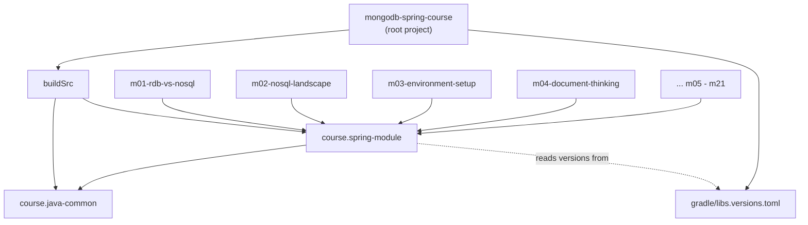
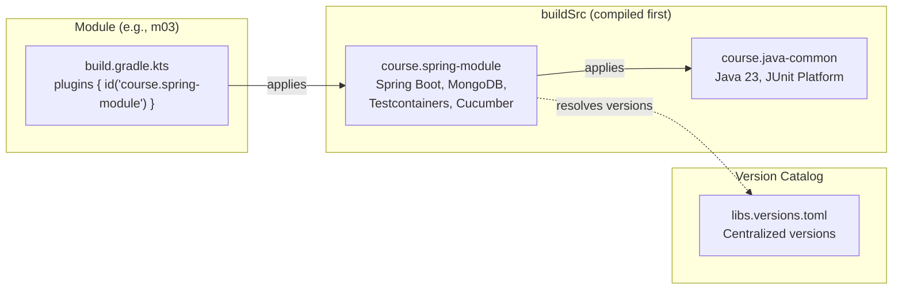

# Gradle Multi-Module Project Build Guide

## Overview

This course is organized as a **Gradle multi-module project** with 21 submodules (`m01` through `m21`).
Each module is a standalone Spring Boot application that can be built and tested independently,
while sharing common build conventions through `buildSrc` convention plugins.

If you have worked with Maven multi-module projects (parent POM + child modules), the Gradle equivalent
uses a `settings.gradle.kts` to declare submodules and a `buildSrc` directory to host reusable build logic
-- think of `buildSrc` as a "parent POM" you can write in Kotlin.

---

## Project Layout

```
mongodb-spring-course/                  # Root project
├── build.gradle.kts                    # Root build script (group, version, base plugin)
├── settings.gradle.kts                 # Declares all 21 submodules
├── gradle.properties                   # JVM args, parallel builds, caching
├── gradle/
│   └── libs.versions.toml              # Version catalog (single source of truth for versions)
├── buildSrc/
│   ├── build.gradle.kts                # Pulls in Spring Boot + Dependency Management plugins
│   ├── settings.gradle.kts             # Imports libs.versions.toml into buildSrc
│   └── src/main/kotlin/
│       ├── course.java-common.gradle.kts     # Convention: Java 23, JUnit Platform, logging
│       └── course.spring-module.gradle.kts   # Convention: Spring Boot + MongoDB + Test stack
├── m01-rdb-vs-nosql/
│   └── build.gradle.kts               # apply: course.spring-module
├── m02-nosql-landscape/
│   └── build.gradle.kts
├── m03-environment-setup/              # <-- You are here
│   ├── build.gradle.kts
│   ├── docs/
│   ├── src/main/java/...
│   └── src/test/java/...
├── m04-document-thinking/
│   ...
└── m21-ecommerce-capstone/
```



---

## Root `build.gradle.kts`

The root build file is intentionally minimal. It applies only the `base` plugin (so you can run
`./gradlew clean` and `./gradlew build` from the root) and declares the shared group and version:

```kotlin
// build.gradle.kts (root)
plugins {
    base
}

group = "com.mongodb.course"
version = "1.0.0-SNAPSHOT"
```

> **Coming from Maven?** In Maven you would put `<groupId>` and `<version>` in a parent POM.
> In Gradle, the root `build.gradle.kts` serves that role, but child modules inherit group/version
> through the convention plugins in `buildSrc`.

---

## `settings.gradle.kts` -- Module Registration

Every submodule must be registered here. Gradle uses this file to know the project hierarchy:

```kotlin
// settings.gradle.kts
rootProject.name = "mongodb-spring-course"

include(
    "m01-rdb-vs-nosql",
    "m02-nosql-landscape",
    "m03-environment-setup",
    "m04-document-thinking",
    "m05-spring-data-crud",
    "m06-query-dsl",
    "m07-aggregation-pipeline",
    "m08-schema-validation",
    "m09-transactions",
    "m10-ddd-aggregate-modeling",
    "m11-polymorphism-inheritance",
    "m12-event-sourcing",
    "m13-cqrs-read-model",
    "m14-saga-pattern",
    "m15-indexing-performance",
    "m16-change-streams",
    "m17-observability",
    "m18-migration-versioning",
    "m19-banking-capstone",
    "m20-insurance-capstone",
    "m21-ecommerce-capstone"
)
```

---

## `gradle.properties` -- Build Performance

```properties
org.gradle.parallel=true          # Build independent modules in parallel
org.gradle.caching=true           # Enable the Gradle build cache
org.gradle.jvmargs=-Xmx2g -XX:+UseParallelGC   # JVM settings for the Gradle daemon
```

These settings make a significant difference in a 21-module project. Parallel builds let independent
modules compile simultaneously, and the build cache avoids re-running tasks whose inputs have not changed.

---

## `buildSrc` -- Convention Plugins

`buildSrc` is a special Gradle directory. Code here is compiled **before** any submodule build script
is evaluated, so it can provide plugins that submodules apply with a single line.

### `buildSrc/build.gradle.kts`

This file makes the Spring Boot and Dependency Management Gradle plugins available to our convention
plugins:

```kotlin
// buildSrc/build.gradle.kts
plugins {
    `kotlin-dsl`
}

repositories {
    mavenCentral()
    gradlePluginPortal()
}

dependencies {
    implementation("org.springframework.boot:spring-boot-gradle-plugin:3.4.1")
    implementation("io.spring.gradle:dependency-management-plugin:1.1.7")
}
```

### `buildSrc/settings.gradle.kts`

This imports the version catalog so convention plugins can reference `libs.versions.toml`:

```kotlin
// buildSrc/settings.gradle.kts
dependencyResolutionManagement {
    versionCatalogs {
        create("libs") {
            from(files("../gradle/libs.versions.toml"))
        }
    }
}
```

### Convention Plugin: `course.java-common`

This is the **base** convention applied to every Java module. It configures the Java toolchain,
group/version, repositories, and test execution:

```kotlin
// buildSrc/src/main/kotlin/course.java-common.gradle.kts
plugins {
    java
}

group = "com.mongodb.course"
version = "1.0.0-SNAPSHOT"

repositories {
    mavenCentral()
}

java {
    toolchain {
        languageVersion.set(JavaLanguageVersion.of(23))   // Java 23
    }
}

tasks.withType<Test> {
    useJUnitPlatform()              // Use JUnit 5 Platform for all tests
    testLogging {
        events("passed", "skipped", "failed")
    }
}
```

Key decisions:
- **Java 23** via the toolchain API. Gradle will automatically download JDK 23 if it is not already
  installed, so contributors do not need to manually manage SDK versions.
- **JUnit Platform** is configured globally. This is required for both JUnit 5 tests and the Cucumber
  JUnit Platform Engine.

### Convention Plugin: `course.spring-module`

This builds on top of `course.java-common` and adds everything needed for a Spring Boot + MongoDB
module with full test support:

```kotlin
// buildSrc/src/main/kotlin/course.spring-module.gradle.kts
plugins {
    id("course.java-common")                    // Inherit base Java config
    id("org.springframework.boot")              // Spring Boot plugin (fat JAR, run task)
    id("io.spring.dependency-management")       // BOM-based version management
}

dependencies {
    // --- Production ---
    implementation("org.springframework.boot:spring-boot-starter-data-mongodb")

    // --- Test: Spring + Testcontainers ---
    testImplementation("org.springframework.boot:spring-boot-starter-test")
    testImplementation("org.springframework.boot:spring-boot-testcontainers")
    testImplementation("org.testcontainers:mongodb")
    testImplementation("org.testcontainers:junit-jupiter")
    testImplementation("org.assertj:assertj-core")

    // --- Test: Cucumber BDD ---
    testImplementation("io.cucumber:cucumber-java:7.20.1")
    testImplementation("io.cucumber:cucumber-spring:7.20.1")
    testImplementation("io.cucumber:cucumber-junit-platform-engine:7.20.1")
    testImplementation("org.junit.platform:junit-platform-suite")
}
```

**What this gives each module out of the box:**

| Concern | Library | Purpose |
|---|---|---|
| MongoDB access | `spring-boot-starter-data-mongodb` | `MongoTemplate`, `MongoRepository` |
| Test framework | `spring-boot-starter-test` | JUnit 5, Mockito, Spring Test |
| Container lifecycle | `spring-boot-testcontainers` | `@ServiceConnection` auto-config |
| MongoDB container | `testcontainers:mongodb` | Docker-based MongoDB for tests |
| Testcontainers JUnit | `testcontainers:junit-jupiter` | `@Container`, `@Testcontainers` |
| Fluent assertions | `assertj-core` | Readable assertions |
| BDD framework | `cucumber-java` + `cucumber-spring` | Gherkin step definitions |
| BDD engine | `cucumber-junit-platform-engine` | Run Cucumber via JUnit Platform |
| Suite runner | `junit-platform-suite` | `@Suite` + `@SelectClasspathResource` |

---

## Version Catalog: `gradle/libs.versions.toml`

The version catalog is the **single source of truth** for all dependency versions. It uses the TOML
format introduced in Gradle 7.0:

```toml
[versions]
spring-boot = "3.4.1"
spring-dependency-management = "1.1.7"
testcontainers = "1.20.4"
cucumber = "7.20.1"
assertj = "3.27.3"
junit-platform = "1.11.4"
postgresql = "42.7.4"
spring-data-jpa = "3.4.1"

[libraries]
spring-boot-starter-data-mongodb = { module = "org.springframework.boot:spring-boot-starter-data-mongodb" }
spring-boot-starter-data-jpa     = { module = "org.springframework.boot:spring-boot-starter-data-jpa" }
spring-boot-starter-test         = { module = "org.springframework.boot:spring-boot-starter-test" }
spring-boot-testcontainers       = { module = "org.springframework.boot:spring-boot-testcontainers" }

testcontainers-bom              = { module = "org.testcontainers:testcontainers-bom", version.ref = "testcontainers" }
testcontainers-mongodb          = { module = "org.testcontainers:mongodb", version.ref = "testcontainers" }
testcontainers-postgresql       = { module = "org.testcontainers:postgresql", version.ref = "testcontainers" }
testcontainers-junit-jupiter    = { module = "org.testcontainers:junit-jupiter", version.ref = "testcontainers" }

cucumber-java                   = { module = "io.cucumber:cucumber-java", version.ref = "cucumber" }
cucumber-spring                 = { module = "io.cucumber:cucumber-spring", version.ref = "cucumber" }
cucumber-junit-platform-engine  = { module = "io.cucumber:cucumber-junit-platform-engine", version.ref = "cucumber" }

junit-platform-suite            = { module = "org.junit.platform:junit-platform-suite", version.ref = "junit-platform" }
assertj-core                    = { module = "org.assertj:assertj-core", version.ref = "assertj" }
postgresql-driver               = { module = "org.postgresql:postgresql", version.ref = "postgresql" }

[plugins]
spring-boot                     = { id = "org.springframework.boot", version.ref = "spring-boot" }
spring-dependency-management    = { id = "io.spring.dependency-management", version.ref = "spring-dependency-management" }
```

> **Why a version catalog?** When you have 21 modules, managing versions in each `build.gradle.kts`
> becomes painful. The catalog gives you one place to bump a version and have it take effect everywhere.
> It is the Gradle equivalent of a Maven `<dependencyManagement>` block in a parent POM.

Note that Spring Boot-managed dependencies (like `spring-boot-starter-data-mongodb`) do not need
explicit versions in the catalog -- the Spring Dependency Management plugin resolves them from the
Spring Boot BOM. The catalog entries for those libraries omit `version.ref` intentionally.

---

## How to Run Builds

### Build the Entire Project

```bash
./gradlew build
```

This compiles all 21 modules, runs all tests (unit + integration + BDD), and produces artifacts.
Thanks to `org.gradle.parallel=true`, independent modules build concurrently.

### Build a Single Module

```bash
./gradlew :m03-environment-setup:build
```

The colon-prefixed syntax addresses a specific submodule. This is faster when you are working on
one module at a time.

### Run Tests Only

```bash
# All modules
./gradlew test

# Single module
./gradlew :m03-environment-setup:test
```

### Run the Spring Boot Application

```bash
./gradlew :m03-environment-setup:bootRun
```

This starts the Spring Boot application defined by `M03Application`. You will need a running MongoDB
instance (or the application will fail to connect). For local development, you can start MongoDB with
Docker:

```bash
docker run -d --name mongo-dev -p 27017:27017 mongo:8.0
```

### Clean Build

```bash
./gradlew clean build
```

### List Available Tasks

```bash
./gradlew tasks --all
```

### Dependency Insight

To see why a particular dependency version was chosen:

```bash
./gradlew :m03-environment-setup:dependencyInsight --dependency org.testcontainers:mongodb
```

---

## How a Module Build File Looks

Because all the shared configuration lives in `course.spring-module`, individual module build files
are extremely concise. Here is the complete `m03-environment-setup/build.gradle.kts`:

```kotlin
plugins {
    id("course.spring-module")
}
```

That single line gives the module:
- Java 23 compilation
- Spring Boot plugin (fat JAR packaging, `bootRun` task)
- Spring Dependency Management (BOM-based version resolution)
- `spring-boot-starter-data-mongodb` on the compile classpath
- The full test stack (JUnit 5, Testcontainers, Cucumber, AssertJ)

If a module needs additional dependencies beyond the common set, it simply adds them:

```kotlin
plugins {
    id("course.spring-module")
}

dependencies {
    // Module-specific additions
    implementation(libs.spring.boot.starter.data.jpa)
    runtimeOnly(libs.postgresql.driver)
}
```

---

## Dependency Flow Diagram



---

## Troubleshooting

| Problem | Cause | Solution |
|---|---|---|
| `Could not resolve org.springframework.boot:spring-boot-gradle-plugin` | buildSrc cannot reach Maven Central | Check network/proxy, run `./gradlew --refresh-dependencies` |
| `No matching toolchains found for Java 23` | JDK 23 not installed and auto-download disabled | Install JDK 23 or let Gradle auto-provision (ensure `org.gradle.java.installations.auto-download=true`) |
| `Task 'bootRun' not found in root project` | `bootRun` only exists on submodules | Use `./gradlew :m03-environment-setup:bootRun` |
| Tests are slow on first run | Docker images being pulled | Pre-pull with `docker pull mongo:8.0` |
| `Could not find method testImplementation()` | Missing `java` plugin | Ensure `course.java-common` is applied |

---

## Summary

The build system follows a clear hierarchy:

1. **`libs.versions.toml`** -- declares all dependency versions in one place.
2. **`buildSrc/course.java-common`** -- configures Java 23, JUnit Platform, and standard settings.
3. **`buildSrc/course.spring-module`** -- layers Spring Boot, MongoDB, Testcontainers, and Cucumber on top.
4. **Each module's `build.gradle.kts`** -- applies `course.spring-module` and optionally adds module-specific dependencies.

This design keeps individual module build files to 1-3 lines while ensuring consistency across all 21 modules.
