# Testcontainers + MongoDB Testing Strategy

## Overview

When you test against a relational database, you might use H2 or HSQLDB as an in-memory stand-in.
MongoDB has no equivalent lightweight in-memory substitute. Instead, this project uses
**Testcontainers** to spin up a real MongoDB 8.0 instance inside Docker for every test run.

This gives you **production-parity testing** -- the MongoDB version, storage engine, and query
behavior in tests are identical to what you will run in production.

### Prerequisites

- **Docker Desktop** (or a compatible container runtime like Colima, Rancher Desktop, or Podman)
  must be running on your machine.
- The `mongo:8.0` image will be pulled automatically on first run. Pre-pull it to avoid
  timeouts: `docker pull mongo:8.0`

---

## Core Dependencies

These are declared once in the `course.spring-module` convention plugin and inherited by every module:

```kotlin
// From buildSrc/src/main/kotlin/course.spring-module.gradle.kts
testImplementation("org.springframework.boot:spring-boot-testcontainers")  // @ServiceConnection
testImplementation("org.testcontainers:mongodb")                           // MongoDBContainer
testImplementation("org.testcontainers:junit-jupiter")                     // @Testcontainers, @Container
```

| Dependency | Role |
|---|---|
| `spring-boot-testcontainers` | Provides `@ServiceConnection` for automatic Spring property injection |
| `testcontainers:mongodb` | The `MongoDBContainer` class that manages the Docker container lifecycle |
| `testcontainers:junit-jupiter` | JUnit 5 integration: `@Testcontainers` and `@Container` annotations |

---

## Pattern 1: Per-Test-Class Container (Basic)

The simplest approach. Each test class starts its own MongoDB container:

```java
@Testcontainers
@SpringBootTest
class MongoDbSmokeTest {

    @Container
    @ServiceConnection
    static MongoDBContainer mongoDBContainer = new MongoDBContainer("mongo:8.0");

    @Autowired
    private MongoTemplate mongoTemplate;

    @Test
    void shouldConnectToMongoDB() {
        Document result = mongoTemplate.getDb().runCommand(new Document("ping", 1));
        assertThat(result.getDouble("ok")).isEqualTo(1.0);
    }
}
```

### How It Works -- Step by Step


### Annotation Breakdown

| Annotation | Target | Purpose |
|---|---|---|
| `@Testcontainers` | Class | Activates the Testcontainers JUnit 5 extension. It looks for `@Container` fields and manages their lifecycle. |
| `@Container` | Static field | Marks a container to be started before any test in the class runs, and stopped after all tests complete. If the field is `static`, the container is shared across all tests in the class. If non-static, a new container is created per test method. |
| `@ServiceConnection` | Field | Spring Boot 3.1+ feature. Tells Spring Boot to extract the connection details from the container and automatically set the appropriate properties (`spring.data.mongodb.uri`). This replaces `@DynamicPropertySource`. |

---

## Understanding `@ServiceConnection` (Spring Boot 3.1+)

Before Spring Boot 3.1, you had to manually wire the container's dynamic port into Spring properties:

```java
// OLD approach (Spring Boot < 3.1) -- still works, but no longer recommended
@DynamicPropertySource
static void setProperties(DynamicPropertyRegistry registry) {
    registry.add("spring.data.mongodb.uri", mongoDBContainer::getReplicaSetUrl);
}
```

With `@ServiceConnection`, Spring Boot auto-detects the container type and injects the right
properties automatically:

```java
// NEW approach (Spring Boot 3.1+) -- used in this project
@Container
@ServiceConnection
static MongoDBContainer mongoDBContainer = new MongoDBContainer("mongo:8.0");
// That's it. No @DynamicPropertySource needed.
```

`@ServiceConnection` works with many container types out of the box:

| Container Type | Properties Auto-Configured |
|---|---|
| `MongoDBContainer` | `spring.data.mongodb.uri` |
| `PostgreSQLContainer` | `spring.datasource.url`, `username`, `password` |
| `KafkaContainer` | `spring.kafka.bootstrap-servers` |
| `RedisContainer` | `spring.data.redis.host`, `spring.data.redis.port` |

> **For developers coming from JPA/Hibernate:** You no longer need an `application-test.properties`
> file with hardcoded connection strings. The container picks a random free port, and
> `@ServiceConnection` tells Spring Boot about it at runtime.

---

## Pattern 2: Singleton Container (Shared Across Test Classes)

Starting a new MongoDB container for each test class is safe but slow. In a module with many test
classes, you can share a single container using the **Singleton Container Pattern**:

```java
/**
 * Abstract base class that all integration tests extend.
 * The MongoDB container starts once and is reused across all test classes.
 */
public abstract class AbstractMongoIntegrationTest {

    @ServiceConnection
    static MongoDBContainer mongoDBContainer = new MongoDBContainer("mongo:8.0");

    static {
        mongoDBContainer.start();   // Start once when the class is loaded
    }
}
```

Test classes extend this base:

```java
@SpringBootTest
class OrderRepositoryTest extends AbstractMongoIntegrationTest {

    @Autowired
    private MongoTemplate mongoTemplate;

    @BeforeEach
    void cleanUp() {
        mongoTemplate.getDb().drop();   // Clean state for each test
    }

    @Test
    void shouldSaveOrder() {
        // ...
    }
}

@SpringBootTest
class ProductRepositoryTest extends AbstractMongoIntegrationTest {

    @Autowired
    private MongoTemplate mongoTemplate;

    @BeforeEach
    void cleanUp() {
        mongoTemplate.getDb().drop();
    }

    @Test
    void shouldSaveProduct() {
        // ...
    }
}
```



```mermaid
graph TD
    subgraph "JVM Lifetime"
        SC["Static initializer:<br/>mongoDBContainer.start()"]
        TC1["OrderRepositoryTest"]
        TC2["ProductRepositoryTest"]
        TC3["InventoryServiceTest"]
        STOP["JVM shutdown → container stopped<br/>(via Ryuk sidecar)"]
    end

    SC -->|"container running"| TC1
    TC1 -->|"same container"| TC2
    TC2 -->|"same container"| TC3
    TC3 --> STOP
```

### Why `static { mongoDBContainer.start(); }` Instead of `@Container`?

The `@Container` annotation ties the container lifecycle to the JUnit extension for **one test class**.
By calling `start()` in a static initializer block of a shared base class, the container starts when
the JVM loads the class and stays running until the JVM exits. Testcontainers' **Ryuk sidecar
container** automatically cleans up when the JVM terminates.

This is exactly the pattern used in this project's BDD configuration:

```java
// From CucumberSpringConfig.java
@CucumberContextConfiguration
@SpringBootTest
public class CucumberSpringConfig {

    @Container
    @ServiceConnection
    static MongoDBContainer mongoDBContainer = new MongoDBContainer("mongo:8.0");

    static {
        mongoDBContainer.start();   // Singleton -- started once for all Cucumber scenarios
    }
}
```

---

## Pattern 3: `@DynamicPropertySource` (Manual Property Injection)

Sometimes you need fine-grained control over which properties are set, or you want to configure
multiple databases. In those cases, use `@DynamicPropertySource`:

```java
@Testcontainers
@SpringBootTest
class MultiDatabaseTest {

    @Container
    static MongoDBContainer mongo = new MongoDBContainer("mongo:8.0");

    @Container
    static PostgreSQLContainer<?> postgres =
            new PostgreSQLContainer<>("postgres:16-alpine");

    @DynamicPropertySource
    static void configureProperties(DynamicPropertyRegistry registry) {
        registry.add("spring.data.mongodb.uri", mongo::getReplicaSetUrl);
        registry.add("spring.datasource.url", postgres::getJdbcUrl);
        registry.add("spring.datasource.username", postgres::getUsername);
        registry.add("spring.datasource.password", postgres::getPassword);
    }

    // Tests use both MongoDB and PostgreSQL...
}
```

> **When to use which:**
> - Use `@ServiceConnection` for the common case (one database, standard properties).
> - Use `@DynamicPropertySource` when you need multiple containers or custom property names.

---

## Reusable Containers for Local Development

During active development, you may run tests dozens of times per hour. Starting a fresh container
each time adds 3-5 seconds of overhead. Testcontainers supports **reusable containers** that survive
across test runs:

### Step 1: Enable Reusable Containers Globally

Create or edit `~/.testcontainers.properties`:

```properties
testcontainers.reuse.enable=true
```

### Step 2: Mark the Container as Reusable

```java
@ServiceConnection
static MongoDBContainer mongoDBContainer =
        new MongoDBContainer("mongo:8.0")
                .withReuse(true);   // Keep the container running between test runs
```

### How It Works


### Caveats

- Reusable containers are **not** cleaned between runs. You must handle data cleanup yourself.
- The container runs until you explicitly stop it: `docker stop <container-id>`.
- Do **not** use reusable containers in CI/CD -- they are a local development optimization only.
- The `@Container` annotation and `.withReuse(true)` are mutually exclusive in intent. When using
  reusable containers, manage the lifecycle manually (start in `static {}` block) rather than relying
  on `@Container` to stop it.

---

## Test Data Lifecycle Management

With a shared container, test isolation depends on **cleaning up data between tests**. MongoDB makes
this straightforward:

### Strategy 1: Drop the Entire Database

```java
@BeforeEach
void cleanUp() {
    mongoTemplate.getDb().drop();
}
```

Fast and thorough. Every test starts with a completely empty database. Best for integration tests
where you want a clean slate.

### Strategy 2: Drop Specific Collections

```java
@BeforeEach
void cleanUp() {
    mongoTemplate.dropCollection("orders");
    mongoTemplate.dropCollection("products");
}
```

More targeted. Use this when your application creates collections with specific indexes or validation
rules during startup, and you want to preserve those while clearing data.

### Strategy 3: Delete Documents (Preserve Collection Metadata)

```java
@BeforeEach
void cleanUp() {
    mongoTemplate.remove(new Query(), "orders");
    mongoTemplate.remove(new Query(), "products");
}
```

Preserves collections, indexes, and validation rules. Removes only the documents. This is the most
conservative approach but also the slowest if you have many documents.

### Choosing the Right Strategy

| Strategy | Speed | Preserves Indexes | Preserves Validation | Best For |
|---|---|---|---|---|
| `getDb().drop()` | Fastest | No | No | Unit/integration tests with simple setup |
| `dropCollection()` | Fast | No | No | Tests that recreate collections |
| `remove(new Query())` | Slower | Yes | Yes | Tests that rely on indexes/validation |

> **Coming from JPA?** In JPA testing, you might use `@Transactional` on tests to auto-rollback.
> MongoDB does not have that luxury (transactions require replica sets, and even then, auto-rollback
> is not a test framework feature). Explicit cleanup in `@BeforeEach` is the standard MongoDB testing
> pattern.

---

## Complete Example: The M03 Smoke Test

Here is the actual smoke test from this module, annotated with explanations:

```java
package com.mongodb.course.m03;

import org.bson.Document;
import org.junit.jupiter.api.Test;
import org.springframework.beans.factory.annotation.Autowired;
import org.springframework.boot.test.context.SpringBootTest;
import org.springframework.boot.testcontainers.service.connection.ServiceConnection;
import org.springframework.data.mongodb.core.MongoTemplate;
import org.testcontainers.containers.MongoDBContainer;
import org.testcontainers.junit.jupiter.Container;
import org.testcontainers.junit.jupiter.Testcontainers;

import static org.assertj.core.api.Assertions.assertThat;

@Testcontainers                  // 1. Activate Testcontainers JUnit 5 extension
@SpringBootTest                  // 2. Load full Spring ApplicationContext
class MongoDbSmokeTest {

    @Container                   // 3. Manage container lifecycle (start before tests, stop after)
    @ServiceConnection           // 4. Auto-inject mongodb URI into Spring properties
    static MongoDBContainer mongoDBContainer = new MongoDBContainer("mongo:8.0");

    @Autowired                   // 5. Inject MongoTemplate (auto-configured by Spring Boot)
    private MongoTemplate mongoTemplate;

    @Test
    void shouldConnectToMongoDB() {
        // 6. Use the low-level MongoDB driver command to verify connectivity
        Document result = mongoTemplate.getDb().runCommand(new Document("ping", 1));
        assertThat(result.getDouble("ok")).isEqualTo(1.0);
    }

    @Test
    void shouldWriteAndReadDocument() {
        // 7. Create a BSON Document (MongoDB's equivalent of a row)
        Document doc = new Document("name", "smoke-test")
                .append("status", "passed")
                .append("module", "m03");

        // 8. Insert into a collection (MongoDB's equivalent of a table)
        mongoTemplate.insert(doc, "smoke_tests");

        // 9. Read back by _id (auto-generated ObjectId, like an auto-increment PK)
        Document found = mongoTemplate.findById(
                doc.getObjectId("_id"), Document.class, "smoke_tests");
        assertThat(found).isNotNull();
        assertThat(found.getString("name")).isEqualTo("smoke-test");
        assertThat(found.getString("status")).isEqualTo("passed");
    }

    @Test
    void shouldPerformCrudOperations() {
        // Create
        Document doc = new Document("item", "widget").append("qty", 25);
        mongoTemplate.insert(doc, "inventory");

        // Read
        Document found = mongoTemplate.findById(
                doc.getObjectId("_id"), Document.class, "inventory");
        assertThat(found).isNotNull();
        assertThat(found.getInteger("qty")).isEqualTo(25);

        // Update (modify the document and save it back)
        found.put("qty", 50);
        mongoTemplate.save(found, "inventory");
        Document updated = mongoTemplate.findById(
                doc.getObjectId("_id"), Document.class, "inventory");
        assertThat(updated.getInteger("qty")).isEqualTo(50);

        // Delete
        mongoTemplate.remove(updated, "inventory");
        Document deleted = mongoTemplate.findById(
                doc.getObjectId("_id"), Document.class, "inventory");
        assertThat(deleted).isNull();
    }
}
```

---

## Summary: Decision Matrix


| Pattern | Container Starts | Best For |
|---|---|---|
| Per-class (`@Container`) | Once per test class | Simple modules with few test classes |
| Singleton (static block) | Once per JVM | Modules with many test classes |
| Reusable (`.withReuse(true)`) | Once, survives JVM restarts | Local development iteration |
| `@DynamicPropertySource` | Depends on lifecycle | Multi-database or custom property scenarios |
