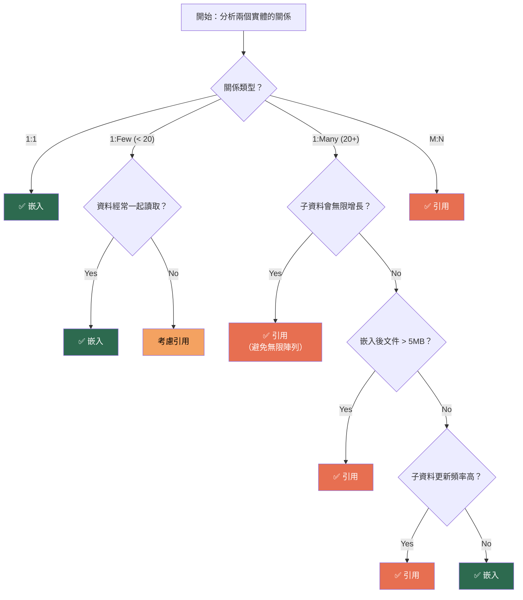

# M04-DOC-01: Document 建模原則

> **模組**: M04 - Document Thinking
> **對象**: 具備 RDB 經驗的 Java Spring 開發者
> **目標**: 掌握 MongoDB Document Model 的核心建模原則，建立「以查詢驅動」的設計思維

---

## 目錄

1. [從關聯式思維到文件式思維](#1-從關聯式思維到文件式思維)
2. [Embedding vs Referencing 決策矩陣](#2-embedding-vs-referencing-決策矩陣)
3. [決策流程圖](#3-決策流程圖)
4. [金融場景範例：嵌入模型](#4-金融場景範例嵌入模型)
5. [金融場景範例：引用模型](#5-金融場景範例引用模型)
6. [M04 Lab 程式碼解析](#6-m04-lab-程式碼解析)
7. [效能比較：Read Amplification vs Write Amplification](#7-效能比較read-amplification-vs-write-amplification)
8. [Anti-Patterns 與常見陷阱](#8-anti-patterns-與常見陷阱)
9. [建模決策總結](#9-建模決策總結)

---

## 1. 從關聯式思維到文件式思維

### 1.1 思維模式的根本差異

關聯式資料庫的建模思維是 **「資料導向」** — 先分析實體與關係，再正規化成多張表格，最後透過 JOIN 組裝查詢結果。

MongoDB 的建模思維是 **「查詢導向」** — 先分析應用程式的存取模式（Access Pattern），再決定如何將資料組織成文件，讓最常見的查詢能夠在 **一次讀取** 中完成。


### 1.2 核心原則

| 原則 | 關聯式 (RDB) | 文件式 (MongoDB) |
|------|-------------|-----------------|
| **建模起點** | 實體與關係 (ER Diagram) | 應用程式的查詢模式 |
| **正規化** | 盡可能正規化到 3NF | 適度反正規化以優化讀取 |
| **資料冗餘** | 極力避免 | 有策略地接受 |
| **一致性** | 強一致性 (ACID) | 最終一致性或單文件原子性 |
| **JOIN** | 常見且便宜 | 避免 `$lookup`，偏好嵌入 |
| **Schema** | 預先定義，變更昂貴 | 彈性 Schema，漸進式演化 |

### 1.3 「What gets queried together, gets stored together」

這是 MongoDB 建模的黃金法則。如果應用程式總是同時需要客戶資料和帳戶資料，那麼就應該把它們放在同一份文件中：


---

## 2. Embedding vs Referencing 決策矩陣

### 2.1 嵌入 (Embedding)

將子文件直接嵌入父文件中，形成單一的巢狀文件結構。

**適用場景：**

| 條件 | 說明 |
|------|------|
| 一對一 (1:1) | 客戶 ↔ 地址，一個客戶只有一個地址 |
| 一對少量 (1:Few) | 客戶 → 帳戶（通常 2-5 個） |
| 資料經常一起讀取 | 顯示客戶頁面時總是要列出帳戶 |
| 子資料不需獨立存取 | 不會有「只查帳戶不查客戶」的需求 |
| 子資料更新頻率低 | 地址、基本資料不常變動 |
| 子資料數量有上限 | 帳戶數量不會無限增長 |

**優勢：**
- 單次查詢取得所有資料（Zero Read Amplification）
- 單文件寫入具有原子性保證
- 無需 `$lookup` 或額外的 JOIN 操作

### 2.2 引用 (Referencing)

在父文件中儲存子文件的 `_id` 參照，子文件獨立存放在另一個 collection 中。

**適用場景：**

| 條件 | 說明 |
|------|------|
| 一對多 (1:N, N 很大) | 客戶 → 交易紀錄（可達數萬筆） |
| 多對多 (M:N) | 客戶 ↔ 產品（互相關聯） |
| 子資料需獨立存取 | 交易紀錄需獨立查詢、分頁、聚合 |
| 子資料更新頻繁 | 帳戶餘額頻繁變動 |
| 子資料可能無限增長 | 日誌、事件流 |
| 文件大小風險 | 避免逼近 16MB 上限 |

**代價：**
- 需要多次查詢（Read Amplification）
- 跨文件無原子性保證（除非使用 multi-document transaction）
- 應用層負責組裝完整資料

### 2.3 混合模式 (Hybrid)

在實務中，最常見的是混合模式 — 嵌入頻繁一起讀取的資料，引用獨立存取或無限增長的資料。


---

## 3. 決策流程圖

以下流程圖可協助你決定何時使用嵌入、何時使用引用：



---

## 4. 金融場景範例：嵌入模型

### 4.1 場景描述

銀行系統中，一個客戶擁有少量帳戶（通常 1-3 個），每個帳戶有近期交易紀錄。客戶頁面需要同時顯示客戶資訊、帳戶列表和最近的交易。

### 4.2 嵌入文件結構

```json
{
  "_id": ObjectId("665a1b2c3d4e5f6a7b8c9d0e"),
  "name": "王大明",
  "email": "daming.wang@bank.com",
  "accounts": [
    {
      "accountNumber": "ACC-001",
      "type": "savings",
      "balance": NumberDecimal("50000.00"),
      "transactions": [
        {
          "type": "deposit",
          "amount": NumberDecimal("50000.00"),
          "timestamp": ISODate("2024-01-15T10:30:00Z")
        },
        {
          "type": "withdrawal",
          "amount": NumberDecimal("5000.00"),
          "timestamp": ISODate("2024-01-20T14:00:00Z")
        }
      ]
    },
    {
      "accountNumber": "ACC-002",
      "type": "checking",
      "balance": NumberDecimal("15000.00"),
      "transactions": []
    }
  ]
}
```

### 4.3 文件結構圖


### 4.4 存取模式分析

| 操作 | 查詢次數 | 說明 |
|------|---------|------|
| 顯示客戶完整資料 | **1 次** | 單一文件包含所有資訊 |
| 新增交易紀錄 | **1 次** | `$push` 到嵌入陣列 |
| 更新帳戶餘額 | **1 次** | 透過 `$set` 修改嵌入欄位 |
| 查詢特定帳戶的交易 | **1 次** | `$elemMatch` 過濾嵌入陣列 |

---

## 5. 金融場景範例：引用模型

### 5.1 場景描述

同樣的銀行系統，但交易量龐大（每月數百筆），需要獨立查詢交易、做分頁和聚合分析。此時將客戶和帳戶拆成不同的 collection。

### 5.2 引用文件結構

**customers_ref collection：**

```json
{
  "_id": ObjectId("665a1b2c3d4e5f6a7b8c9d0f"),
  "name": "李小華",
  "email": "xiaohua.li@bank.com"
}
```

**accounts_ref collection：**

```json
{
  "_id": ObjectId("665a1b2c3d4e5f6a7b8c9d10"),
  "customerId": "665a1b2c3d4e5f6a7b8c9d0f",
  "accountNumber": "ACC-101",
  "type": "savings",
  "balance": NumberDecimal("30000.00")
}
```

**transactions collection（獨立引用）：**

```json
{
  "_id": ObjectId("665a1b2c3d4e5f6a7b8c9d11"),
  "accountId": "665a1b2c3d4e5f6a7b8c9d10",
  "type": "transfer",
  "amount": NumberDecimal("10000.00"),
  "timestamp": ISODate("2024-01-22T09:15:00Z"),
  "description": "轉帳至 ACC-102"
}
```

### 5.3 文件結構圖


### 5.4 存取模式分析

| 操作 | 查詢次數 | 說明 |
|------|---------|------|
| 顯示客戶完整資料 | **2-3 次** | 查客戶 → 查帳戶 → 查交易 |
| 新增交易紀錄 | **1 次** | 直接 insert 到 transactions collection |
| 更新帳戶餘額 | **1 次** | 只更新 accounts_ref 中的文件 |
| 分頁查詢交易 | **1 次** | 直接在 transactions collection 查詢 |
| 交易統計聚合 | **1 次** | 直接對 transactions 做 aggregation |

---

## 6. M04 Lab 程式碼解析

### 6.1 嵌入模型 — BankCustomerDocument

本模組的 `embedded` package 展示了完整的嵌入模式實作：

```java
// 來源: com.mongodb.course.m04.embedded.BankCustomerDocument
@Document("bank_customers_embedded")
public class BankCustomerDocument {

    @Id
    private String id;
    private String name;
    private String email;
    private List<Account> accounts = new ArrayList<>();

    // Account 作為內部靜態類別 — 嵌入文件
    public static class Account {
        private String accountNumber;
        private String type;

        @Field(targetType = FieldType.DECIMAL128)
        private BigDecimal balance;

        private List<Transaction> transactions = new ArrayList<>();
    }

    // Transaction 作為內部靜態類別 — 二層嵌入
    public static class Transaction {
        private String type;

        @Field(targetType = FieldType.DECIMAL128)
        private BigDecimal amount;

        private Instant timestamp;
    }
}
```

**關鍵設計觀察：**

1. **內部靜態類別**：`Account` 和 `Transaction` 定義為 `BankCustomerDocument` 的內部類別，強調它們不是獨立實體
2. **`@Field(targetType = FieldType.DECIMAL128)`**：金額欄位使用 `Decimal128` 確保精度
3. **`ArrayList` 初始化**：避免 null 陣列導致的 NPE

### 6.2 引用模型 — CustomerRef / AccountRef

`referenced` package 展示了引用模式：

```java
// 來源: com.mongodb.course.m04.referenced.CustomerRef
@Document("customers_ref")
public class CustomerRef {
    @Id
    private String id;
    private String name;
    private String email;
}

// 來源: com.mongodb.course.m04.referenced.AccountRef
@Document("accounts_ref")
public class AccountRef {
    @Id
    private String id;
    private String customerId;   // 手動引用 — 儲存 CustomerRef 的 _id
    private String accountNumber;
    private String type;

    @Field(targetType = FieldType.DECIMAL128)
    private BigDecimal balance;
}
```

**關鍵設計觀察：**

1. **獨立 `@Document`**：`CustomerRef` 和 `AccountRef` 各自映射到不同的 collection
2. **手動引用**：`customerId` 欄位手動儲存父文件的 `_id`，而非使用 `@DBRef`
3. **獨立 Repository**：各自擁有獨立的 `MongoRepository`，支援獨立的 CRUD 操作

### 6.3 測試驗證 — 嵌入 vs 引用

```java
// 嵌入模式：單次查詢
BankCustomerDocument found = embeddedRepository.findByName("Alice").getFirst();
assertThat(found.getAccounts()).hasSize(2);
assertThat(found.getAccounts().getFirst().getTransactions()).hasSize(1);

// 引用模式：需要兩次查詢
CustomerRef foundCustomer = customerRefRepository.findById(customer.getId()).orElseThrow();
List<AccountRef> accounts = accountRefRepository.findByCustomerId(foundCustomer.getId());
assertThat(accounts).hasSize(2);
```

---

## 7. 效能比較：Read Amplification vs Write Amplification

### 7.1 概念定義

| 指標 | 定義 | 嵌入模式 | 引用模式 |
|------|------|---------|---------|
| **Read Amplification** | 完成一次邏輯讀取需要的實際 I/O 次數 | 低 (1 次) | 高 (N+1 次) |
| **Write Amplification** | 完成一次邏輯寫入需要的實際 I/O 量 | 高 (重寫整個文件) | 低 (只寫目標文件) |

### 7.2 場景分析


### 7.3 實際效能考量

**嵌入模式的效能特性：**

- 文件越大，每次寫入的 I/O 量越大
- 當嵌入陣列增長時，MongoDB 可能需要遷移文件到更大的儲存空間（document migration）
- 工作集（Working Set）較大，因為每次讀取都載入完整文件

**引用模式的效能特性：**

- 多次查詢增加網路往返（round trip）延遲
- 索引維護成本分散在多個 collection
- 工作集較小，因為文件更精簡

### 7.4 讀寫比例與模型選擇

| 讀寫比例 | 建議模型 | 金融場景範例 |
|---------|---------|------------|
| 讀多寫少 (10:1) | 嵌入 | 客戶基本資料 + 帳戶摘要 |
| 讀寫平衡 (1:1) | 混合 | 帳戶 + 最近 N 筆交易 |
| 寫多讀少 (1:10) | 引用 | 高頻交易日誌、事件流 |

---

## 8. Anti-Patterns 與常見陷阱

### 8.1 無限增長陣列 (Unbounded Arrays)

**問題**：將交易紀錄全部嵌入帳戶文件中，隨時間增長可能達到數萬筆。

```json
// ❌ Anti-Pattern: 無限增長的交易陣列
{
  "_id": "customer-001",
  "name": "王大明",
  "accounts": [
    {
      "accountNumber": "ACC-001",
      "transactions": [
        // 10,000+ 筆交易... 文件越來越大
      ]
    }
  ]
}
```

**解決方案**：


- **Bucket Pattern**：將交易按時間分桶（例如每月一個文件）
- **Subset Pattern**：嵌入最近 5 筆交易，歷史交易放到獨立 collection

### 8.2 過度深層巢狀 (Deep Nesting)

**問題**：超過 3 層的巢狀結構會讓查詢和更新變得複雜。

```json
// ❌ Anti-Pattern: 過度巢狀
{
  "customer": {
    "accounts": [
      {
        "transactions": [
          {
            "details": {
              "metadata": {
                "auditTrail": [...]  // 第 6 層！
              }
            }
          }
        ]
      }
    ]
  }
}
```

**建議**：保持巢狀不超過 2-3 層，超過的部分考慮引用。

### 8.3 忽略 16MB 文件大小限制

MongoDB 單一文件的最大大小為 **16MB**。在金融場景中，這個限制特別需要注意：

| 內容 | 預估大小 | 安全嵌入數量 |
|------|---------|------------|
| 單筆交易紀錄 | ~200 bytes | ~80,000 筆 |
| 帳戶摘要 | ~500 bytes | ~32,000 個 |
| 含簽名的文件 | ~50 KB | ~320 份 |

> **最佳實踐**：將文件大小控制在 **5MB 以下**，保留成長空間。

### 8.4 過度使用 `$lookup`

**問題**：把 MongoDB 當成 RDB 使用，設計成完全正規化的多 collection 結構，然後大量使用 `$lookup`。

```javascript
// ❌ Anti-Pattern: 把 MongoDB 當 SQL 用
db.customers.aggregate([
  { $lookup: { from: "accounts", ... } },
  { $lookup: { from: "transactions", ... } },
  { $lookup: { from: "branches", ... } },
  { $lookup: { from: "products", ... } }
]);
```

**正確做法**：重新思考文件結構，將經常一起查詢的資料嵌入。

### 8.5 不當使用 `@DBRef`

Spring Data MongoDB 的 `@DBRef` 會在讀取時自動發出額外查詢，等同於 JPA 的 `EAGER` 載入，可能造成 N+1 問題：

```java
// ⚠️ 謹慎使用：@DBRef 會自動觸發額外查詢
@Document
public class Customer {
    @DBRef
    private List<Account> accounts;  // 讀取 Customer 時會自動查詢所有 Account
}
```

**建議**：優先使用手動引用（儲存 `String customerId`），由應用層控制查詢時機。

---

## 9. 建模決策總結

### 9.1 決策 Checklist

在設計每一個 MongoDB 文件結構時，請回答以下問題：

| # | 問題 | 嵌入偏好 | 引用偏好 |
|---|------|---------|---------|
| 1 | 這些資料經常一起讀取嗎？ | 是 | 否 |
| 2 | 子資料需要獨立查詢或分頁嗎？ | 否 | 是 |
| 3 | 子資料的數量有上限嗎？ | 有 (< 100) | 無上限 |
| 4 | 子資料的更新頻率高嗎？ | 低 | 高 |
| 5 | 嵌入後文件大小會超過 5MB 嗎？ | 不會 | 會 |
| 6 | 需要跨多個父文件共享子資料嗎？ | 否 | 是 |
| 7 | 需要對子資料做聚合分析嗎？ | 否 | 是 |

### 9.2 金融領域建模指引


### 9.3 文件模型設計的三步驟


1. **列出所有 Query Use Cases**：不是先畫 ER 圖，而是先列出應用程式會執行的所有查詢
2. **根據存取模式分組**：哪些資料總是一起被讀取？哪些需要獨立查詢？
3. **套用決策矩陣**：根據關係類型、資料量、更新頻率等因素，選擇嵌入或引用

> **記住**：沒有唯一正確的模型，只有最適合你的應用程式存取模式的模型。Document Model 的設計是一門藝術，需要在讀取效能、寫入效能和資料一致性之間取得平衡。

---

## 參考資源

- [MongoDB Data Modeling](https://www.mongodb.com/docs/manual/data-modeling/)
- [Building with Patterns: A Summary](https://www.mongodb.com/blog/post/building-with-patterns-a-summary)
- [M04 Lab 原始碼](../src/main/java/com/mongodb/course/m04/)
