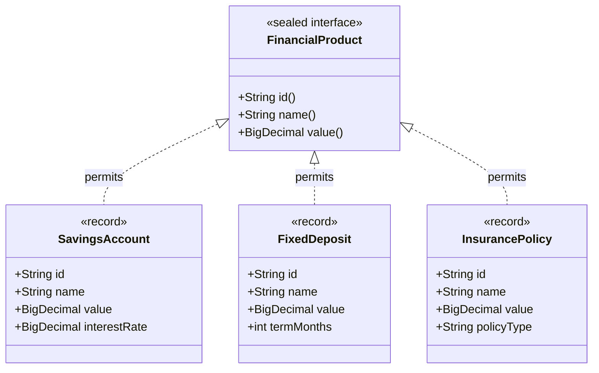
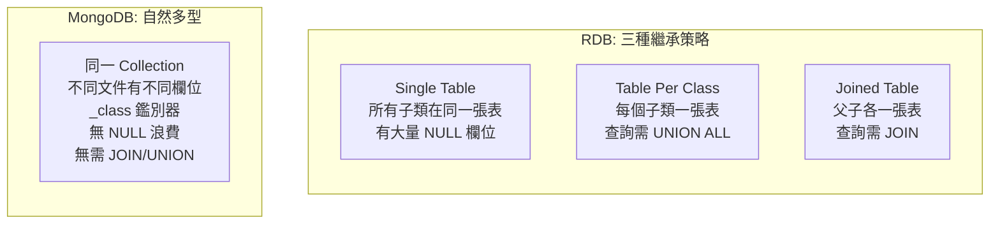
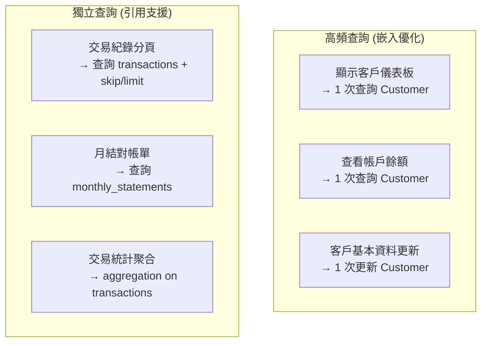
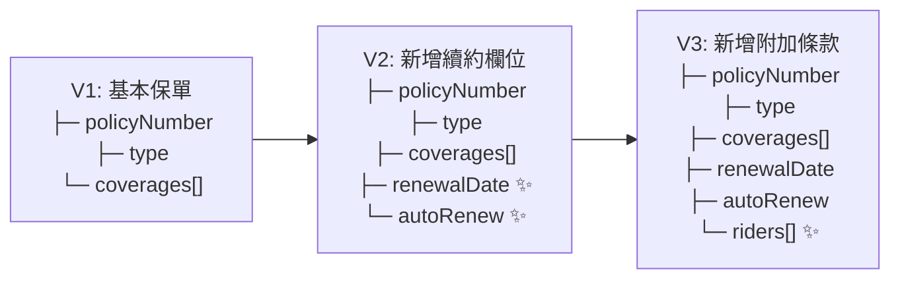
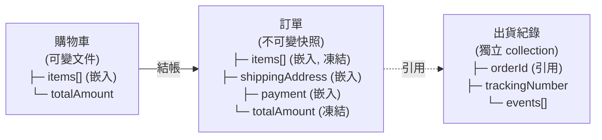
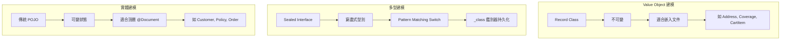
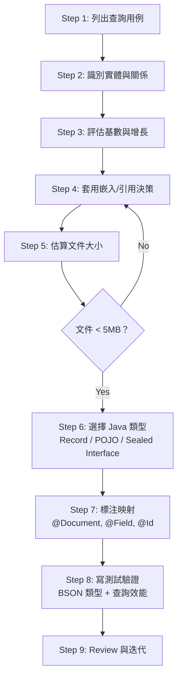

# M04-DOC-03: 金融場景建模實戰

> **模組**: M04 - Document Thinking
> **對象**: 具備 RDB 經驗的 Java Spring 開發者
> **目標**: 運用 Java 23 新特性結合 MongoDB Document Model，實戰設計金融領域的資料模型

---

## 目錄

1. [Java 23 新特性與 MongoDB 的結合](#1-java-23-新特性與-mongodb-的結合)
2. [金融產品建模：Sealed Interface + Record](#2-金融產品建模sealed-interface--record)
3. [多型持久化與 _class 鑑別器](#3-多型持久化與-_class-鑑別器)
4. [銀行帳戶系統建模實戰](#4-銀行帳戶系統建模實戰)
5. [保險系統建模](#5-保險系統建模)
6. [電商系統建模](#6-電商系統建模)
7. [建模 Checklist](#7-建模-checklist)

---

## 1. Java 23 新特性與 MongoDB 的結合

### 1.1 Record Classes — 不可變資料載體

Java Record 是語言層級的不可變資料類別，天然適合作為 MongoDB 的 Value Object：

| 特性 | 傳統 POJO | Record |
|------|----------|--------|
| **不可變性** | 需手動實作 | 語言保證 |
| **equals/hashCode** | 需手動覆寫 | 自動生成（基於所有欄位） |
| **toString** | 需手動覆寫 | 自動生成 |
| **建構子** | 手動定義 | 自動產生 canonical constructor |
| **樣板程式碼** | 大量 getter/setter | 零樣板 |
| **MongoDB 映射** | MappingMongoConverter 支援 | MappingMongoConverter 支援 |

```java
// 傳統 POJO — 需要 50+ 行
public class SavingsAccountPojo {
    private String id;
    private String name;
    private BigDecimal value;
    private BigDecimal interestRate;

    // 建構子、getter、setter、equals、hashCode、toString...
}

// Record — 只需 5 行
public record SavingsAccount(
    @Id String id,
    String name,
    BigDecimal value,
    BigDecimal interestRate
) implements FinancialProduct {}
```

### 1.2 Sealed Interfaces — 窮盡式型別階層

Sealed Interface 限制了可以實作介面的類別，編譯器可以確保 switch 表達式涵蓋所有子類型：



### 1.3 Pattern Matching with Switch — 多型派發

結合 Sealed Interface 和 Pattern Matching，switch 表達式可以做到：
- **窮盡性檢查**：編譯器確保所有子類型都被處理
- **型別安全解構**：直接在 case 中綁定具體型別的變數
- **無需 if-else 鏈**：取代傳統的 instanceof 級聯

```java
// 窮盡式 switch — 新增 permits 類型時，編譯器會強制你處理
public String describe(FinancialProduct product) {
    return switch (product) {
        case SavingsAccount sa ->
            "Savings: %s at %s%% interest".formatted(sa.name(), sa.interestRate());
        case FixedDeposit fd ->
            "Fixed Deposit: %s for %d months".formatted(fd.name(), fd.termMonths());
        case InsurancePolicy ip ->
            "Insurance: %s (%s)".formatted(ip.name(), ip.policyType());
        // 不需要 default — sealed interface 確保窮盡
    };
}
```

---

## 2. 金融產品建模：Sealed Interface + Record

### 2.1 M04 Lab 完整實作

**Sealed Interface 定義：**

```java
// 來源: com.mongodb.course.m04.java23.FinancialProduct
public sealed interface FinancialProduct
        permits SavingsAccount, FixedDeposit, InsurancePolicy {

    String id();
    String name();
    BigDecimal value();
}
```

**活存帳戶：**

```java
// 來源: com.mongodb.course.m04.java23.SavingsAccount
public record SavingsAccount(
        @Id String id,
        String name,
        BigDecimal value,
        BigDecimal interestRate
) implements FinancialProduct {}
```

**定期存款：**

```java
// 來源: com.mongodb.course.m04.java23.FixedDeposit
public record FixedDeposit(
        @Id String id,
        String name,
        BigDecimal value,
        int termMonths
) implements FinancialProduct {}
```

**保險保單：**

```java
// 來源: com.mongodb.course.m04.java23.InsurancePolicy
public record InsurancePolicy(
        @Id String id,
        String name,
        BigDecimal value,
        String policyType
) implements FinancialProduct {}
```

### 2.2 Service 層：MongoTemplate 持久化

```java
// 來源: com.mongodb.course.m04.java23.FinancialProductService
@Service
public class FinancialProductService {

    private static final String COLLECTION = "financial_products";
    private final MongoTemplate mongoTemplate;

    public FinancialProductService(MongoTemplate mongoTemplate) {
        this.mongoTemplate = mongoTemplate;
    }

    // Pattern Matching switch
    public String describe(FinancialProduct product) {
        return switch (product) {
            case SavingsAccount sa ->
                "Savings: %s at %s%% interest".formatted(sa.name(), sa.interestRate());
            case FixedDeposit fd ->
                "Fixed Deposit: %s for %d months".formatted(fd.name(), fd.termMonths());
            case InsurancePolicy ip ->
                "Insurance: %s (%s)".formatted(ip.name(), ip.policyType());
        };
    }

    // 泛型方法：儲存任何金融產品到同一 collection
    public <T extends FinancialProduct> T save(T product) {
        return mongoTemplate.save(product, COLLECTION);
    }

    // 按具體型別查詢
    public List<SavingsAccount> findAllSavings() {
        return mongoTemplate.findAll(SavingsAccount.class, COLLECTION);
    }

    public List<FixedDeposit> findAllFixedDeposits() {
        return mongoTemplate.findAll(FixedDeposit.class, COLLECTION);
    }

    public List<InsurancePolicy> findAllInsurancePolicies() {
        return mongoTemplate.findAll(InsurancePolicy.class, COLLECTION);
    }
}
```

### 2.3 為何使用 MongoTemplate 而非 Repository？

在多型場景中，`MongoTemplate` 比 `MongoRepository` 更靈活：

| 面向 | MongoRepository | MongoTemplate |
|------|----------------|---------------|
| **多型支援** | 綁定單一實體類型 | 可指定任意類型和 collection |
| **Collection 彈性** | 由 `@Document` 決定 | 可動態指定 collection |
| **型別查詢** | 需要額外配置 | `findAll(SavingsAccount.class, COLLECTION)` |
| **適用場景** | 單型別 CRUD | 多型別、複雜查詢 |

---

## 3. 多型持久化與 _class 鑑別器

### 3.1 _class 欄位的作用

當不同子類型的文件儲存在同一個 collection 中時，Spring Data MongoDB 使用 `_class` 欄位作為鑑別器（discriminator），在讀取時決定要反序列化為哪個 Java 類別：

```json
// financial_products collection 中的三個文件

// SavingsAccount
{
  "_id": "sa-001",
  "_class": "com.mongodb.course.m04.java23.SavingsAccount",
  "name": "My Savings",
  "value": 50000,
  "interestRate": 2.5
}

// FixedDeposit
{
  "_id": "fd-001",
  "_class": "com.mongodb.course.m04.java23.FixedDeposit",
  "name": "1-Year FD",
  "value": 200000,
  "termMonths": 12
}

// InsurancePolicy
{
  "_id": "ip-001",
  "_class": "com.mongodb.course.m04.java23.InsurancePolicy",
  "name": "Life Shield",
  "value": 500000,
  "policyType": "term-life"
}
```

### 3.2 多型查詢流程

```mermaid
sequenceDiagram
    participant App as Application
    participant MT as MongoTemplate
    participant Conv as MappingMongoConverter
    participant DB as MongoDB

    App->>MT: findAll(SavingsAccount.class, "financial_products")
    MT->>DB: find({ _class: "...SavingsAccount" })
    DB-->>MT: BSON Documents[]
    MT->>Conv: read(SavingsAccount.class, doc)
    Conv-->>MT: SavingsAccount record
    MT-->>App: List&lt;SavingsAccount&gt;

    Note over Conv: _class 欄位決定<br/>反序列化的目標類別
```

### 3.3 測試驗證

```java
// 來源: Java23FeaturesTest.polymorphicProductsInSameCollection()
productService.save(new SavingsAccount("sa-003", "Basic Savings",
        new BigDecimal("10000"), new BigDecimal("1.5")));
productService.save(new FixedDeposit("fd-002", "6-Month FD",
        new BigDecimal("50000"), 6));
productService.save(new InsurancePolicy("ip-002", "Health Plan",
        new BigDecimal("100000"), "health"));

// 各型別各自查詢
assertThat(productService.findAllSavings()).hasSize(1);
assertThat(productService.findAllFixedDeposits()).hasSize(1);
assertThat(productService.findAllInsurancePolicies()).hasSize(1);

// 驗證 _class 欄位存在
Document raw = mongoTemplate.getCollection("financial_products")
        .find(new Document("_id", "sa-003")).first();
assertThat(raw.getString("_class")).contains("SavingsAccount");
```

### 3.4 RDB 多型 vs MongoDB 多型



MongoDB 的無綱要（schemaless）特性讓多型持久化變得自然：每個文件可以有不同的欄位結構，`_class` 欄位告訴轉換器該使用哪個類別。相比 RDB 的三種繼承策略，MongoDB 的方式更簡潔且效能更好。

---

## 4. 銀行帳戶系統建模實戰

### 4.1 領域模型

一個完整的銀行帳戶系統包含以下實體：

```mermaid
classDiagram
    class Customer {
        +String id
        +String name
        +String email
        +Address address
        +List~Account~ accounts
    }

    class Address {
        <<value object>>
        +String street
        +String city
        +String zipCode
        +String country
    }

    class Account {
        +String accountNumber
        +AccountType type
        +BigDecimal balance
        +Instant openedAt
    }

    class Transaction {
        +String id
        +String accountId
        +TransactionType type
        +BigDecimal amount
        +Instant timestamp
        +String description
    }

    class MonthlyStatement {
        +String id
        +String accountId
        +YearMonth period
        +BigDecimal openingBalance
        +BigDecimal closingBalance
        +int transactionCount
    }

    Customer *-- Address : 嵌入 1:1
    Customer *-- Account : 嵌入 1:Few
    Account "1" <-- "*" Transaction : 引用 1:Many
    Account "1" <-- "*" MonthlyStatement : 引用 1:Many
```

### 4.2 嵌入 vs 引用決策

| 關係 | 決策 | 理由 |
|------|------|------|
| Customer ↔ Address | **嵌入** | 1:1 關係，總是一起讀取，地址不需獨立查詢 |
| Customer ↔ Account | **嵌入** | 1:Few（通常 1-5 個），客戶頁面總是顯示帳戶 |
| Account → Transaction | **引用** | 1:Many（可達數萬），需獨立分頁查詢和聚合分析 |
| Account → MonthlyStatement | **引用** | 1:Many（每月一筆），需獨立查詢特定月份 |

### 4.3 文件大小估算

| 文件內容 | 預估大小 | 說明 |
|---------|---------|------|
| Customer 基本資料 | ~300 bytes | name, email, address |
| 單個 Account | ~200 bytes | accountNumber, type, balance, openedAt |
| 嵌入 5 個 Account | ~1,300 bytes | 300 + 5 x 200 |
| 單筆 Transaction | ~200 bytes | 獨立 collection，不影響 Customer 大小 |

> 即使客戶有 5 個帳戶，Customer 文件也只有約 1.3KB，遠低於 16MB 限制。

### 4.4 嵌入模型的 Java 實作

```java
@Document("bank_customers")
public class BankCustomer {

    @Id
    private String id;
    private String name;
    private String email;
    private Address address;  // 嵌入 1:1
    private List<Account> accounts = new ArrayList<>();  // 嵌入 1:Few

    // 嵌入的地址 Value Object
    public static class Address {
        private String street;
        private String city;
        private String zipCode;
        private String country;
    }

    // 嵌入的帳戶
    public static class Account {
        private String accountNumber;
        private String type;

        @Field(targetType = FieldType.DECIMAL128)
        private BigDecimal balance;

        private Instant openedAt;
    }
}
```

### 4.5 引用模型的交易文件

```java
@Document("transactions")
public class TransactionDoc {

    @Id
    private String id;
    private String accountId;  // 手動引用 Account
    private String type;       // DEPOSIT, WITHDRAWAL, TRANSFER

    @Field(targetType = FieldType.DECIMAL128)
    private BigDecimal amount;

    private Instant timestamp;
    private String description;
    private String counterpartyAccount;  // 轉帳對象
}
```

### 4.6 查詢模式分析



---

## 5. 保險系統建模

### 5.1 保單層級架構

保險系統的核心是保單（Policy），包含承保範圍（Coverage）和理賠紀錄（Claim）：

```mermaid
classDiagram
    class Policy {
        +String id
        +String policyNumber
        +String customerId
        +PolicyType type
        +PolicyStatus status
        +Instant effectiveDate
        +Instant expirationDate
        +List~Coverage~ coverages
        +Long version
    }

    class Coverage {
        <<value object>>
        +String coverageCode
        +String description
        +BigDecimal limit
        +BigDecimal deductible
        +BigDecimal premium
    }

    class Claim {
        +String id
        +String policyId
        +String claimNumber
        +ClaimStatus status
        +BigDecimal claimAmount
        +BigDecimal approvedAmount
        +Instant filedDate
        +Instant resolvedDate
        +List~ClaimEvent~ events
    }

    class ClaimEvent {
        <<value object>>
        +Instant timestamp
        +String action
        +String handler
        +String notes
    }

    Policy *-- Coverage : 嵌入 1:Few
    Policy "1" <-- "*" Claim : 引用 1:Many
    Claim *-- ClaimEvent : 嵌入 1:Few
```

### 5.2 保單文件設計

```java
@Document("policies")
public class Policy {

    @Id
    private String id;
    private String policyNumber;
    private String customerId;
    private String type;       // LIFE, HEALTH, AUTO, HOME
    private String status;     // ACTIVE, EXPIRED, CANCELLED

    private Instant effectiveDate;
    private Instant expirationDate;

    // 嵌入：承保範圍通常 1-5 項，總是和保單一起讀取
    private List<Coverage> coverages = new ArrayList<>();

    @Version
    private Long version;  // 樂觀鎖：防止並發更新

    public static class Coverage {
        private String coverageCode;
        private String description;

        @Field(targetType = FieldType.DECIMAL128)
        private BigDecimal limit;

        @Field(targetType = FieldType.DECIMAL128)
        private BigDecimal deductible;

        @Field(targetType = FieldType.DECIMAL128)
        private BigDecimal premium;
    }
}
```

### 5.3 理賠文件設計

```java
@Document("claims")
public class Claim {

    @Id
    private String id;
    private String policyId;      // 引用保單
    private String claimNumber;
    private String status;        // FILED, REVIEWING, APPROVED, REJECTED, PAID

    @Field(targetType = FieldType.DECIMAL128)
    private BigDecimal claimAmount;

    @Field(targetType = FieldType.DECIMAL128)
    private BigDecimal approvedAmount;

    private Instant filedDate;
    private Instant resolvedDate;

    // 嵌入：理賠事件通常 3-10 筆，記錄審核歷程
    private List<ClaimEvent> events = new ArrayList<>();

    public static class ClaimEvent {
        private Instant timestamp;
        private String action;     // FILED, ASSIGNED, REVIEWED, APPROVED, PAID
        private String handler;
        private String notes;
    }
}
```

### 5.4 Schema Versioning 策略

保險產品的規格經常變動，需要一套 Schema 演化策略：



**使用 `@Version` 實作樂觀鎖：**

```java
@Document("policies")
public class Policy {

    @Version
    private Long version;  // Spring Data 自動管理

    // 每次 save() 時 version 遞增
    // 如果並發更新，版本不匹配會拋出 OptimisticLockingFailureException
}
```

**Schema 演化的相容策略：**

```java
// 新欄位使用 Optional 或 null 預設值，舊文件讀取時不會出錯
@Document("policies")
public class Policy {
    // V1 欄位
    private String policyNumber;
    private String type;
    private List<Coverage> coverages;

    // V2 新增欄位（舊文件中不存在，讀取時為 null）
    private Instant renewalDate;      // null for V1 documents
    private Boolean autoRenew;        // null for V1 documents

    // V3 新增欄位
    private List<Rider> riders;       // null for V1/V2 documents
}
```

---

## 6. 電商系統建模

### 6.1 商品目錄建模

電商系統的商品目錄是 Document Model 的經典應用場景。不同類別的商品有不同的屬性，這在 RDB 中是著名的 EAV（Entity-Attribute-Value）難題，但在 MongoDB 中可以自然解決。

```mermaid
classDiagram
    class Product {
        +String id
        +String name
        +String category
        +String brand
        +BigDecimal basePrice
        +List~Variant~ variants
        +Map~String, Object~ attributes
    }

    class Variant {
        <<value object>>
        +String sku
        +String color
        +String size
        +BigDecimal price
        +int stockQuantity
    }

    class CartDocument {
        +String id
        +String customerId
        +List~CartItem~ items
        +Instant lastUpdated
        +BigDecimal totalAmount
    }

    class CartItem {
        <<value object>>
        +String productId
        +String sku
        +String productName
        +BigDecimal unitPrice
        +int quantity
    }

    Product *-- Variant : 嵌入 1:Few
    CartDocument *-- CartItem : 嵌入 1:Few
```

### 6.2 商品文件設計

```java
@Document("products")
public class Product {

    @Id
    private String id;
    private String name;
    private String category;
    private String brand;

    @Field(targetType = FieldType.DECIMAL128)
    private BigDecimal basePrice;

    // 嵌入：規格變體通常 5-20 個，總是和商品一起展示
    private List<Variant> variants = new ArrayList<>();

    // 彈性屬性：不同類別有不同屬性
    private Map<String, Object> attributes = new HashMap<>();

    public static class Variant {
        private String sku;
        private String color;
        private String size;

        @Field(targetType = FieldType.DECIMAL128)
        private BigDecimal price;

        private int stockQuantity;
    }
}
```

**MongoDB 中的實際文件：**

```json
{
  "_id": "prod-001",
  "name": "Premium Dress Shirt",
  "category": "clothing",
  "brand": "BankStyle",
  "basePrice": NumberDecimal("1200.00"),
  "variants": [
    { "sku": "DS-WHT-M", "color": "white", "size": "M",
      "price": NumberDecimal("1200.00"), "stockQuantity": 50 },
    { "sku": "DS-WHT-L", "color": "white", "size": "L",
      "price": NumberDecimal("1200.00"), "stockQuantity": 30 },
    { "sku": "DS-BLU-M", "color": "blue", "size": "M",
      "price": NumberDecimal("1300.00"), "stockQuantity": 20 }
  ],
  "attributes": {
    "material": "100% cotton",
    "collarType": "spread",
    "sleeveLength": "long",
    "careInstructions": ["machine wash cold", "tumble dry low"]
  }
}
```

### 6.3 購物車建模

購物車是「嵌入」的經典場景 — 項目數量有限，總是需要完整載入，生命週期短暫：

```java
@Document("carts")
public class CartDocument {

    @Id
    private String id;
    private String customerId;
    private Instant lastUpdated;

    // 嵌入：購物車項目通常 1-20 個
    private List<CartItem> items = new ArrayList<>();

    @Field(targetType = FieldType.DECIMAL128)
    private BigDecimal totalAmount;

    public static class CartItem {
        private String productId;
        private String sku;
        private String productName;  // 反正規化：快取商品名稱

        @Field(targetType = FieldType.DECIMAL128)
        private BigDecimal unitPrice;  // 反正規化：快取加入時的價格

        private int quantity;
    }
}
```

**設計要點：**

1. **反正規化 `productName` 和 `unitPrice`**：避免顯示購物車時需要查詢商品 collection
2. **`totalAmount` 快取**：避免每次顯示都重新計算
3. **`lastUpdated` 追蹤**：用於清理過期購物車

### 6.4 訂單建模（購物車的演化）

當購物車結帳為訂單時，需要完整快照當時的價格和商品資訊：



---

## 7. 建模 Checklist

### 7.1 通用建模決策清單

在設計任何 MongoDB 文件結構之前，逐項確認以下問題：

| # | 檢查項目 | 行動 |
|---|---------|------|
| 1 | **列出前 5 大查詢用例** | 建模的起點是查詢模式，不是 ER 圖 |
| 2 | **評估每對關係的基數** | 1:1, 1:Few, 1:Many, M:N |
| 3 | **估算文件大小** | 確保遠低於 16MB 限制（目標 < 5MB） |
| 4 | **確認讀寫比例** | 讀多 → 嵌入；寫多 → 引用 |
| 5 | **檢查無限增長風險** | 陣列是否有上限？需要 Bucket Pattern？ |
| 6 | **金額是否使用 Decimal128？** | 所有金融數值必須用 `@Field(targetType = DECIMAL128)` |
| 7 | **時間是否使用 Instant？** | UTC 時間戳，應用層處理時區 |
| 8 | **是否需要多型？** | Sealed Interface + `_class` 鑑別器 |
| 9 | **是否需要樂觀鎖？** | `@Version` 防止並發更新衝突 |
| 10 | **Schema 演化策略** | 新增欄位使用 nullable 預設值 |

### 7.2 Java 23 + MongoDB 最佳實踐



| 場景 | 推薦方式 | 說明 |
|------|---------|------|
| **Value Object** | `record` | 不可變，適合嵌入文件（Address, Money） |
| **多型產品** | `sealed interface` + `record` | 窮盡式分派，自然支援 MongoDB 多型 |
| **可變實體** | 傳統 `class` | 頂層 `@Document`，需要 setter |
| **業務邏輯分派** | Pattern Matching `switch` | 取代 if-else 或 Visitor Pattern |
| **型別安全計算** | `switch` 表達式 | 費率計算、風險評估等 |

### 7.3 金融領域專用 Checklist

| # | 金融專項 | 說明 |
|---|---------|------|
| 1 | 所有金額使用 `Decimal128` | 永遠不要用 `Double` 儲存金額 |
| 2 | 交易紀錄獨立 collection | 避免無限增長嵌入 |
| 3 | 審計軌跡 (Audit Trail) | 使用嵌入的事件陣列記錄狀態變更 |
| 4 | 保單版本控制 | `@Version` + Schema 演化策略 |
| 5 | 對帳單按月分桶 | Bucket Pattern 優化查詢 |
| 6 | 匯率快照 | 交易文件中嵌入當時的匯率，不引用 |
| 7 | 餘額快取 | 帳戶文件中維護當前餘額，交易 collection 為真實來源 |

### 7.4 建模流程總結



---

## 參考資源

- [MongoDB Data Modeling](https://www.mongodb.com/docs/manual/data-modeling/)
- [Java 23 Record Classes](https://docs.oracle.com/en/java/javase/23/language/records.html)
- [Java 23 Sealed Classes](https://docs.oracle.com/en/java/javase/23/language/sealed-classes-and-interfaces.html)
- [Java 23 Pattern Matching for switch](https://docs.oracle.com/en/java/javase/23/language/pattern-matching-switch-expressions-and-statements.html)
- [Spring Data MongoDB - Polymorphic Types](https://docs.spring.io/spring-data/mongodb/reference/mongodb/mapping.html)
- [M04 Lab 原始碼](../src/main/java/com/mongodb/course/m04/)
